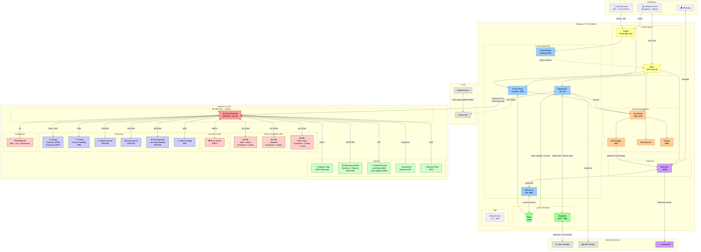
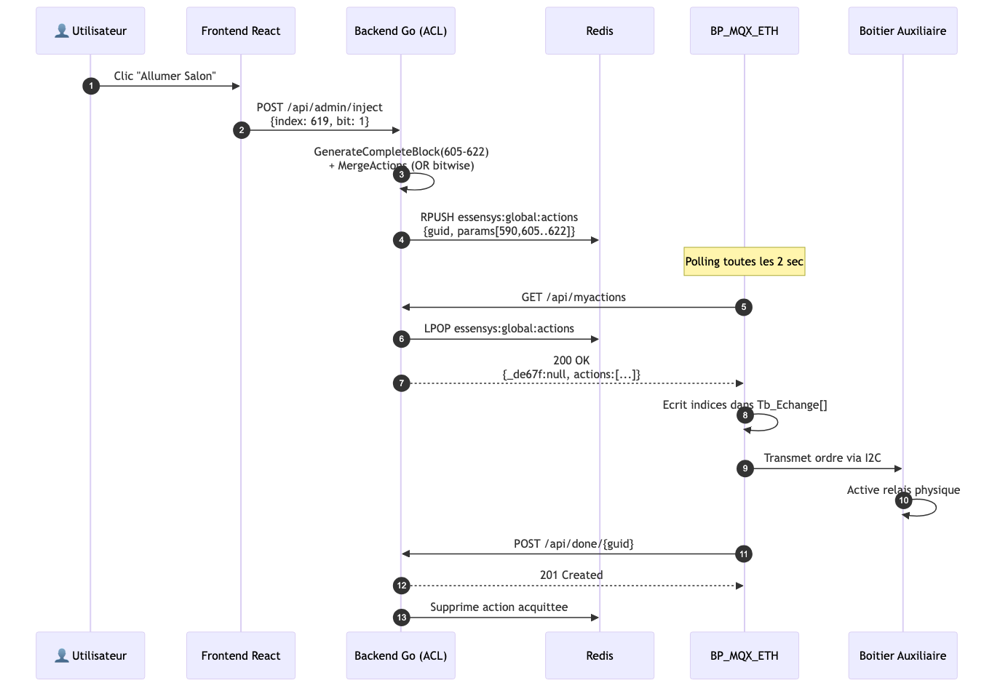
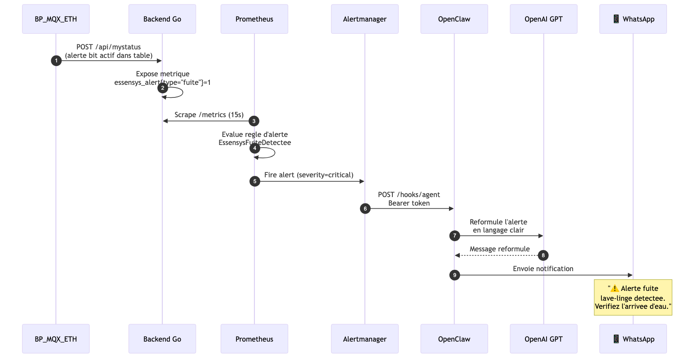
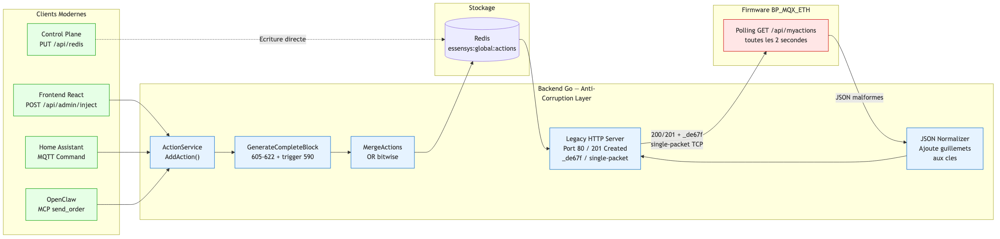
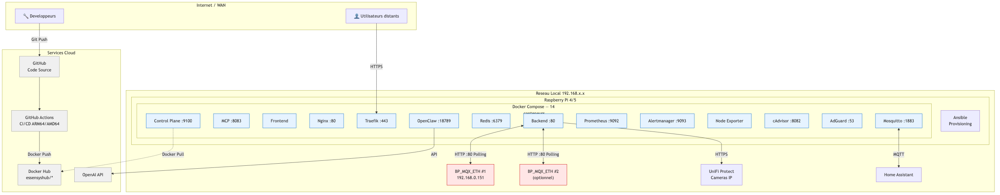

# Essensys Documentation

Documentation technique de l'ecosysteme domotique Essensys : architecture logicielle, specifications materielles, references de protocole et guides de deploiement.

## Architecture Globale

> Diagramme complet avec tous les composants, flux et acteurs. Voir [tous les diagrammes](archi/diagrams.md) pour les vues detaillees.

## Documentation

La documentation d'architecture se trouve dans [`archi/`](archi/) et suit le modele C4 :

| Document | Description |
|----------|-------------|
| [Vue d'ensemble](archi/index.md) | Contexte C4, defis du client legacy, piliers architecturaux |
| [Client Embarque BP_MQX_ETH](archi/legacy-client.md) | Hardware Coldfire MCF52259, MQX RTOS, 8 contraintes firmware |
| ↳ [Securite](archi/legacy-client-security.md) | Auth HTTP Basic, chiffrement AES alarme, secrets EEPROM |
| ↳ [Build et Toolchain](archi/legacy-client-build.md) | CodeWarrior, makefile, structure projet, format S19 |
| ↳ [Protocoles Internes](archi/legacy-client-protocols.md) | I2C (BA), UART (ecran, Linky), SPI (EEPROM) |
| ↳ [Configuration Hardware](archi/legacy-client-config.md) | Mapping GPIO, peripheriques, parametres systeme |
| ↳ [Deploiement et OTA](archi/legacy-client-deployment.md) | Bootloader, mise a jour OTA, flashing JTAG/BDM |
| ↳ [Diagnostic et Debug](archi/legacy-client-testing.md) | EspionRS, GPIO debug, CRC, surveillance |
| [Table d'Echange](archi/exchange-table.md) | Cartographie des ~600 indices, droits d'acces, bitmasks, Flash |
| [Domaines Fonctionnels](archi/domaines-fonctionnels.md) | Alarme, chauffage, volets, cumulus, securite, fuites, vent, arrosage |
| [Services (Conteneurs)](archi/containers.md) | Les 14 services Docker, roles et interactions |
| [Pattern Bridge](archi/bridge-pattern.md) | Anti-Corruption Layer, 4 points d'entree, flux complets |
| [Deploiement](archi/deployment.md) | Ansible, Docker Compose, CI/CD |
| [Diagrammes](archi/diagrams.md) | Tous les diagrammes Mermaid + PNG |
| [Autocritique DDD](archi/critique_ddd.md) | Analyse critique, score, recommandations |

## Composants Physiques du BP_MQX_ETH

Le controleur BP_MQX_ETH est relie a l'ensemble des peripheriques terrain :

| Composant | Interface | Role |
|-----------|-----------|------|
| **3 Boitiers Auxiliaires** (BA PDV, CHB, PDE) | I2C 50 kHz | Pilotent 24 lumieres + 14 volets + 1 store |
| **Ecran Tactile** | UART 0 | Interface locale utilisateur |
| **Compteur Linky** | UART 1 (1200 bauds) | Teleinfo consommation electrique |
| **Detecteurs Alarme** | GPIO ETOR | Ouverture + presence (anti-intrusion) |
| **Sondes Fuite Eau** | ADC AIN5/AIN6 | Lave-linge et lave-vaisselle |
| **Anemometre** | Impulsions GPT | Vitesse vent pour retraction store |
| **Detecteur Pluie** | GPIO | Suspension arrosage automatique |
| **Sirenes** | PWM + GPIO | Interieure (PWM) et exterieure (GPIO) |
| **Fil Pilote** | PWM | 4 zones chauffage (6 consignes) |
| **Relais Cumulus** | GPIO DD5 | Ballon eau chaude |
| **Prise Securite** | GPIO DD4 | Coupure appareils sensibles |
| **Prise Machines** | GPIO DD6 | Lave-linge / lave-vaisselle (coupure auto fuite) |
| **Vanne Arrosage** | GPIO | Electrovanne jardin |
| **EEPROM** | SPI | Adresse MAC, cle serveur, code alarme |

Pour le detail de chaque domaine fonctionnel, voir [Domaines Fonctionnels](archi/domaines-fonctionnels.md).

## Diagrammes Cles

### Flux : du bouton au relais

### Flux : de l'alerte au WhatsApp

### Anti-Corruption Layer (Pattern Bridge)

## Ecosysteme Essensys

Ce depot documente l'ensemble des projets de l'organisation [essensys-hub](https://github.com/essensys-hub) :

| Depot | Role |
|-------|------|
| `essensys-server-backend` | Backend Go — Anti-Corruption Layer, API REST, MQTT, normalisation legacy |
| `essensys-server-frontend` | Frontend React/Vite — dashboard domotique SPA |
| `essensys-control-plane` | Panneau de controle Go + React — Docker, Redis, Prometheus, logs |
| `essensys-ansible` | Roles Ansible pour le deploiement automatise sur Raspberry Pi |
| `essensys-raspberry-install` | Scripts d'installation et configuration initiale |
| `essensys-nginx` | Image Nginx personnalisee (reverse proxy LAN, buffer single-packet) |
| `essensys-traefik` | Image Traefik personnalisee (reverse proxy WAN, SSL Let's Encrypt) |
| `essensys-redis` | Image Redis personnalisee |
| `essensys-mosquitto` | Image Mosquitto MQTT personnalisee |
| `essensys-support-site` | Portail support React + Go (gestion machines, newsletters) |
| `client-essensys-legacy` | Code source firmware C du controleur BP_MQX_ETH (Coldfire/MQX) |

## Deploiement cible

## Nouvelles Fonctionnalites (Propositions)

| Document | Description |
|----------|-------------|
| [Firmware v2 — Local + Status Reel](new_feature/firmware-v2-local-fullstatus.md) | Migration DNS local, status complet table d'echange, retour etat BA |
| [Integration Home Assistant](new_feature/firmware-ha-integration.md) | Diagnostic HA existant, 4 axes d'amelioration, mapping complet des entites, phasing |
| [Modernisation HTTP et Discovery](new_feature/firmware-http-modernisation.md) | HTTPS, mDNS/Bonjour, SSDP/UPnP, discovery boxes Internet, keep-alive |
| [Errata — Table d'Echange](new_feature/errata-table-echange.md) | Corrections a appliquer : taille reelle = 953 indices (pas ~600) |

## Par ou commencer

1. Lire la [vue d'ensemble de l'architecture](archi/index.md) pour comprendre le contexte
2. Consulter le [client legacy](archi/legacy-client.md) pour comprendre les contraintes imposees par le materiel
   - Approfondir avec : [securite](archi/legacy-client-security.md), [build](archi/legacy-client-build.md), [protocoles](archi/legacy-client-protocols.md), [GPIO](archi/legacy-client-config.md), [OTA](archi/legacy-client-deployment.md), [debug](archi/legacy-client-testing.md)
3. Explorer la [table d'echange](archi/exchange-table.md) pour comprendre le modele de donnees central
4. Voir le [pattern bridge](archi/bridge-pattern.md) pour comprendre comment le backend moderne s'interface avec le legacy
5. Parcourir les [diagrammes](archi/diagrams.md) pour une vue visuelle complete
