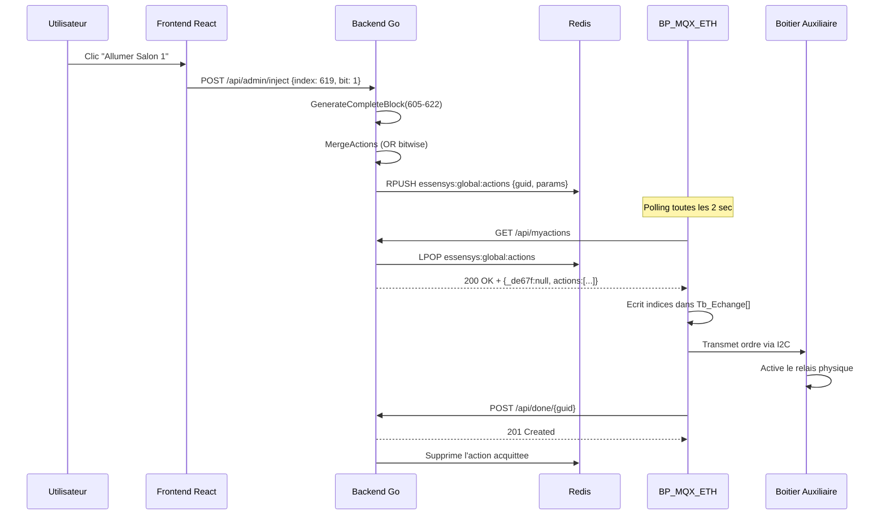
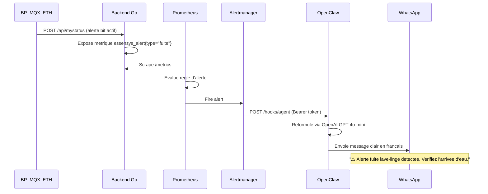

# Le Pattern Bridge : du Legacy au Moderne

Ce document explique comment le backend Go (`essensys-server-backend`) comble l'obsolescence du client materiel BP_MQX_ETH en implementant un **Anti-Corruption Layer** (ACL) — une couche de traduction qui isole le domaine moderne du protocole legacy.

## 1. Le Probleme

Le firmware BP_MQX_ETH communique via un protocole HTTP non-standard, des JSON malformes, et un modele de donnees opaque (tableau d'octets). Aucun client moderne (navigateur, IA, Home Assistant) ne peut dialoguer directement avec le materiel.

```
                          ❌ Incompatible directement
  ┌──────────────┐                                    ┌──────────────┐
  │  React SPA   │ ────── JSON standard ─────── ✗ ──→ │  BP_MQX_ETH  │
  │  Home Asst.  │ ────── MQTT ──────────────── ✗ ──→ │  (Coldfire)   │
  │  OpenClaw IA │ ────── MCP/SSE ───────────── ✗ ──→ │              │
  └──────────────┘                                    └──────────────┘
```

## 2. L'Anti-Corruption Layer

Le backend Go se positionne comme traducteur bilateral :

```
  ┌──────────────┐         ┌───────────────────┐        ┌──────────────┐
  │  React SPA   │         │   Backend Go       │        │  BP_MQX_ETH  │
  │  Home Asst.  │ ◄─────► │   (ACL Bridge)     │ ◄────► │  (Coldfire)   │
  │  OpenClaw IA │         │                   │        │              │
  └──────────────┘         └───────────────────┘        └──────────────┘
    API REST standard        Traduction + Buffer          Protocole legacy
    JSON RFC 8259            Normalisation JSON           JSON malformes
    WebSocket/SSE            Single-packet TCP            Polling 2s
    MQTT Discovery           Queue Redis                  Port 80 fixe
    MCP Protocol             Bloc complet 605-622         Table d'echange brute
```

## 3. Les Composants du Bridge

### 3.1 Normalisation JSON (`internal/api/json_normalizer.go`)

Le firmware envoie du JSON invalide. Le normalizer corrige les trames **avant** le parsing Go :

```
Entree firmware :  {version:"1.0",ek:[{k:613,v:"1"},{k:607,v:"0"}]}
                    ↓
Normalizer Go   :  {"version":"1.0","ek":[{"k":613,"v":"1"},{"k":607,"v":"0"}]}
                    ↓
json.Unmarshal  :  OK ✓
```

Transformations effectuees :
- Ajout de guillemets autour des cles non-quotees
- Preservation des valeurs deja entre guillemets
- Gestion des imbrications (tableaux, objets)

### 3.2 Legacy HTTP Server (`internal/api/legacy_http_server.go`)

Le serveur HTTP dedie au firmware implemente toutes les quirks :

| Quirk | Implementation |
|-------|---------------|
| Port 80 obligatoire | Le serveur ecoute sur `:80` en mode production |
| `Content-Type: application/json ;charset=UTF-8` | Header custom avec espace avant `;` |
| Code 201 pour POST | `w.WriteHeader(http.StatusCreated)` |
| `_de67f` en premiere position | Champ fixe dans la structure de reponse, serialise en premier |
| Single-packet TCP | Reponse assemblée en memoire puis ecrite en un seul `Write()` |

### 3.3 Admin HTTP Server (`internal/api/admin_http_server.go`)

En parallele, un second serveur HTTP expose une API REST standard pour les clients modernes :

| Aspect | Legacy Server | Admin Server |
|--------|--------------|--------------|
| Port | 80 | Configurable (ex: 3001) |
| JSON | Normalise a l'entree | Standard |
| Content-Type | Avec espace | Standard |
| Code POST | 201 | 200 |
| Authentification | Aucune (LAN) | Bearer token |

### 3.4 Action Service (`internal/core/action_service.go`)

Le service central qui traduit les intentions utilisateur en ordres firmware :

```
Intention utilisateur : "Allumer le salon"
         ↓
Frontend traduit en : {index: 619, bit: 1}
         ↓
ActionService.AddAction()
         ↓
GenerateCompleteBlock(605-622) : genere le bloc complet avec OR bitwise
         ↓
Redis essensys:global:actions : stocke la commande
         ↓
GET /api/myactions (polling firmware) : le firmware recupere l'ordre
         ↓
POST /api/done/{guid} : le firmware acquitte
```

#### Expansion du Bloc Complet

La methode `GenerateCompleteBlock()` prend les indices fournis par le client et genere un bloc atomique de 18 indices (605-622) :

```go
func (s *ActionService) GenerateCompleteBlock(params []ActionParam) []ActionParam {
    block := make(map[int]int)
    for i := 605; i <= 622; i++ {
        block[i] = 0 // Initialiser tout a 0
    }
    for _, p := range params {
        if p.Key >= 605 && p.Key <= 622 {
            block[p.Key] = p.Value
        }
    }
    // Convertir en slice triee + ajouter trigger 590
    result := []ActionParam{{Key: 590, Value: 1}}
    for i := 605; i <= 622; i++ {
        result = append(result, ActionParam{Key: i, Value: block[i]})
    }
    return result
}
```

#### Fusion Bitwise (OR)

Quand plusieurs commandes arrivent pendant le meme cycle de polling :

```go
func (s *ActionService) MergeActions(existing, incoming []ActionParam) []ActionParam {
    merged := make(map[int]int)
    for _, p := range existing {
        merged[p.Key] = p.Value
    }
    for _, p := range incoming {
        merged[p.Key] |= p.Value // OR bitwise
    }
    return toSlice(merged)
}
```

### 3.5 Store Abstraction (`internal/data/store.go`)

Le pattern Repository isole l'acces aux donnees :

```go
type Store interface {
    GetExchangeTable(clientID string) (map[int]int, error)
    SetExchangeValue(clientID string, index, value int) error
    GetPendingActions(clientID string) ([]Action, error)
    AckAction(clientID, guid string) error
    GetClientInfo(clientID string) (*ClientInfo, error)
}
```

Implementations :
- **RedisStore** : Production (Raspberry Pi)
- **MemoryStore** : Tests unitaires et mode development
- **PostgresStore** : Support Portal (gestion des machines/gateways)

## 4. Les 4 Points d'Entree des Ordres

Le backend accepte des commandes depuis 4 sources differentes, toutes convergent vers `ActionService.AddAction()` :

```
                                    ┌─────────────────────┐
   Frontend Web ──── POST /api ────►│                     │
                                    │                     │
   MQTT (HA) ─── CommandHandler ───►│  ActionService      │───► Redis ───► Firmware
                                    │  .AddAction()       │
   MCP (IA) ──── Tool send_order ──►│  .GenerateComplete  │
                                    │  Block()            │
   Control Plane ─ PUT /api/redis ─►│                     │
                                    └─────────────────────┘
```

| Source | Mecanisme | Normalisation | Bloc complet |
|--------|-----------|---------------|-------------|
| Frontend React | `POST /api/admin/inject` ou `/api/web/actions` | Oui | Oui (automatique) |
| Home Assistant | Commande MQTT → `CommandHandler` | Oui | Oui (automatique) |
| OpenClaw / IA | Outil MCP `send_order` | Oui | Oui (auto dans le MCP server) |
| Control Plane | `PUT /api/redis/exchange/{client}/{index}` | Non (ecriture directe) | Non |

### Particularite du Control Plane

Le Control Plane ecrit directement dans Redis, contournant `ActionService`. C'est une **porte de secours administrative** pour injecter ou corriger des valeurs sans passer par le cycle action/acquittement.

## 5. Pont MQTT vers Home Assistant

Le backend publie l'etat de la table d'echange sur des topics MQTT structures pour le mecanisme de discovery de Home Assistant :

```
homeassistant/switch/essensys/salon1/config     → auto-configuration HA
homeassistant/switch/essensys/salon1/state       → ON/OFF
homeassistant/switch/essensys/salon1/set         → commande depuis HA
```

Quand Home Assistant publie sur le topic `/set`, le backend :
1. Recoit la commande via le subscriber MQTT
2. Traduit le nom symbolique ("salon1") en indice de la table (619, bit 1)
3. Appelle `ActionService.AddAction()` avec le bloc complet
4. Le firmware recupere l'ordre lors du prochain polling

## 6. Le MCP : Interface IA

Le Model Context Protocol expose le systeme comme un ensemble d'outils utilisables par un agent IA :

```
Agent IA : "Quelle est la temperature de consigne du salon ?"
    ↓
Outil MCP : read_exchange_value(index=349)
    ↓
Redis : Tb_Echange[349] = 0x11
    ↓
MCP decode : mode automatique, consigne CONFORT
    ↓
Agent IA : "Le salon est en mode automatique, consigne CONFORT"
```

Le MCP server est un binaire Go independant (`cmd/mcp-server/main.go`) qui se connecte au meme Redis que le backend. Il implemente l'auto-expansion du bloc complet quand un agent IA envoie un ordre.

## 7. Le Frontend : Traduction Visuelle

Le frontend React traduit les indices numeriques opaques en interface utilisateur intuitive :

```
Indice 619 bit 1 → Bouton "Salon 1" avec icone ampoule
Indice 349 = 0x01 → Slider "Zone Jour" position "CONFORT"
Indice 625 = 0x07 → 3 volets salon coches dans l'interface
Indice 11 bit 0 = 1 → Badge rouge "ALARME" dans le header
```

Le frontend ne contient **aucune logique metier**. Il ne sait pas ce que signifie "indice 619 bit 1" au-dela de ce qui est configure dans ses fichiers de mapping. Si un nouveau dispositif est ajoute a la table d'echange, le frontend doit etre mis a jour manuellement.

## 8. Flux de Donnees Complet

### Du Bouton au Relais



### De l'Alerte au WhatsApp



## 9. Resilience et Degradation Gracieuse

Le systeme est concu pour fonctionner meme en cas de panne partielle :

| Composant en panne | Impact | Mitigation |
|--------------------|--------|------------|
| Redis | Plus de queue d'actions, perte de cache | Le firmware continue de fonctionner en autonome |
| Backend Go | Plus de communication avec le firmware | L'ecran tactile local reste operationnel |
| MCP / OpenClaw | Plus d'interaction IA | Le frontend web reste fonctionnel |
| Prometheus / Alertmanager | Plus d'alertes proactives | Le firmware continue de signaler les alertes sur l'ecran |
| Internet (Traefik) | Plus d'acces distant | L'acces LAN via Nginx reste operationnel |
| Nginx | Plus d'acces web LAN | L'ecran tactile sur le materiel reste operationnel |

Le firmware BP_MQX_ETH est **autonome** : meme sans serveur, il continue de gerer le chauffage, l'alarme et les scenarios localement.

## References Sources

- Normalisation JSON : `essensys-server-backend/internal/api/json_normalizer.go`
- Serveur legacy : `essensys-server-backend/internal/api/legacy_http_server.go`
- Serveur admin : `essensys-server-backend/internal/api/admin_http_server.go`
- Action Service : `essensys-server-backend/internal/core/action_service.go`
- Store interface : `essensys-server-backend/internal/data/store.go`
- MCP Server : `essensys-server-backend/cmd/mcp-server/main.go`
- Pont MQTT : `essensys-server-backend/internal/mqtt/`
- Documentation legacy : `client-essensys-legacy/docs/protocol/`
