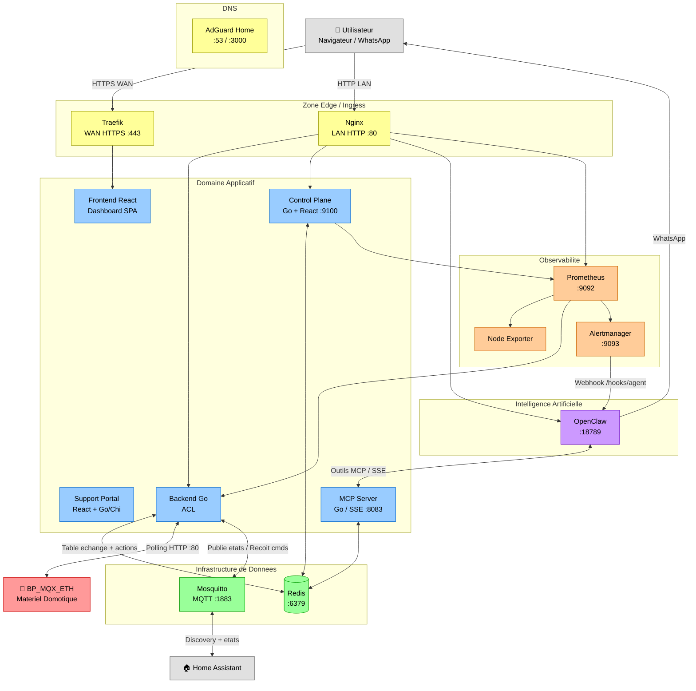

# Architecture des Conteneurs (Services)

Cette section detaille les 14 conteneurs logiciels deployes sur le Raspberry Pi via Docker Compose. Chaque conteneur a une responsabilite stricte.

## Diagramme des Conteneurs

## Description des Services

### 1. Backend Go (`essensys-server-backend`)

| Propriete | Valeur |
|-----------|--------|
| Image | `essensyshub/essensys-server-backend` |
| Port | 80 (obligatoire pour BP_MQX_ETH) |
| Depot | `essensys-hub/essensys-server-backend` |

**Role** : Anti-Corruption Layer. Traduit le protocole legacy non-standard (JSON malformes, single-packet TCP, polling synchrone) en API REST propre. Gere la normalisation JSON, l'expansion du bloc complet 605-622, la fusion bitwise, et le stockage d'etat dans Redis.

**Endpoints** : `/api/mystatus`, `/api/myactions`, `/api/done/{guid}`, `/api/admin/inject`, `/api/web/actions`, `/health`, `/debug`, `/table_ref`, `/metrics`

### 2. MCP Server (`essensys-server-backend/cmd/mcp-server`)

| Propriete | Valeur |
|-----------|--------|
| Image | Meme image que le backend (binaire `mcp-server`) |
| Port | 8083 (configurable) |
| Transport | SSE (Server-Sent Events) + HTTP POST |

**Role** : Expose le systeme domotique aux agents IA via le Model Context Protocol. Fournit des outils pour lire la table d'echange, envoyer des ordres, diagnostiquer le systeme.

**Outils MCP** : `read_exchange_table`, `read_exchange_value`, `set_exchange_value`, `find_device_index`, `send_order`, `list_service_status`, `restart_service`, `read_service_logs`, `get_system_metrics`, `run_self_diagnostic`

### 3. Frontend React (`essensys-server-frontend`)

| Propriete | Valeur |
|-----------|--------|
| Image | `essensyshub/essensys-nginx` (sert les assets statiques) |
| Stack | React 19, TypeScript, Vite, Tailwind CSS |

**Role** : Application SPA de controle domotique. Traduit les indices opaques (613, 621, etc.) en concepts visuels : boutons, sliders, zones par piece. Aucune logique metier embarquee.

**Pages** : Dashboard, Securite, Chauffage, Eclairage, Volets, Cumulus, Arrosage, UniFi Protect, Notifications, Reglages

### 4. Support Portal (`essensys-support-site`)

| Propriete | Valeur |
|-----------|--------|
| Stack frontend | React 19, Vite, Leaflet (cartes) |
| Stack backend | Go avec Chi Router, PostgreSQL optionnel |

**Role** : Portail d'information, admin et support. Gestion des machines/gateways, newsletters, utilisateurs, audit. Authentification Google/Apple OAuth.

### 5. Control Plane (`essensys-control-plane`)

| Propriete | Valeur |
|-----------|--------|
| Image | `essensyshub/essensys-control-plane` |
| Port | 9100 |
| Stack | Go + React 19, SQLite (audit), Tailwind CSS |

**Role** : Panneau de controle operationnel complet :
- Gestion des conteneurs Docker (restart, update, rollback)
- Administration Redis (table d'echange, actions, backup/restore)
- Proxy Prometheus et Alertmanager
- Logs en temps reel via WebSocket
- Audit trail SQLite

**Pages UI** : Dashboard, Versions, Exchange, Clients, Actions, Logs, Redis Monitor, System, Metrics, Alerts, OpenClaw

### 6. OpenClaw (`openclaw`)

| Propriete | Valeur |
|-----------|--------|
| Image | `coollabsio/openclaw:latest` |
| Port | 18789 |
| LLM | OpenAI (gpt-4o-mini) |
| Canal | WhatsApp (Baileys, mode pairing) |

**Role** : Assistant IA multi-canal. Recoit les alertes Alertmanager via webhook, les reformule en langage clair, et les envoie sur WhatsApp. Peut interroger le systeme via MCP.

### 7. Redis (`essensys-redis`)

| Propriete | Valeur |
|-----------|--------|
| Image | `redis` |
| Port | 6379 |
| Max memoire | 128 Mo |

**Role** : State store principal. Stocke la table d'echange (`essensys:client:{id}:exchange`), la queue d'actions (`essensys:global:actions`), l'etat de connexion des clients, et les informations d'authentification.

### 8. Mosquitto (`essensys-mosquitto`)

| Propriete | Valeur |
|-----------|--------|
| Image | Configuration personnalisee |
| Port | 1883 |

**Role** : Broker MQTT servant de bus evenements. Publie les etats domotiques en temps reel et recoit les commandes depuis Home Assistant via le mecanisme de discovery automatique.

### 9. Nginx (`essensys-nginx`)

| Propriete | Valeur |
|-----------|--------|
| Image | `essensyshub/essensys-nginx` |
| Port | 80 (LAN uniquement) |

**Role** : Reverse proxy LAN. Sert le frontend statique et proxifie vers le backend, le Control Plane, Prometheus, Alertmanager et OpenClaw. Configure avec buffer single-packet TCP et gzip off pour la compatibilite legacy.

**Routes** : `/api/` → backend:80, `/mcp/` → MCP:8083, `/controle_plane/` → CP:9100, `/prometheus/` → Prometheus:9092, `/alertmanager/` → AM:9093, `/openclaw/` → OpenClaw:18789

### 10. Traefik (`essensys-traefik`)

| Propriete | Valeur |
|-----------|--------|
| Image | `traefik:v2.11.3` |
| Ports | 80, 443, 8080 (dashboard) |

**Role** : Point d'entree WAN. Gere la terminaison SSL via Let's Encrypt, le routage par nom d'hote, et l'authentification basic pour les services exposes sur Internet.

### 11. AdGuard Home (`essensys-adguard`)

| Propriete | Valeur |
|-----------|--------|
| Image | `adguard/adguardhome` |
| Ports | 53 (DNS), 3000 (web UI) |

**Role** : Resolveur DNS local avec filtrage publicitaire. Configure automatiquement le rewrite DNS pour `mon.essensys.fr` vers l'IP locale du Raspberry Pi.

### 12. Prometheus (`essensys-prometheus`)

| Propriete | Valeur |
|-----------|--------|
| Image | `prom/prometheus` |
| Port | 9092 |
| Retention | Configurable |

**Role** : Collecte et stockage des metriques de tous les services (backend, Control Plane, Node Exporter). Evalue les regles d'alertes et declenche les notifications via Alertmanager.

### 13. Alertmanager (`essensys-alertmanager`)

| Propriete | Valeur |
|-----------|--------|
| Image | `prom/alertmanager` |
| Port | 9093 |

**Role** : Routage, deduplication et groupement des alertes. Envoie les notifications a OpenClaw via webhook (`/hooks/agent`) avec authentification Bearer token pour relais sur WhatsApp.

### 14. Node Exporter (`essensys-node-exporter`)

| Propriete | Valeur |
|-----------|--------|
| Image | `prom/node-exporter` |
| Port | 9100 (namespace host) |

**Role** : Expose les metriques systeme du Raspberry Pi (CPU, RAM, disque, temperature, reseau) au format Prometheus.

## Orchestration

Tous les services sont deployes via un fichier `docker-compose.yml` unique genere par Ansible (`roles/raspberry_compose/templates/docker-compose.yml.j2`). Tous utilisent `network_mode: host` pour simplifier la communication inter-services sur le Raspberry Pi.

L'ordre de demarrage est gere par `depends_on` :
- Redis et Mosquitto demarrent en premier
- Le Backend depend de Redis
- Le MCP depend de Redis
- Nginx depend du Backend
- OpenClaw depend du MCP
