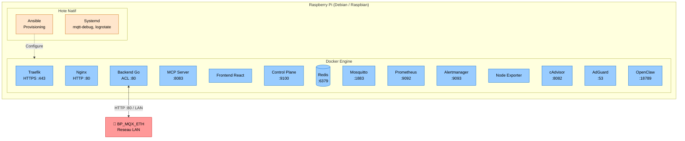

# Architecture de Déploiement & Configuration

L'approche choisie pour le déploiement d'Essensys repose sur le principe de **Infrastructure as Code (IaC)**.
Rien ne doit être installé "à la main" sur les hôtes cibles.

## Référentiels Logiciels de Déploiement

Cette automatisation repose sur deux dépôts principaux :

### 1. `essensys-ansible`

C'est le référentiel maître pour la configuration.
*   **Concept** : Utilise Ansible pour garantir l'idempotence. On peut lancer et relancer les scripts, le serveur convergera toujours vers l'état désiré.
*   **Structure** : Découpé en "Rôles" (Roles). Chaque rôle gère un conteneur physique ou logique (ex: `roles/raspberry_backend`, `roles/nginx`, etc.).
*   **Cibles** : Capable de configurer un nœud Edge (Raspberry Pi sur site) ou un contrôleur global (VPS distant type OVH).

### 2. `essensys-raspberry-install`

*   **Concept** : Point d'entrée "Boostrap" minimal. Scripts Bash (`install.sh`, `update.sh`) conçus pour initialiser un Raspberry Pi vierge afin qu'il puisse exécuter Ansible ou Docker.
*   **Responsabilités** :
    *   Installation des prérequis de base (Docker, Git, Python).
    *   Création des dossiers et permissions initiales.
    *   Mise en place de la pile minimale avant le passage de relais à Ansible.

## Diagramme de Déploiement Cible (Raspberry Pi Local)

## Le Cycle de Vie Typique

1.  **Code Commit** : Un développeur pousse du code dans `essensys-server-backend`.
2.  **Build** : (Potentiellement via GitHub Actions), une image Docker est construite pour l'architecture cible (ARM64 pour Raspberry Pi).
3.  **Update Script / Ansible** : L'administrateur exécute le playbook Ansible (ou le script `update.sh` de `essensys-raspberry-install`).
4.  **Convergence** : Ansible détecte la nouvelle image, stoppe l'ancien conteneur, et lance le nouveau proprement en restaurant les montages de données (volumes).
