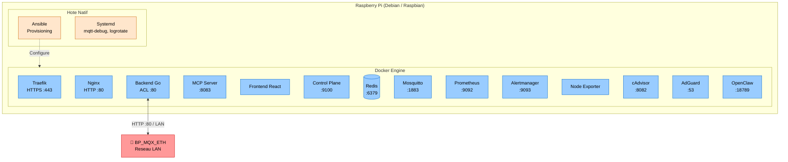

# Architecture de Déploiement & Configuration

L'approche choisie pour le déploiement d'Essensys repose sur le principe de **Infrastructure as Code (IaC)**.
Rien ne doit être installé "à la main" sur les hôtes cibles.

## Référentiels Logiciels de Déploiement

Cette automatisation repose sur deux dépôts principaux :

### 1. `essensys-ansible`

C'est le référentiel maître pour la configuration.
*   **Concept** : Utilise Ansible pour garantir l'idempotence. On peut lancer et relancer les scripts, le serveur convergera toujours vers l'état désiré.
*   **Structure** : Découpé en "Rôles" (Roles). Chaque rôle gère un conteneur physique ou logique (ex: `roles/raspberry_backend`, `roles/nginx`, etc.).
*   **Cibles** : Capable de configurer un nœud Edge (Raspberry Pi sur site) ou un contrôleur global (VPS distant type OVH).

### 2. `essensys-raspberry-install`

*   **Concept** : Point d'entrée "Boostrap" minimal. Scripts Bash (`install.sh`, `update.sh`) conçus pour initialiser un Raspberry Pi vierge afin qu'il puisse exécuter Ansible ou Docker.
*   **Responsabilités** :
    *   Installation des prérequis de base (Docker, Git, Python).
    *   Création des dossiers et permissions initiales.
    *   Mise en place de la pile minimale avant le passage de relais à Ansible.

## Diagramme de Déploiement Cible (Raspberry Pi Local)


```mermaid
graph TB
    subgraph RPi["Raspberry Pi (Debian / Raspbian)"]
        subgraph Docker["Docker Engine"]
            traefik["Traefik<br/>HTTPS :443"]
            nginx["Nginx<br/>HTTP :80"]
            backend["Backend Go<br/>ACL :80"]
            mcp["MCP Server<br/>:8083"]
            frontend["Frontend React"]
            controlplane["Control Plane<br/>:9100"]
            redis[("Redis<br/>:6379")]
            mqtt["Mosquitto<br/>:1883"]
            prometheus["Prometheus<br/>:9092"]
            alertmanager["Alertmanager<br/>:9093"]
            nodeexporter["Node Exporter"]
            cadvisor["cAdvisor<br/>:8082"]
            adguard["AdGuard<br/>:53"]
            openclaw["OpenClaw<br/>:18789"]
        end

        subgraph Host["Hote Natif"]
            ansible["Ansible<br/>Provisioning"]
            systemd["Systemd<br/>mqtt-debug, logrotate"]
        end
    end

    hardware["🔌 BP_MQX_ETH<br/>Reseau LAN"]

    backend <-->|HTTP :80 / LAN| hardware
    ansible -.->|Configure| Docker

    classDef docker fill:#99ccff,stroke:#0066cc,color:#000
    classDef host fill:#ffe6cc,stroke:#cc6600,color:#000
    classDef hw fill:#ff9999,stroke:#cc0000,color:#000

    class traefik,nginx,backend,mcp,frontend,controlplane,redis,mqtt,prometheus,alertmanager,nodeexporter,cadvisor,adguard,openclaw docker
    class ansible,systemd host
    class hardware hw
```

## Roles Ansible

Le playbook principal `site.yml` enchaine les roles suivants :

| Role Ansible | Conteneur(s) | Responsabilite |
|-------------|-------------|----------------|
| `common` | — | Paquets systeme, fuseau horaire, locale |
| `docker` | — | Installation Docker Engine + Compose plugin |
| `traefik` | Traefik | Certificats Let's Encrypt, reverse-proxy HTTPS |
| `nginx` | Nginx | Proxy HTTP LAN, static files frontend |
| `backend` | Backend Go | Serveur ACL port 80, polling firmware |
| `mcp` | MCP Server | Serveur SSE port 8083 pour OpenClaw |
| `frontend` | Frontend React | Build Vite, assets statiques |
| `controlplane` | Control Plane | UI admin + API Go port 9100 |
| `redis` | Redis | Stockage en memoire, volumes persistants |
| `mosquitto` | Mosquitto | Broker MQTT, ACL fichier |
| `prometheus` | Prometheus | TSDB, regles d'alerte, scrape 15s |
| `alertmanager` | Alertmanager | Routage alertes vers OpenClaw |
| `node_exporter` | Node Exporter | Metriques host (CPU, RAM, disque) |
| `cadvisor` | cAdvisor | Metriques conteneurs Docker |
| `adguard` | AdGuard Home | DNS local, rewrite `mon.essensys.fr` → RPi |
| `openclaw` | OpenClaw | Bridge WhatsApp, outils MCP, GPT |

### Variables importantes (`group_vars/all.yml`)

```yaml
essensys_domain: mon.essensys.fr
essensys_client_id: "unique-client-id"
backend_port: 80
mcp_port: 8083
controlplane_port: 9100
redis_port: 6379
mqtt_port: 1883
```

## Docker Compose

Tous les conteneurs sont orchestres via un fichier `docker-compose.yml` genere par Ansible. Reseau Docker interne : `essensys-net` (bridge).

### Services et images

| Service | Image | Architecture | Port expose |
|---------|-------|-------------|-------------|
| backend | `essensyshub/backend:latest` | ARM64, AMD64 | 80 |
| mcp | `essensyshub/mcp-server:latest` | ARM64, AMD64 | 8083 |
| frontend | `essensyshub/frontend:latest` | ARM64, AMD64 | — (via Nginx) |
| controlplane | `essensyshub/controlplane:latest` | ARM64, AMD64 | 9100 |
| redis | `redis:7-alpine` | multi-arch | 6379 |
| mosquitto | `eclipse-mosquitto:2` | multi-arch | 1883 |
| traefik | `traefik:v3` | multi-arch | 443, 8080 |
| nginx | `nginx:alpine` | multi-arch | 80 |
| prometheus | `prom/prometheus:latest` | multi-arch | 9092 |
| alertmanager | `prom/alertmanager:latest` | multi-arch | 9093 |
| node-exporter | `prom/node-exporter:latest` | multi-arch | 9100 |
| cadvisor | `gcr.io/cadvisor/cadvisor:latest` | ARM64, AMD64 | 8082 |
| adguard | `adguard/adguardhome:latest` | multi-arch | 53, 3000 |
| openclaw | `essensyshub/openclaw:latest` | ARM64, AMD64 | 18789 |

### Volumes persistants

```yaml
volumes:
  redis-data:       # Donnees Redis (RDB + AOF)
  prometheus-data:  # TSDB 15 jours retention
  adguard-data:     # Configuration DNS + logs
  mosquitto-data:   # Messages retenus + ACL
  traefik-certs:    # Certificats Let's Encrypt
```

## Pipeline CI/CD (GitHub Actions)

```
┌─────────────┐     ┌──────────────┐     ┌──────────────┐     ┌───────────┐
│ git push    │────→│ Build multi- │────→│ Push Docker  │────→│ Webhook   │
│ main branch │     │ arch (ARM64  │     │ Hub          │     │ Control   │
│             │     │ + AMD64)     │     │ essensyshub/ │     │ Plane     │
└─────────────┘     └──────────────┘     └──────────────┘     └───────────┘
                         │                                         │
                    docker buildx                             docker pull
                    --platform                                + restart
                    linux/arm64,
                    linux/amd64
```

### Workflows principaux

| Workflow | Declencheur | Actions |
|----------|------------|---------|
| `build-backend.yml` | Push sur `main` dans `essensys-server-backend` | Build Go, tests, image Docker multi-arch |
| `build-frontend.yml` | Push sur `main` dans `essensys-support-site` | Build Vite, image Nginx + assets |
| `build-mcp.yml` | Push sur `main` dans `essensys-server-backend` | Build MCP server, image Docker |
| `build-controlplane.yml` | Push sur `main` dans `essensys-server-controlplane` | Build Go+React, image Docker |

## Le Cycle de Vie Typique

1.  **Code Commit** : Un developpeur pousse du code dans `essensys-server-backend`.
2.  **Build CI** : GitHub Actions construit une image Docker multi-architecture (ARM64 + AMD64) via `docker buildx`.
3.  **Push Registry** : L'image est poussee sur Docker Hub (`essensyshub/*`).
4.  **Update** : L'administrateur execute le playbook Ansible (ou le script `update.sh` de `essensys-raspberry-install`), ou le Control Plane declenche un `docker pull` automatique.
5.  **Convergence** : Ansible/Docker detecte la nouvelle image, stoppe l'ancien conteneur, et lance le nouveau proprement en restaurant les volumes de donnees.

## Inscription publique (Cloudflare Turnstile)

L'anti-spam sur `POST /api/auth/register` utilise **Cloudflare Turnstile**.
Le compte Cloudflare qui détient le widget et les clés de vérification est
documenté dans [Inscription Turnstile](turnstile-registration.md)
(`nicolas.rineau@gmail.com`, profil **Verified**).

## Mise a Jour d'Urgence (Rollback)

```bash
ssh pi@mon.essensys.local
docker compose pull backend
docker compose up -d backend
docker logs -f essensys-backend
```

En cas de probleme, revenir a la version precedente :

```bash
docker compose down backend
docker tag essensyshub/backend:latest essensyshub/backend:rollback
docker pull essensyshub/backend:previous-tag
docker compose up -d backend
```
