# Diagrammes d'Architecture Essensys

Tous les diagrammes sont disponibles en Mermaid (source) et en PNG (rendu).

---

## 1. Vue d'ensemble — Architecture Globale

Diagramme principal montrant tous les composants, flux et acteurs du systeme.

```mermaid
graph TB
    subgraph Utilisateurs
        user["👤 Utilisateur Final<br/>(Navigateur / Mobile)"]
        admin["🔧 Administrateur<br/>(SSH / Control Plane)"]
        wa_user["📱 WhatsApp"]
    end

    subgraph Externes["Systemes Externes"]
        ha["🏠 Home Assistant"]
        unifi["📷 UniFi Protect"]
        openai["🧠 OpenAI API"]
    end

    subgraph CICD["CI/CD"]
        github["GitHub Actions"]
        dockerhub["Docker Hub"]
    end

    subgraph RaspberryPi["Raspberry Pi 4/5 (ARM64)"]

        subgraph Ingress["Couche Ingress"]
            traefik["Traefik<br/>HTTPS WAN :443"]
            nginx["Nginx<br/>HTTP LAN :80"]
        end

        subgraph App["Couche Applicative"]
            frontend["Frontend React<br/>Dashboard SPA"]
            backend["Backend Go<br/>ACL :80"]
            mcp["MCP Server<br/>SSE :8083"]
            controlplane["Control Plane<br/>Go+React :9100"]
        end

        subgraph AI["Couche IA"]
            openclaw["OpenClaw<br/>:18789"]
        end

        subgraph Data["Couche Donnees"]
            redis[("Redis<br/>:6379")]
            mqtt["Mosquitto<br/>MQTT :1883"]
        end

        subgraph Monitoring["Couche Observabilite"]
            prometheus["Prometheus<br/>TSDB :9092"]
            alertmanager["Alertmanager<br/>:9093"]
            nodeexporter["Node Exporter"]
            cadvisor["cAdvisor<br/>:8082"]
        end

        subgraph DNS["DNS"]
            adguard["AdGuard Home<br/>:53 / :3000"]
        end
    end

    subgraph Terrain["Materiel sur Site"]
        subgraph BP["BP_MQX_ETH — Coldfire MCF52259"]
            bp_core["🔌 Carte Principale<br/>MQX RTOS / Port 80"]
        end

        subgraph BA["Boitiers Auxiliaires (I2C)"]
            ba_pdv["BA PDV<br/>Salon / Sejour<br/>8 lumieres + 6 volets"]
            ba_chb["BA CHB<br/>Chambres<br/>8 lumieres + 5 volets"]
            ba_pde["BA PDE<br/>Pieces d'eau<br/>8 lumieres + 3 volets<br/>+ 1 store"]
        end

        subgraph IHM["Interface Locale"]
            ecran["🖥️ Ecran Tactile<br/>UART 0"]
        end

        subgraph Capteurs["Capteurs"]
            linky["⚡ Compteur Linky<br/>UART 1200 bauds"]
            detect_alarme["🚨 Detecteurs Alarme<br/>Ouverture + Presence<br/>GPIO ETOR"]
            sonde_fuite["💧 Sondes Fuite Eau<br/>Lave-linge (AIN6)<br/>Lave-vaisselle (AIN5)"]
            anemo["🌬️ Anemometre<br/>Impulsions GPT"]
            detect_pluie["🌧️ Detecteur Pluie<br/>GPIO"]
        end

        subgraph Actionneurs["Actionneurs"]
            sirenes["🔔 Sirenes<br/>Interieure (PWM)<br/>Exterieure (GPIO)"]
            fil_pilote["🔥 Fil Pilote<br/>4 zones chauffage<br/>PWM"]
            cumulus_relay["♨️ Relais Cumulus<br/>GPIO DD5"]
            prise_secu["🔌 Prise Securite<br/>GPIO DD4"]
            prise_machine["🔌 Prise Machines<br/>Lave-linge/Vaisselle<br/>GPIO DD6"]
            vanne["🌿 Vanne Arrosage<br/>GPIO"]
        end

        subgraph Config["Configuration"]
            eeprom["💾 EEPROM SPI<br/>MAC + Cle + Code Alarme"]
        end
    end

    user -->|HTTPS| traefik
    user -->|HTTP LAN| nginx
    admin -->|HTTPS / SSH| traefik
    wa_user <-->|Messages| openclaw

    traefik --> frontend
    traefik --> controlplane
    nginx --> backend
    nginx --> controlplane
    nginx --> openclaw
    nginx --> prometheus

    frontend -.->|Assets statiques| nginx

    backend <-->|Table echange + Actions| redis
    backend <-->|Polling HTTP 2s<br/>JSON malformes| bp_core
    backend <-->|Publie etats / Recoit cmds| mqtt
    backend -->|/metrics| prometheus

    mcp <-->|Lecture/Ecriture| redis
    openclaw <-->|Outils MCP| mcp
    openclaw -->|Reformule alertes| openai
    alertmanager -->|Webhook /hooks/agent| openclaw

    mqtt <-->|Discovery + Commandes| ha

    controlplane <--> redis
    controlplane --> prometheus
    prometheus --> nodeexporter
    prometheus --> cadvisor
    prometheus --> alertmanager

    github -->|Push images ARM64/AMD64| dockerhub
    controlplane -.->|Pull images| dockerhub

    backend -->|Snapshots| unifi

    bp_core <-->|I2C 50 kHz| ba_pdv
    bp_core <-->|I2C 50 kHz| ba_chb
    bp_core <-->|I2C 50 kHz| ba_pde
    bp_core <-->|UART 0| ecran
    bp_core <---|UART 1| linky
    bp_core <---|GPIO ETOR| detect_alarme
    bp_core <---|ADC| sonde_fuite
    bp_core <---|Impulsions| anemo
    bp_core <---|GPIO| detect_pluie
    bp_core -->|PWM + GPIO| sirenes
    bp_core -->|PWM| fil_pilote
    bp_core -->|GPIO DD5| cumulus_relay
    bp_core -->|GPIO DD4| prise_secu
    bp_core -->|GPIO DD6| prise_machine
    bp_core -->|GPIO| vanne
    bp_core <-->|SPI| eeprom

    classDef legacy fill:#ff9999,stroke:#cc0000,color:#000
    classDef modern fill:#99ccff,stroke:#0066cc,color:#000
    classDef data fill:#99ff99,stroke:#009900,color:#000
    classDef monitoring fill:#ffcc99,stroke:#cc6600,color:#000
    classDef ai fill:#cc99ff,stroke:#6600cc,color:#000
    classDef ingress fill:#ffff99,stroke:#999900,color:#000
    classDef external fill:#e0e0e0,stroke:#666,color:#000
    classDef hw fill:#ffcccc,stroke:#990000,color:#000
    classDef sensor fill:#ccffcc,stroke:#006600,color:#000
    classDef actuator fill:#ccccff,stroke:#000099,color:#000

    class bp_core legacy
    class frontend,backend,mcp,controlplane modern
    class redis,mqtt data
    class prometheus,alertmanager,nodeexporter,cadvisor monitoring
    class openclaw ai
    class openai ai
    class traefik,nginx ingress
    class ha,unifi,github,dockerhub external
    class ba_pdv,ba_chb,ba_pde hw
    class ecran,eeprom hw
    class linky,detect_alarme,sonde_fuite,anemo,detect_pluie sensor
    class sirenes,fil_pilote,cumulus_relay,prise_secu,prise_machine,vanne actuator
```

---

## 2. Flux de Donnees — Du Bouton au Relais

Sequence complete depuis le clic utilisateur jusqu'a l'activation physique du relais.

---

## 3. Flux d'Alertes — De la Metrique au WhatsApp

Chaine complete de surveillance : du capteur a la notification WhatsApp.

```mermaid
sequenceDiagram
    autonumber
    participant FW as BP_MQX_ETH
    participant BE as Backend Go
    participant P as Prometheus
    participant AM as Alertmanager
    participant OC as OpenClaw
    participant AI as OpenAI GPT
    participant WA as 📱 WhatsApp

    FW->>BE: POST /api/mystatus<br/>(alerte bit actif dans table)
    BE->>BE: Expose metrique<br/>essensys_alert{type="fuite"}=1
    P->>BE: Scrape /metrics (15s)
    P->>P: Evalue regle d'alerte<br/>EssensysFuiteDetectee
    P->>AM: Fire alert (severity=critical)
    AM->>OC: POST /hooks/agent<br/>Bearer token
    OC->>AI: Reformule l'alerte<br/>en langage clair
    AI-->>OC: Message reformule
    OC->>WA: Envoie notification
    Note over WA: "⚠️ Alerte fuite<br/>lave-linge detectee.<br/>Verifiez l'arrivee d'eau."
```

---

## 4. Architecture des Conteneurs — Diagramme C4 Container

Vue C4 de niveau 2 montrant les 14 conteneurs et leurs interactions.

---

## 5. Anti-Corruption Layer — Pattern Bridge

Comment le backend Go traduit entre le monde legacy et le monde moderne.

---

## 6. Table d'Echange — Structure Memoire

Organisation de la table d'echange en memoire (~600 octets).

---

## 7. Deploiement — Infrastructure

Vue physique du deploiement sur Raspberry Pi.

---

## 8. Les 4 Points d'Entree des Ordres

Comment les commandes arrivent au firmware depuis differentes sources.

```mermaid
graph TB
    subgraph Sources["Sources de Commandes"]
        web["🌐 Frontend React<br/>POST /api/admin/inject<br/>POST /api/web/actions"]
        mqtt_src["🏠 Home Assistant<br/>MQTT Command"]
        mcp_src["🤖 OpenClaw / IA<br/>MCP send_order"]
        cp_src["⚙️ Control Plane<br/>PUT /api/redis/exchange"]
    end

    subgraph Pipeline["Pipeline de Traitement"]
        as["ActionService.AddAction()"]
        gcb["GenerateCompleteBlock()<br/>590 + 605..622"]
        ma["MergeActions()<br/>OR bitwise si concurrent"]
    end

    subgraph Redis["Redis"]
        queue["essensys:global:actions<br/>(RPUSH / LPOP)"]
        direct["essensys:client:*:exchange<br/>(HSET direct)"]
    end

    subgraph Firmware["BP_MQX_ETH"]
        poll["GET /api/myactions<br/>toutes les 2 sec"]
        exec["Applique dans Tb_Echange[]"]
        ack["POST /api/done/{guid}"]
    end

    web --> as
    mqtt_src --> as
    mcp_src --> as
    cp_src -.->|Bypass ActionService| direct

    as --> gcb
    gcb --> ma
    ma --> queue

    queue --> poll
    poll --> exec
    exec --> ack

    classDef source fill:#e6ffe6,stroke:#009900
    classDef pipe fill:#e6f3ff,stroke:#0066cc
    classDef store fill:#fff3e6,stroke:#cc6600
    classDef fw fill:#ffe6e6,stroke:#cc0000

    class web,mqtt_src,mcp_src,cp_src source
    class as,gcb,ma pipe
    class queue,direct store
    class poll,exec,ack fw
```

