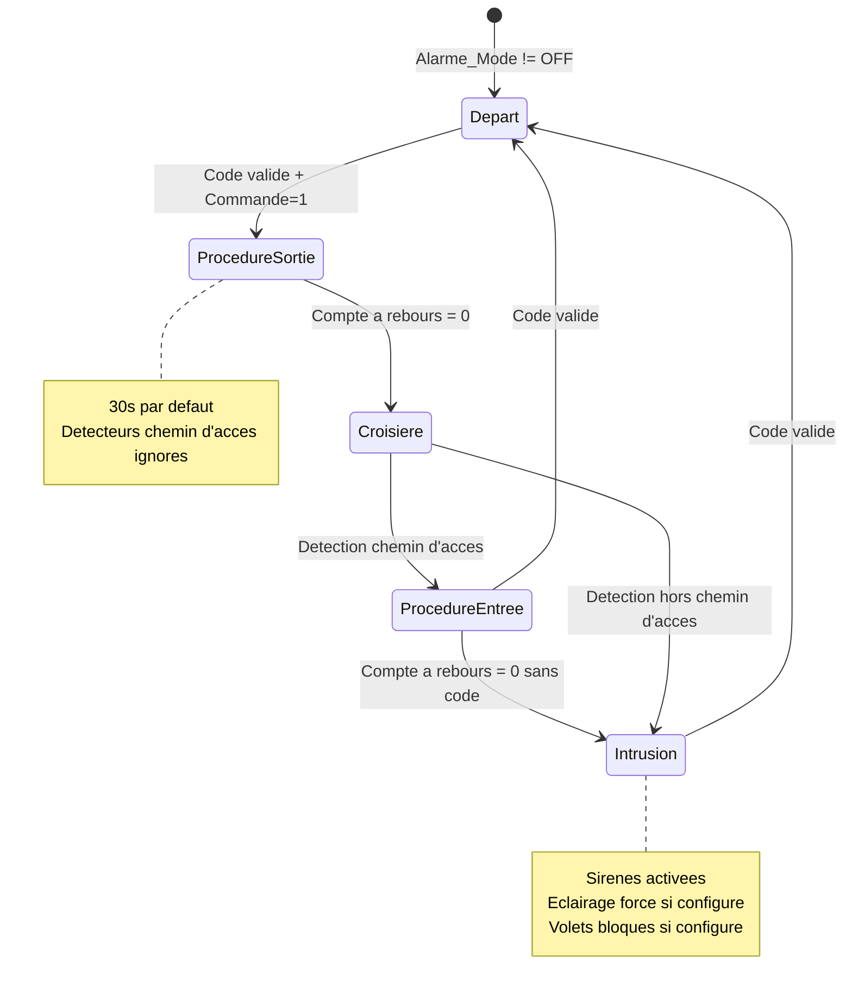
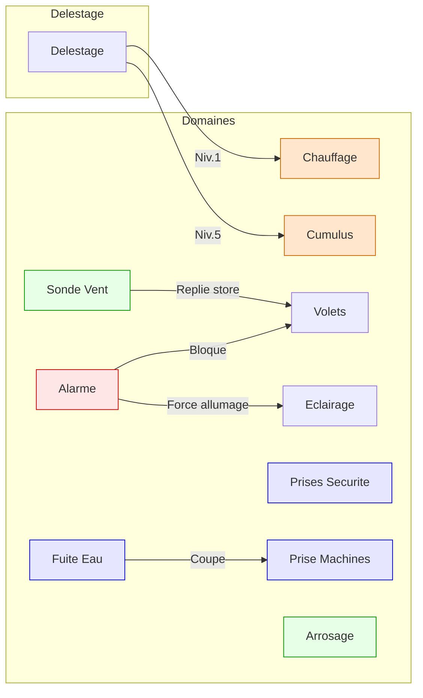

# Domaines Fonctionnels Essensys

Ce document decrit les 10 domaines fonctionnels geres par le systeme Essensys. Pour chaque domaine : les indices de la table d'echange, la logique firmware, les interactions avec les scenarios, et les commandes depuis le serveur.

Pour la reference technique complete des indices, voir [Table d'Echange](exchange-table.md).

---

## 1. Alarme

### Presentation

Systeme d'alarme anti-intrusion avec detecteurs d'ouverture et de presence, sirenes interieure (PWM) et exterieure (GPIO), et procedure d'entree/sortie avec compte a rebours.

### Indices Table d'Echange

| Indice | Mnemonique | Droits | Description |
|--------|-----------|--------|-------------|
| 407 | `Alarme_AccesADistance` | RWS | 1 = autorise activation/desactivation a distance |
| 408 | `Alarme_Mode` | RWS | 0=OFF, 1=reglage, 2=independante, 3-6=liee a un scenario |
| 409 | `Alarme_Commande` | RW | 1 = demande de mise sous alarme |
| 410-411 | `Alarme_CodeSaisi LSB/MSB` | RW | Code 4 chiffres saisi (4 bits par chiffre) |
| 412 | `Alarme_Autorisation` | R_ | 0=attente, 1=code valide, 2=code invalide |
| 413 | `Alarme_SuiviAlarme` | R_ | Etat automate (voir ci-dessous) |
| 414 | `Alarme_Detection` | R_ | Bitmask detecteurs actifs |
| 415 | `Alarme_Fraude` | R_ | Bitmask fraude detectee |
| 421 | `Alarme_CompteARebours` | R_ | Secondes restantes en procedure entree/sortie |
| 425-435 | `AlarmeConfig` | RWS | 11 parametres de configuration |

### Machine a Etats



| Valeur `SuiviAlarme` | Etat | Description |
|-----------------------|------|-------------|
| 0 | Depart | Alarme prete, en attente d'activation |
| 3 | Sortie | Compte a rebours sortie (detecteurs chemin d'acces ignores) |
| 4 | Croisiere | Alarme active, surveillance des detecteurs |
| 5 | Entree | Detection sur chemin d'acces, compte a rebours pour saisir le code |
| 6 | Intrusion | Intrusion confirmee, sirenes actives |

### Detecteurs (indice 414 — bitmask)

| Bit | Capteur |
|-----|---------|
| b0 | Detecteur d'ouverture (porte/fenetre) |
| b1 | Detecteur de presence 1 |
| b2 | Detecteur de presence 2 |

### Fraude (indice 415 — bitmask)

| Bit | Source |
|-----|--------|
| b0 | Ouverture tableau electrique |
| b1 | Ouverture boitier IHM |
| b2-b5 | Arrachement detecteurs/sirenes |
| b6 | Absence batterie de secours |

### Configuration (indices 425-435)

| Offset | Parametre | Description |
|--------|-----------|-------------|
| 0 | CodeRequis | 1 = code obligatoire pour desactiver |
| 1 | DetecteurOuverture | 1 = detecteur ouverture actif |
| 2 | DetecteurPresence1 | 1 = detecteur presence 1 actif |
| 3 | DetecteurPresence2 | 1 = detecteur presence 2 actif |
| 4 | SireneInterieure | 1 = sirene interieure active |
| 5 | SireneExterieure | 1 = sirene exterieure active |
| 6 | BloqueVolets | 1 = bloquer les volets en cas d'intrusion |
| 7 | ForcerEclairage | 1 = allumer toutes les lumieres en cas d'intrusion |
| 8 | DureeSortie | Duree procedure sortie (secondes) |
| 9 | DureeEntree | Duree procedure entree (secondes) |
| 10 | DureeSirene | Duree sirene en intrusion (secondes) |

### Commande depuis le Serveur

Via scenario (bloc complet 605-622) :

```json
{"k": 601, "v": "1"}   // 1=activer alarme, 2=desactiver
{"k": 602, "v": "..."}  // AlarmeConfig[0..10] (optionnel)
```

L'activation a distance n'est possible que si `Alarme_AccesADistance == 1`.

### Anti-sabotage

- Debounce detecteurs : 400 ms minimum avant declenchement
- Detecteurs chemin d'acces ignores pendant la procedure de sortie
- Fraude : toute tentative d'ouverture des boitiers ou d'arrachement des capteurs est signalee

---

## 2. Chauffage

### Presentation

Gestion du chauffage electrique par fil pilote sur 4 zones independantes. Chaque zone possede un planning hebdomadaire automatique et un mode de forcage immediat. Le chauffage est le premier consommateur concerne par le delestage.

### Les 4 Zones

| Zone | Mnemonique | Pieces |
|------|-----------|--------|
| Zone Jour (ZJ) | `Chauf_zj_*` | Salon, sejour, entree |
| Zone Nuit (ZN) | `Chauf_zn_*` | Chambres |
| Salle de Bain 1 (ZSB1) | `Chauf_zsb1_*` | SDB principale |
| Salle de Bain 2 (ZSB2) | `Chauf_zsb2_*` | SDB secondaire |

### Indices Table d'Echange

| Plage | Mnemonique | Droits | Description |
|-------|-----------|--------|-------------|
| 13-96 | `Chauf_zj_Auto` | RWS | Planning zone jour (84 octets) |
| 97-180 | `Chauf_zn_Auto` | RWS | Planning zone nuit (84 octets) |
| 181-264 | `Chauf_zsb1_Auto` | RWS | Planning SDB 1 (84 octets) |
| 265-348 | `Chauf_zsb2_Auto` | RWS | Planning SDB 2 (84 octets) |
| 349 | `Chauf_zj_Mode` | RWS | Mode immediat zone jour |
| 350 | `Chauf_zn_Mode` | RWS | Mode immediat zone nuit |
| 351 | `Chauf_zsb1_Mode` | RWS | Mode immediat SDB 1 |
| 352 | `Chauf_zsb2_Mode` | RWS | Mode immediat SDB 2 |

### Consignes Fil Pilote

| Valeur | Mode | Signal Fil Pilote |
|--------|------|-------------------|
| 0 | OFF | Pleine onde (pas de chauffage) |
| 1 | CONFORT | Pas de signal (temperature de consigne) |
| 2 | ECO | Demi-alternance negative (-3.5°C) |
| 3 | ECO+ | Non standard (extension Essensys) |
| 4 | ECO++ | Non standard (extension Essensys) |
| 5 | HORS GEL | Demi-alternance positive (~7°C) |

### Planning Automatique

Chaque zone a un planning de 84 octets codant 1 semaine :

```
7 jours × 24 heures = 168 creneaux
2 creneaux par octet (4 bits chacun) = 84 octets

Octet N = | Heure paire (bits 0-3) | Heure impaire (bits 4-7) |

Exemple : octet 0 du lundi = consigne 0h (b0-b3) + consigne 1h (b4-b7)
```

### Encodage Mode Immediat (indices 349-352)

```
Bits 0-3 : Consigne (0-5, voir tableau ci-dessus)
Bits 4-5 : Mode
  00 = Automatique (suit le planning)
  01 = Force (consigne fixe)
  10 = Anticipe (avance au prochain changement de planning)
Bit 6    : 1 = Reprendre le dernier mode memorise
Bit 7    : 1 = Continuer le mode actuel (pas de changement)
```

### Delestage

Le delestage coupe progressivement les zones selon 5 niveaux :

| Niveau | Action |
|--------|--------|
| 1 | Zone Jour → HORS GEL |
| 2 | Zone Nuit → HORS GEL |
| 3 | SDB 1 → OFF |
| 4 | SDB 2 → OFF |
| 5 | Cumulus → OFF |

### Commande depuis le Serveur

Via scenario (bloc complet) :

```json
{"k": 633, "v": "17"}  // Zone jour = force (0x10) + CONFORT (0x01) = 0x11 = 17
{"k": 634, "v": "18"}  // Zone nuit = force + ECO = 0x12 = 18
{"k": 635, "v": "0"}   // SDB 1 = automatique + OFF
{"k": 636, "v": "0"}   // SDB 2 = automatique + OFF
```

### Synchronisation

Les indices 349-352 sont **proteges par mutex** (`st_Mutex_ZJ`, `st_Mutex_ZN`, `st_Mutex_Zsdb1`, `st_Mutex_Zsdb2`) car accedes concurremment par :
- Tache Main (boucle chauffage)
- Tache Ecran (saisie utilisateur)
- Tache Ethernet (commandes serveur)

---

## 3. Prises Securite

### Presentation

Prise electrique commandee par relais GPIO. Permet de couper l'alimentation d'appareils sensibles (enfants, absence prolongee). Controlable manuellement ou par scenario.

### Indices Table d'Echange

| Indice | Mnemonique | Droits | Description |
|--------|-----------|--------|-------------|
| 440 | `Securite_PriseCoupe` | RWS | 0 = prise alimentee, 1 = prise coupee |

### Logique Firmware

La prise est **coupee** si l'une de ces conditions est vraie :
- `Securite_PriseCoupe == 1` (commande directe)
- `st_EchangeStatus.uc_SécuOFF == 1` (flag scenario actif)

Sortie GPIO : `BP_O_PRISE_SECURITE` (broche DD4)

### Commande depuis le Serveur

Via scenario :

```json
{"k": 631, "v": "1"}   // Couper les prises securite
{"k": 631, "v": "2"}   // Remettre les prises securite
{"k": 631, "v": "0"}   // Ne rien changer
```

---

## 4. Cumulus (Eau Chaude)

### Presentation

Gestion du ballon d'eau chaude (cumulus) avec 3 modes : toujours allume, gestion heures creuses, ou eteint. Le cumulus est le dernier appareil coupe par le delestage (niveau 5).

### Indices Table d'Echange

| Indice | Mnemonique | Droits | Description |
|--------|-----------|--------|-------------|
| 353 | `Cumulus_Mode` | RWS | Mode de fonctionnement |

### Modes

| Valeur | Mode | Comportement |
|--------|------|-------------|
| 0 | Autonome (ON) | Cumulus toujours alimente |
| 1 | Gestion HC | Alimente uniquement en heures creuses (via Teleinfo) |
| 2 | OFF | Cumulus coupe |

### Logique Firmware

```
SI Cumulus_Mode == ON :
    Alimenter le cumulus
SINON SI Cumulus_Mode == HC :
    SI heure creuse (Status bit 0) OU erreur Teleinfo :
        Alimenter le cumulus
    SINON :
        Couper le cumulus
SINON SI Cumulus_Mode == OFF :
    Couper le cumulus

// Le delestage peut forcer la coupure quel que soit le mode
SI uc_DelestageCouperCumulus == 1 :
    Couper le cumulus
```

Sortie GPIO : `BP_O_CUMULUS` (broche DD5)

### Commande depuis le Serveur

Via scenario :

```json
{"k": 637, "v": "0"}    // Autonome (ON)
{"k": 637, "v": "1"}    // Gestion HC
{"k": 637, "v": "2"}    // OFF
{"k": 637, "v": "64"}   // 0x40 = reprendre le dernier mode memorise
{"k": 637, "v": "128"}  // 0x80 = continuer le mode actuel
```

### Interactions

- **Delestage** : le cumulus est coupe au niveau 5 (dernier)
- **Vacances** : au retour de vacances, le cumulus peut etre force a ON via `uc_Cumulus_ForcerAOnAuRetourVacancesProgramme`
- **Serveur** : le flag `uc_CumulusModifieDepuisServeur` empeche un scenario local d'ecraser la commande serveur

---

## 5. Volets Roulants

### Presentation

Pilotage de 14 volets roulants + 1 store banne repartis sur 3 boitiers auxiliaires (BA), commandes via bus I2C. Chaque volet a un temps de course configurable.

### Repartition par Zone

| Zone | Boitier | Volets |
|------|---------|--------|
| Pieces de Vie (PDV) | BA PDV | 3 salon + 2 SAM + 1 bureau = 6 volets |
| Chambres (CHB) | BA CHB | 2 gr.chambre + 1 pet.ch1 + 1 pet.ch2 + 1 pet.ch3 = 5 volets |
| Pieces d'Eau (PDE) | BA PDE | 2 cuisine + 1 SDB1 = 3 volets + 1 store terrasse |

### Indices Table d'Echange

| Plage | Mnemonique | Droits | Description |
|-------|-----------|--------|-------------|
| ~566-573 | `Volets_PDV_Temps` | RWS | Temps course volets PDV (1-255 sec, defaut 120) |
| ~574-581 | `Volets_CHB_Temps` | RWS | Temps course volets CHB |
| ~582-589 | `Volets_PDE_Temps` | RWS | Temps course volets PDE |
| 938 | `Store_VR` | RWS | 0=mode store, 1=mode 15e volet roulant |

### Commande depuis le Serveur (bitmask)

Ouvrir :

```json
{"k": 625, "v": "63"}   // Ouvrir tous les volets PDV (0x3F = 6 bits)
{"k": 626, "v": "31"}   // Ouvrir tous les volets CHB (0x1F = 5 bits)
{"k": 627, "v": "15"}   // Ouvrir tous les volets PDE + store (0x0F = 4 bits)
```

Fermer :

```json
{"k": 628, "v": "63"}   // Fermer tous les volets PDV
{"k": 629, "v": "31"}   // Fermer tous les volets CHB
{"k": 630, "v": "15"}   // Fermer tous les volets PDE + store
```

### Mapping Bits des Volets

**PDV (indices 625/628)** :

| Bit | Volet |
|-----|-------|
| b0-b2 | Salon (3 volets) |
| b3-b4 | Salle a manger (2 volets) |
| b5 | Bureau |

**CHB (indices 626/629)** :

| Bit | Volet |
|-----|-------|
| b0-b1 | Grande chambre (2 volets) |
| b2 | Petite chambre 1 |
| b3 | Petite chambre 2 |
| b4 | Petite chambre 3 |

**PDE (indices 627/630)** :

| Bit | Volet |
|-----|-------|
| b0-b1 | Cuisine (2 volets) |
| b2 | SDB 1 |
| b3 | Store terrasse |

### Interactions

- **Reveil** : les volets des chambres avec reveil actif sont exclus des commandes d'ouverture scenario (geres par la fonction reveil)
- **Alarme** : si `AlarmeConfig_BloqueVolets == 1` et alarme declenchee, tous les volets sont bloques
- **Store/Vent** : le store terrasse se replie automatiquement si la vitesse du vent depasse le seuil (voir sonde vent)

---

## 6. Sondes Fuite d'Eau

### Presentation

Deux capteurs analogiques (ADC) detectent la presence d'eau sous le lave-linge et le lave-vaisselle. En cas de fuite, le systeme coupe la prise des machines et declenche une alerte sonore.

### Indices Table d'Echange

| Indice | Mnemonique | Droits | Description |
|--------|-----------|--------|-------------|
| 441 | `Securite_FuiteLinge` | RWS | 1 = detection fuite lave-linge activee |
| 442 | `Securite_FuiteVaisselle` | RWS | 1 = detection fuite lave-vaisselle activee |
| 443 | `Securite_FuiteAlerte` | RWS | 1 = alerte sonore en cas de fuite |
| 11 bit 1 | `Alerte` | RW | Fuite lave-linge detectee |
| 11 bit 2 | `Alerte` | RW | Fuite lave-vaisselle detectee |

### Seuils de Detection (ADC)

| Valeur ADC | Etat |
|-----------|------|
| < 2040 | Normal (sec) |
| >= 2040 | Fuite detectee |
| >= 3390 | Court-circuit (info) |

### Canaux ADC

| Canal | Capteur |
|-------|---------|
| AIN6 | Sonde fuite lave-linge |
| AIN5 | Sonde fuite lave-vaisselle |

### Logique Firmware

```
SI Securite_FuiteLinge == 1 ET ADC(AIN6) >= 2040 :
    st_EchangeStatus.uc_FuiteLL = TRUE
    Alerte bit 1 = 1
    SI Securite_FuiteAlerte == 1 :
        Activer sirene (intensite et duree configurees)
    Couper prise machine a laver

SI Securite_FuiteVaisselle == 1 ET ADC(AIN5) >= 2040 :
    st_EchangeStatus.uc_FuiteLV = TRUE
    Alerte bit 2 = 1
    Meme logique que ci-dessus
```

### Acquittement

L'alerte est acquittee via `Alerte_Acquit` (indice 439). Le capteur doit d'abord revenir en etat sec avant qu'une nouvelle alerte puisse se declencher.

### Configuration Sirene

| Indice | Mnemonique | Valeurs |
|--------|-----------|---------|
| 436 | `Alerte_Intensite` | 25=fort, 50=moyen, 75=faible |
| 437 | `Alerte_Duree` | 0=jusqu'a acquittement, 1-255=secondes |

---

## 7. Sonde Vent (Anemometre)

### Presentation

Anemometre a impulsions connecte a l'accumulateur d'impulsions du timer GPT. Mesure la vitesse du vent pour la retraction automatique du store banne.

### Indices Table d'Echange

| Indice | Mnemonique | Droits | Description |
|--------|-----------|--------|-------------|
| 939 | `Store_Vitesse_Vent_Repliage` | RWS | Seuil retraction (0=desactive, 1-255 km/h) |
| 940 | `Store_Vitesse_Vent_Instantane` | R_ | Vitesse actuelle (0-255 km/h, plafonnee a 200) |

### Principe de Mesure

```
Frequence de mesure : 1 fois par seconde
Conversion : vitesse (km/h) = nombre_impulsions / 2
Historique : dernier 4 valeurs conservees dans uc_VitesseVent[4]
Plafond : 200 km/h maximum
```

### Logique de Retraction Automatique

```
TOUTES LES SECONDES :
    Mesurer vitesse = impulsions / 2
    Stocker dans historique circulaire (4 valeurs)
    
    SI Store_Vitesse_Vent_Repliage > 0
       ET Store_VR == 0 (mode store, pas mode VR)
       ET les 4 dernieres vitesses > seuil :
        
        Envoyer commande FERMER store au BA PDE
        (max 1 commande / 30 secondes pour eviter les rebonds)
```

### Securites

- **4 mesures consecutives** au-dessus du seuil requises avant retraction (evite les faux positifs)
- **Throttling 30 secondes** entre deux commandes de retraction
- **Inactif en mode VR** : si `Store_VR == 1`, le store est traite comme un volet roulant normal et l'anemometre est ignore

---

## 8. Arrosage

### Presentation

Gestion d'une electrovanne d'arrosage avec 3 modes : arret, forcage temporaire, et planning automatique hebdomadaire avec detecteur de pluie.

### Indices Table d'Echange

| Indice | Mnemonique | Droits | Description |
|--------|-----------|--------|-------------|
| 363 | `Arrose_Mode` | RWS | Mode (voir ci-dessous) |
| 364-405 | `Arrose_Auto` | RWS | Planning automatique (42 octets) |
| 406 | `Arrose_Detect` | RWS | 0=detecteur pluie desactive, 1=actif |

### Modes

| Valeur | Mode | Comportement |
|--------|------|-------------|
| 0 | OFF | Vanne fermee |
| 1-254 | Force | Arrosage force pendant N minutes |
| 255 | Auto | Suit le planning, respecte le detecteur de pluie |

### Planning Automatique

```
42 octets = 336 bits = 336 creneaux de 30 minutes
7 jours × 48 creneaux/jour = 336

Calcul du creneau : (jour_semaine × 48) + (heure × 2) + (minute >= 30 ? 1 : 0)
Chaque bit : 1 = arroser, 0 = ne pas arroser
```

### Logique Firmware

```
SI Arrose_Mode == 0 :
    Fermer vanne
SINON SI Arrose_Mode == 255 :
    SI creneau actuel == 1 dans le planning :
        SI Arrose_Detect == 1 ET pluie detectee (GPIO) :
            Fermer vanne
        SINON :
            Ouvrir vanne
    SINON :
        Fermer vanne
SINON :  // Mode force (1-254)
    Ouvrir vanne
    Decompter les secondes
    SI duree ecoulee :
        Arrose_Mode = 0 (retour a OFF)
```

Sortie GPIO : `BP_O_VANNE_ARROSAGE`
Entree GPIO : `IO_DIN_Detection_Pluie` (LOW = pas de pluie)

---

## 9. Prise Lave-Linge

### Presentation

Prise electrique commandee alimentant le lave-linge. Peut etre coupee par scenario ("machines OFF") ou automatiquement en cas de detection de fuite d'eau.

### Indices Table d'Echange

| Indice | Mnemonique | Droits | Description |
|--------|-----------|--------|-------------|
| 441 | `Securite_FuiteLinge` | RWS | 1 = detection fuite activee |
| 11 bit 1 | `Alerte` | RW | Fuite lave-linge en cours |

### Logique Firmware

La prise est **coupee** si l'une de ces conditions est vraie :

| Condition | Source |
|-----------|--------|
| `uc_MachinesOFF == 1` | Scenario "couper machines" (indice 632 = 1) |
| `uc_FuiteLL == TRUE` | Fuite lave-linge detectee (ADC AIN6 >= 2040) |
| `uc_FuiteLV == TRUE` | Fuite lave-vaisselle detectee (ADC AIN5 >= 2040) |

Sortie GPIO : `BP_O_MACHINE_A_LAVER` (broche DD6)

### Commande depuis le Serveur

Via scenario :

```json
{"k": 632, "v": "1"}   // Couper la prise machines
{"k": 632, "v": "2"}   // Remettre la prise machines
{"k": 632, "v": "0"}   // Ne rien changer
```

### Particularite

La prise lave-linge et lave-vaisselle est **partagee** : un seul relais GPIO controle les deux machines. Si l'une des deux detecte une fuite, les deux sont coupees.

---

## 10. Prise Lave-Vaisselle

### Presentation

Meme prise physique que le lave-linge (relais partage). Detection de fuite independante via un capteur ADC separe.

### Indices Table d'Echange

| Indice | Mnemonique | Droits | Description |
|--------|-----------|--------|-------------|
| 442 | `Securite_FuiteVaisselle` | RWS | 1 = detection fuite activee |
| 11 bit 2 | `Alerte` | RW | Fuite lave-vaisselle en cours |

### Logique

Identique au lave-linge (section 9). Meme GPIO, meme relais. La seule difference est le canal ADC :

| Machine | Canal ADC | Seuil |
|---------|-----------|-------|
| Lave-linge | AIN6 | >= 2040 |
| Lave-vaisselle | AIN5 | >= 2040 |

---

## Matrice des Interactions entre Domaines



| Source | Cible | Interaction |
|--------|-------|-------------|
| **Alarme** → Volets | Bloque tous les volets si `AlarmeConfig_BloqueVolets == 1` |
| **Alarme** → Eclairage | Force l'allumage si `AlarmeConfig_ForcerEclairage == 1` |
| **Fuite eau** → Prise machines | Coupe la prise machines automatiquement |
| **Sonde vent** → Store | Retraction automatique au-dessus du seuil |
| **Delestage** → Chauffage | Niveaux 1-4 : degrade les zones progressivement |
| **Delestage** → Cumulus | Niveau 5 : coupe le cumulus |
| **Vacances** → Chauffage | Au retour : force les consignes programmees |
| **Vacances** → Cumulus | Au retour : peut forcer ON |
| **Reveil** → Volets | Ouverture a l'heure programmee (exclut ces volets des scenarios) |

## Scenarios Predefinis

Les 8 scenarios combinent les actions de plusieurs domaines :

| Scenario | Alarme | Chauffage | Volets | Lumieres | Securite | Machines | Cumulus |
|----------|--------|-----------|--------|----------|----------|----------|---------|
| 1 - Je sors | Activer | ECO | Fermer | Eteindre | Couper | Couper | HC |
| 2 - Je pars en vacances | Activer | HORS GEL | Fermer | Eteindre | Couper | Couper | OFF |
| 3 - Je rentre | Desactiver | CONFORT | Ouvrir | Allumer entree | Remettre | Remettre | ON |
| 4 - Je me couche | Optionnel | ECO nuit | Fermer CHB | Eteindre | - | - | - |
| 5 - Je me leve | Desactiver | CONFORT | Ouvrir (sauf reveil) | - | - | - | - |
| 6-8 | Personnalise | Personnalise | Personnalise | Personnalise | Personnalise | Personnalise | Personnalise |

Chaque scenario est entierement configurable via les 41 parametres (indices 592-632 pour le scenario 1, voir [Table d'Echange](exchange-table.md) section 4).

## References Sources

- Alarme : `client-essensys-legacy/C/Alarme.c`
- Chauffage : `client-essensys-legacy/C/Chauffage.c`
- Arrosage : `client-essensys-legacy/C/arrosage.c`
- Anemometre : `client-essensys-legacy/C/anemo.c`
- Hardware I/O : `client-essensys-legacy/C/Hard.c`
- Scenarios : `client-essensys-legacy/C/Scenario.c`
- Boitiers auxiliaires : `client-essensys-legacy/C/ba.c`
- Reveil : `client-essensys-legacy/C/reveil.c`
