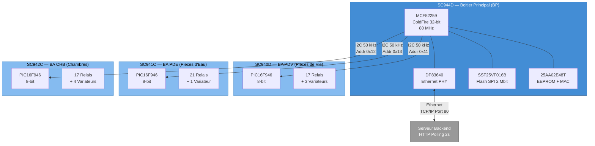
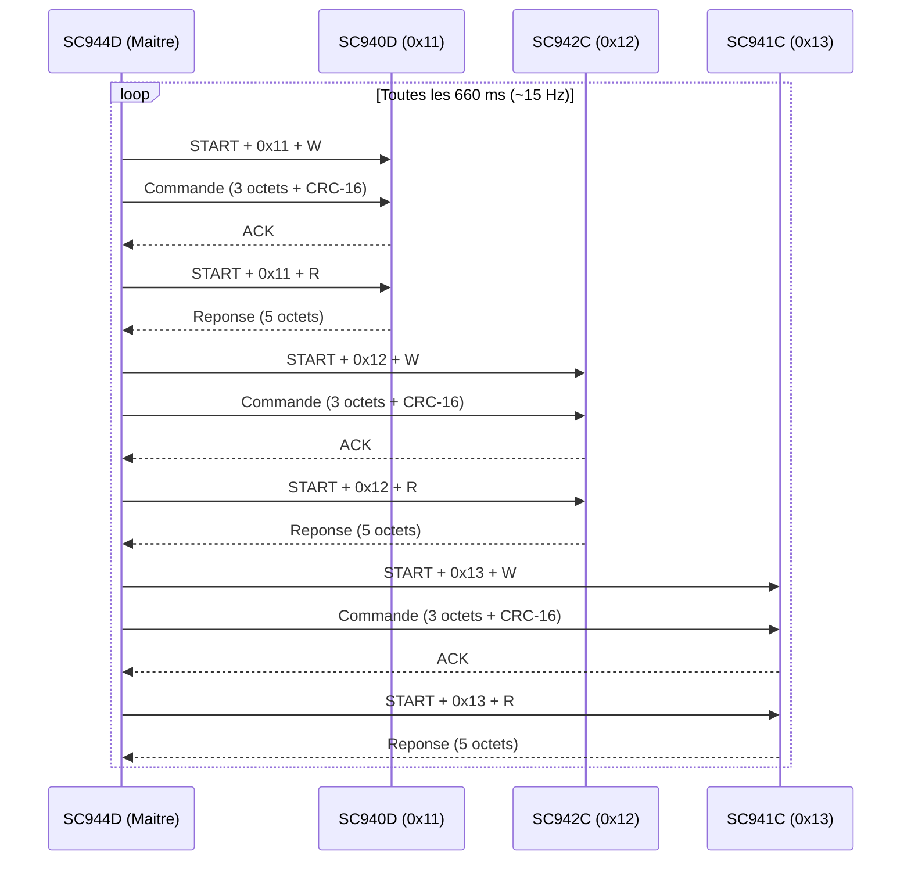

# Vue d'Ensemble du Materiel Essensys

Ce document presente l'architecture materielle complete du systeme Essensys : un boitier principal (BP) et trois boitiers auxiliaires (BA) relies par un bus I2C.

## 1. Architecture Physique

## 2. Tableau Comparatif des Cartes

| Caracteristique | SC944D (BP) | SC940D (BA PDV) | SC941C (BA PDE) | SC942C (BA CHB) |
|-----------------|-------------|-----------------|-----------------|-----------------|
| **Role** | Controleur principal | Pieces de Vie | Pieces d'Eau | Chambres |
| **MCU** | MCF52259 (ColdFire 32-bit, 80 MHz) | PIC16F946 (8-bit) | PIC16F946 (8-bit) | PIC16F946 (8-bit) |
| **Flash/RAM** | 512 KB / 64 KB | 14 KB / 336 B | 14 KB / 336 B | 14 KB / 336 B |
| **Horloge** | 25 MHz + 32.768 kHz RTC | 20 MHz | 20 MHz | 20 MHz |
| **Adresse I2C** | Maitre | 0x11 (esclave) | 0x13 (esclave) | 0x12 (esclave) |
| **Ethernet** | Oui (DP83640 PHY) | Non | Non | Non |
| **Relais monostables** | 3 (Finder 32.21) | 5 (Finder 34.51) | 13 (Finder 34.51) | 7 (Finder 34.51) |
| **Relais bistables** | — | 12 (Finder 40.61.6) | 8 (Finder 40.61.6) | 10 (Finder 40.61.6) |
| **Variateurs** | — | 3 (SC943-0C) | 1 (SC943-0C) | 4 (SC943-0C) |
| **TRIACs** | 4 (T405-600B) | — | — | — |
| **Couches PCB** | 4 | 4 | 4 | 4 |
| **Percages totaux** | 1 141 | 834 | 790 | 869 |
| **Alimentation** | LM3150 + LMR12010 + LD1117 | LMR12010 | LMR12010 | LMR12010 |
| **Projet Altium** | SC944D.PrjPCB | SC940D.PrjPCB | SC941C.PrjPCB | SC942C.PrjPCB |
| **Depot Git** | essensys-board-SC944D | essensys-board-SC940 | essensys-board-SC941C | essensys-board-SC942C |

## 3. Bus I2C Inter-cartes

Le BP (SC944D) est maitre I2C a 50 kHz. Les 3 BA sont esclaves.

### Format de Trame I2C

**Ecriture (BP vers BA) — 6 octets :**

| Octet | Contenu |
|-------|---------|
| 0 | Code commande |
| 1 | Donnee 1 |
| 2 | Donnee 2 |
| 3 | Donnee 3 |
| 4 | CRC-16 LSB |
| 5 | CRC-16 MSB |

**Lecture (BA vers BP) — 5 octets :**

| Octet | Contenu |
|-------|---------|
| 0 | Code reponse |
| 1 | CRC recu LSB |
| 2 | CRC recu MSB |
| 3 | CRC reponse LSB |
| 4 | CRC reponse MSB |

## 4. Carte Fille Variateur SC943-0C

Les modules variateurs SC943-0C sont des cartes filles presentes sur chaque BA :

| Carte | Quantite SC943-0C | Designators |
|-------|--------------------|-------------|
| SC940D (BA PDV) | 3 | U2, U5, U7 |
| SC941C (BA PDE) | 1 | U2 |
| SC942C (BA CHB) | 4 | U2, U3, U6, U8 |

Total systeme : **8 variateurs** pour le controle d'eclairage par gradation.

## 5. Connecteur Inter-cartes IDC 26 Broches

Chaque BA dispose d'un connecteur IDC 26 broches (Wurth 61202621621, pas 2.54 mm) pour la liaison avec le BP via le bus I2C et l'alimentation.

Le BP dispose egalement de ce connecteur (J3) pour la programmation/debug et la liaison vers le bus BA.

## 6. Protection et Securite Electrique

Toutes les cartes integrent des protections :

| Type | Composant | Carte(s) |
|------|-----------|----------|
| TVS 5V (200 W) | SMF5V0A-GS08 | SC940D, SC941C, SC942C |
| TVS 16V (400 W) | SMAJ16A | SC944D |
| Varistance 275 Vac | VDR 820572711 | SC940D, SC941C, SC942C |
| Varistance 300 Vac | V300LA10P | SC944D |
| Fusible polyswitch | MF-RX012/250 | SC944D |
| Fusible temporise | UMT250 0.315A | SC944D |
| Filtre EMI | NFE31PT221D1E9L | SC940D, SC941C |
| Condensateur X2 | ECQ-UAAF104M | SC944D |

## 7. Documentation Detaillee par Carte

| Document | Carte | Contenu |
|----------|-------|---------|
| **[SC944D — Boitier Principal](hardware-sc944d.md)** | BP | MCF52259, Ethernet, Flash SPI, alimentation, TRIACs, GPIO complet |
| **[SC940D — BA Pieces de Vie](hardware-sc940d.md)** | BA PDV | PIC16F946, 17 relais, 3 variateurs, borniers |
| **[SC941C — BA Pieces d'Eau](hardware-sc941c.md)** | BA PDE | PIC16F946, 21 relais, 1 variateur, borniers |
| **[SC942C — BA Chambres](hardware-sc942c.md)** | BA CHB | PIC16F946, 17 relais, 4 variateurs, borniers |

## References

- Projet Altium SC944D : `essensys-board-SC944D/SC944D/SC944D.PrjPCB`
- Projet Altium SC940D : `essensys-board-SC940/SC940D/SC940D.PrjPCB`
- Projet Altium SC941C : `essensys-board-SC941C/SC941C/SC941C.PrjPCB`
- Projet Altium SC942C : `essensys-board-SC942C/SC942C/SC942C.PrjPCB`
- Firmware BP : `client-essensys-legacy/` (C / MQX RTOS)
- Firmware BA : `essensys-board-SC9xx/SC9xx/Prog/code_ba/essensys_ba.X/` (C / MPLAB X / XC8)
