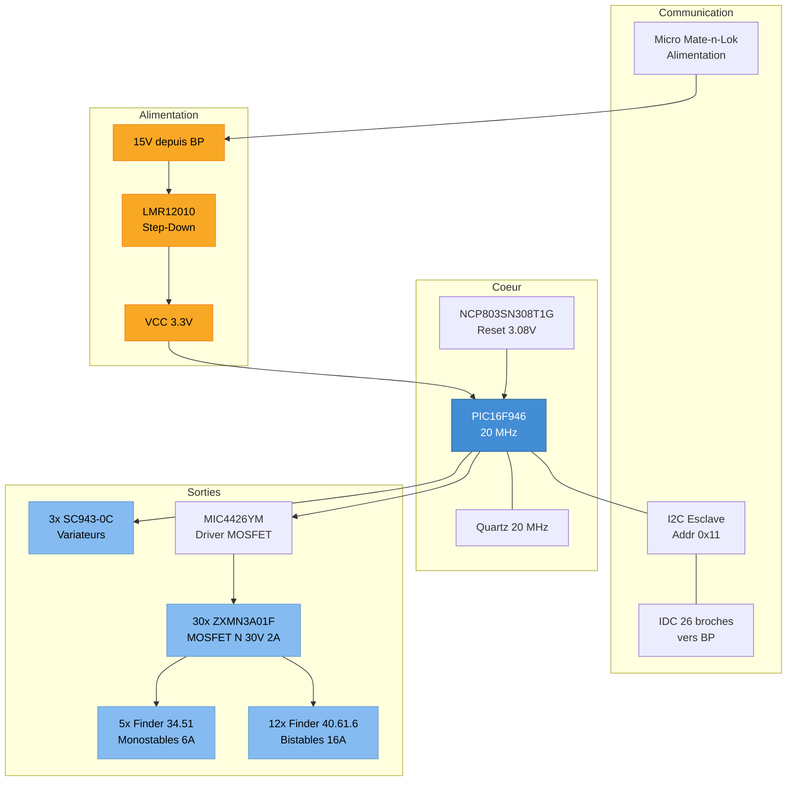

# SC940D — BA Pieces de Vie (BA PDV)

Le SC940D est le boitier auxiliaire "Pieces de Vie" (salon, sejour, cuisine). Il pilote les eclairages, volets et variateurs de cette zone via des relais et des modules gradateurs, sous commande I2C du boitier principal SC944D.

## 1. Specifications Techniques

| Parametre | Valeur |
|-----------|--------|
| **Microcontroleur** | Microchip PIC16F946-I/PT (8-bit) |
| **Frequence** | 20 MHz |
| **Flash** | 14 KB |
| **RAM** | 336 octets |
| **Adresse I2C** | 0x11 (esclave) |
| **Alimentation** | LMR12010YMK (step-down) |
| **Superviseur reset** | NCP803SN308T1G (seuil 3.08 V) |
| **Couches PCB** | 4 |
| **Percages** | 834 trous |
| **Projet Altium** | `SC940D/SC940D.PrjPCB` |

## 2. Hierarchie des Schemas

| # | Feuille | Fonction |
|---|---------|----------|
| 1 | `SC940D_Sommaire` | Page de garde |
| 2 | `SC940D_Coeur` | MCU PIC16F946, quartz, reset, connecteur bus |
| 3 | `SC940D_ETOR1` | Entrees tout-ou-rien groupe 1 |
| 4 | `SC940D_ETOR2` | Entrees tout-ou-rien groupe 2 |
| 5 | `SC940D_STORRM` | Sorties relais monostables |
| 6 | `SC940D_Variateurs` | Modules gradateurs SC943-0C |
| 7 | `SC940D_STORRB` | Sorties relais bistables |
| 8 | `SC940D_Borniers` | Borniers de raccordement terrain |

## 3. Diagramme Fonctionnel



## 4. Sorties de Puissance

### 4.1 Relais Monostables (Finder 34.51)

| Designator | Support | Specs | Utilisation typique |
|------------|---------|-------|---------------------|
| K1 | 93.11 | 1RT, 12 Vdc, 250 Vac/6 A, AgSnO2 | Eclairage on/off |
| K2 | 93.11 | idem | Eclairage on/off |
| K3 | 93.11 | idem | Eclairage on/off |
| K16 | 93.11 | idem | Reserve / Extension |
| K17 | 93.11 | idem | Reserve / Extension |

### 4.2 Relais Bistables (Finder 40.61.6)

| Designator | Support | Specs | Utilisation typique |
|------------|---------|-------|---------------------|
| K4-K15 | 95.15.2 | 1RT bistable, 12 Vdc, 250 Vac/16 A, AgSnO2 | Volets roulants (montee/descente) |

Les relais bistables conservent leur etat sans courant — ideal pour les volets ou le maintien de position est critique en cas de coupure.

### 4.3 Variateurs (SC943-0C)

| Designator | Fonction |
|------------|----------|
| U2 | Variateur eclairage zone 1 |
| U5 | Variateur eclairage zone 2 |
| U7 | Variateur eclairage zone 3 |

Chaque module SC943-0C est une carte fille de gradation qui pilote l'eclairage en variation d'intensite.

### 4.4 Transistors de Commande

| Composant | Quantite | Fonction |
|-----------|----------|----------|
| ZXMN3A01F (MOSFET N, 30 V, 2 A) | 30 | Commande des bobines de relais |
| MIC4426YM (Driver dual 1.5 A) | 1 | Driver de puissance pour MOSFET |

## 5. Protection

| Type | Composant | Quantite | Fonction |
|------|-----------|----------|----------|
| TVS 5 V, 200 W | SMF5V0A-GS08 | 23 | Protection contre surtensions sur les entrees |
| Schottky double | BAT54C | 18 | Clamping / protection ESD |
| Varistance 275 Vac | VDR 820572711 | 4 | Protection secteur |
| Filtre EMI | NFE31PT221D1E9L | 1 | Filtrage perturbations conduites |

## 6. Connectique

| Type | Designator(s) | Pas | Quantite | Fonction |
|------|---------------|-----|----------|----------|
| Bornier a ressort | FFKDSA1/V2 | 7.62 mm | 22 | Raccordement terrain (puissance 17.5 A) |
| Bornier a ressort | FFKDS/V2 | 5.08 mm | 18 | Raccordement terrain (signal 15 A) |
| Bornier a ressort | FFKDSA/V2 | 7.62 mm | 7 | Raccordement terrain |
| IDC 26 broches | 61202621621 | 2.54 mm | 1 | Bus I2C + alim vers BP |
| Micro Mate-n-Lok | Wurth 2x2 | 3 mm | 2 | Alimentation DC |

## 7. Composants Passifs (Resume)

| Categorie | Valeurs principales | Quantite |
|-----------|---------------------|----------|
| Condensateurs ceramiques | 100 nF X7R 0805 (x33), 10 uF X5R 0805 (x3), 18 pF NPO (x2) | ~40 |
| Resistances | 10K (x34), 22K (x21), 6.8K (x21), 1K (x2), 0R (x3), 9.1K (x1), 47K (x1) | ~83 |
| Selfs/Ferrites | 10 uH (x1), ferrite 1206 (x1), filtre double 2x1000 uH (x1) | 3 |

## 8. Firmware

Le firmware du BA PDV est dans le depot `essensys-board-SC940` :

```
essensys-board-SC940/SC940D/Prog/code_ba (fichiers sources 1.7)/essensys_ba.X/
```

- Toolchain : MPLAB X + XC8
- Le PIC16F946 execute une boucle principale qui :
  1. Ecoute les commandes I2C du BP (esclave a 0x11)
  2. Decode la commande (code + donnees + CRC-16)
  3. Actionne les relais / variateurs correspondants
  4. Renvoie une reponse de 5 octets (code + CRC)

## References Sources

- Pick'n'Place : `essensys-board-SC940/SC940D/Assembly/SC940D_Pick'nPlace.csv`
- Drill report : `essensys-board-SC940/SC940D/ProjectOutputs/NC Drill/SI940D.DRR`
- Gerbers : `essensys-board-SC940/SC940D/ProjectOutputs/Gerber/`
- Firmware : `essensys-board-SC940/SC940D/Prog/code_ba/`
