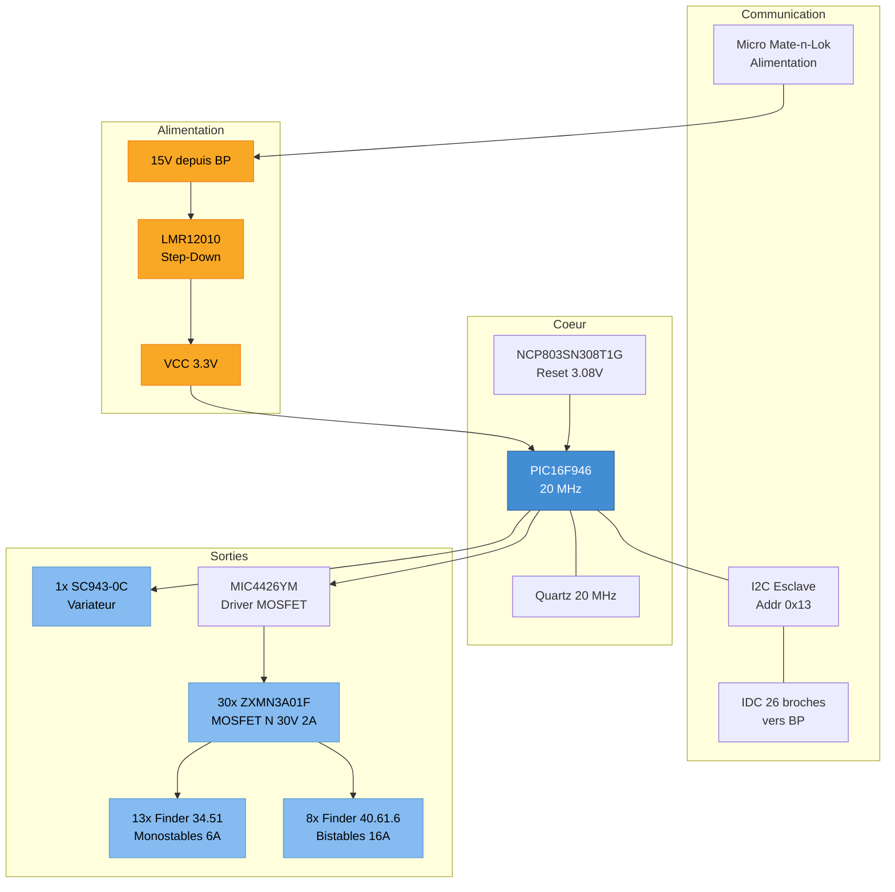

# SC941C — BA Pieces d'Eau (BA PDE)

Le SC941C est le boitier auxiliaire "Pieces d'Eau" (salles de bain, WC, buanderie). Il gere un nombre eleve de relais (21 au total) pour les eclairages et volets de cette zone, avec un seul module variateur.

## 1. Specifications Techniques

| Parametre | Valeur |
|-----------|--------|
| **Microcontroleur** | Microchip PIC16F946-I/PT (8-bit) |
| **Frequence** | 20 MHz |
| **Flash** | 14 KB |
| **RAM** | 336 octets |
| **Adresse I2C** | 0x13 (esclave) |
| **Alimentation** | LMR12010YMK (step-down) |
| **Superviseur reset** | NCP803SN308T1G (seuil 3.08 V) |
| **Couches PCB** | 4 |
| **Percages** | 790 trous |
| **Projet Altium** | `SC941C/SC941C.PrjPCB` |

## 2. Hierarchie des Schemas

| # | Feuille | Fonction |
|---|---------|----------|
| 1 | `SC941C_Sommaire` | Page de garde |
| 2 | `SC941C_Coeur` | MCU PIC16F946, quartz, reset |
| 3 | `SC941C_ETOR1` | Entrees tout-ou-rien groupe 1 |
| 4 | `SC941C_ETOR2` | Entrees tout-ou-rien groupe 2 |
| 5 | `SC941C_STORRM1` | Sorties relais monostables groupe 1 |
| 6 | `SC941C_STORRM2` | Sorties relais monostables groupe 2 |
| 7 | `SC941C_Variateurs` | Module gradateur SC943-0C |
| 8 | `SC941C_STORRB` | Sorties relais bistables |
| 9 | `SC941C_Borniers` | Borniers de raccordement terrain |

> Le SC941C a une page STORRM de plus que le SC940D (STORRM1 + STORRM2 vs STORRM seul), ce qui reflete le nombre superieur de relais monostables (13 vs 5).

## 3. Diagramme Fonctionnel



## 4. Sorties de Puissance

### 4.1 Relais Monostables (Finder 34.51)

| Designator | Support | Utilisation typique |
|------------|---------|---------------------|
| K1, K2 | 93.11 | Eclairage on/off |
| K7 | 93.11 | Eclairage on/off |
| K10, K11 | 93.11 | Eclairage on/off |
| K12, K13 | 93.11 | Eclairage on/off |
| K14, K15 | 93.11 | Eclairage on/off |
| K16, K17 | 93.11 | Eclairage on/off |
| K20, K21 | 93.11 | Eclairage on/off |

Specs : 1RT, 12 Vdc, 250 Vac/6 A, bobine 1940 ohms, AgSnO2.

### 4.2 Relais Bistables (Finder 40.61.6)

| Designator | Support | Utilisation typique |
|------------|---------|---------------------|
| K3, K4, K5, K6 | 95.15.2 | Volets roulants |
| K8, K9 | 95.15.2 | Volets roulants |
| K18, K19 | 95.15.2 | Volets roulants |

Specs : 1RT bistable, 12 Vdc, 250 Vac/16 A, bobine 900 ohms, AgSnO2.

### 4.3 Variateur (SC943-0C)

| Designator | Fonction |
|------------|----------|
| U2 | Variateur eclairage unique |

### 4.4 Transistors de Commande

| Composant | Quantite | Fonction |
|-----------|----------|----------|
| ZXMN3A01F (MOSFET N, 30 V, 2 A) | 30 | Commande des bobines de relais |
| MIC4426YM (Driver dual 1.5 A) | 1 | Driver de puissance pour MOSFET |

## 5. Comparaison avec SC940D (BA PDV)

| Caracteristique | SC941C (PDE) | SC940D (PDV) |
|-----------------|--------------|--------------|
| Relais monostables | 13 | 5 |
| Relais bistables | 8 | 12 |
| Variateurs SC943-0C | 1 | 3 |
| Total relais | 21 | 17 |
| Pages schema | 9 | 8 |
| Pages STORRM | 2 (STORRM1 + STORRM2) | 1 (STORRM) |
| Percages PCB | 790 | 834 |
| Adresse I2C | 0x13 | 0x11 |

Le SC941C privilegia les sorties on/off (monostables) pour les pieces d'eau ou les eclairages directs dominent, tandis que le SC940D a plus de variateurs et de bistables pour les volets et l'eclairage gradue du salon.

## 6. Protection

| Type | Composant | Quantite |
|------|-----------|----------|
| TVS 5 V, 200 W | SMF5V0A-GS08 | 25 |
| Schottky double | BAT54C | 22 |
| Varistance 275 Vac | VDR 820572711 | 1 |
| Filtre EMI | NFE31PT221D1E9L | 1 |
| Redressement | GF1B (100 V, 1 A) | 1 |
| Schottky | PMEG2020AEA (20 V, 2 A) | 1 |

## 7. Connectique

| Type | Pas | Quantite | Fonction |
|------|-----|----------|----------|
| Bornier FFKDSA1/V2 | 7.62 mm | 22 | Raccordement puissance |
| Bornier FFKDS/V2 | 5.08 mm | 18 | Raccordement signal |
| Bornier FFKDSA/V2 | 7.62 mm | 7 | Raccordement puissance |
| IDC 26 broches | 2.54 mm | 1 | Bus I2C + alim vers BP |
| Micro Mate-n-Lok 2x2 | 3 mm | 2 | Alimentation DC |

## 8. Composants Passifs (Resume)

| Categorie | Valeurs principales | Quantite |
|-----------|---------------------|----------|
| Condensateurs ceramiques | 100 nF X7R 0805 (x33), 10 uF X5R (x3), 18 pF NPO (x2), 220 pF (x1) | ~40 |
| Resistances | 10K (x34), 22K (x21), 6.8K (x21), 1K (x2), 0R (x3), 9.1K (x1), 47K (x1) | ~83 |
| Selfs/Ferrites | 10 uH (x1), ferrite 1206 (x1), filtre double 2x1000 uH (x1) | 3 |

## 9. Firmware

Le firmware du BA PDE est dans le depot `essensys-board-SC941C` :

```
essensys-board-SC941C/SC941C/Prog/code_ba (fichiers sources 1.7)/essensys_ba.X/
```

- Toolchain : MPLAB X + XC8
- Fonctionnement identique aux autres BA : esclave I2C recevant des commandes du BP

## References Sources

- Pick'n'Place : `essensys-board-SC941C/SC941C/Assembly/SC941C_Pick'nPlace.csv`
- Drill report : `essensys-board-SC941C/SC941C/ProjectOutputs/NC Drill/SI941C.DRR`
- Gerbers : `essensys-board-SC941C/SC941C/ProjectOutputs/Gerber/`
- Firmware : `essensys-board-SC941C/SC941C/Prog/code_ba/`
