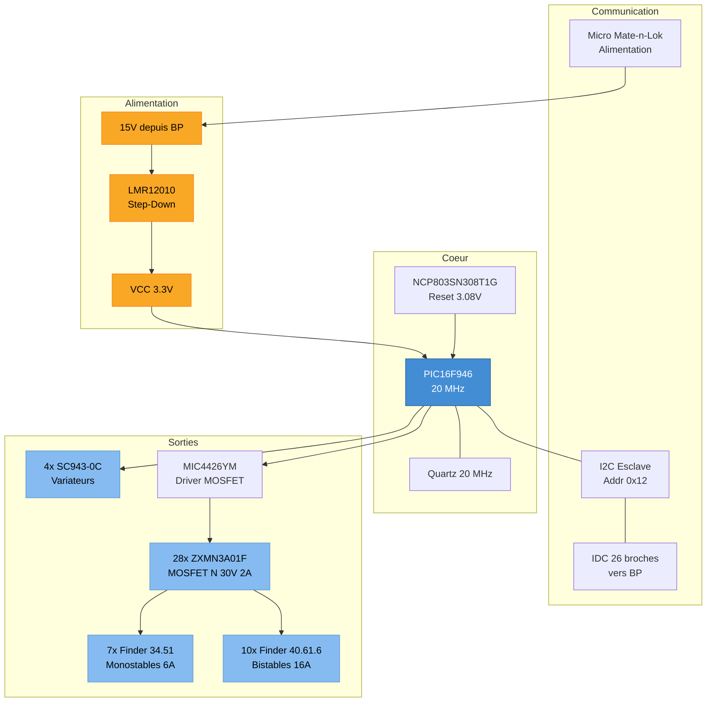

# SC942C — BA Chambres (BA CHB)

Le SC942C est le boitier auxiliaire "Chambres". Il se distingue par le plus grand nombre de modules variateurs (4 SC943-0C) pour gerer l'eclairage gradue des chambres et pieces de nuit.

## 1. Specifications Techniques

| Parametre | Valeur |
|-----------|--------|
| **Microcontroleur** | Microchip PIC16F946-I/PT (8-bit) |
| **Frequence** | 20 MHz |
| **Flash** | 14 KB |
| **RAM** | 336 octets |
| **Adresse I2C** | 0x12 (esclave) |
| **Alimentation** | LMR12010YMK (step-down) |
| **Superviseur reset** | NCP803SN308T1G (seuil 3.08 V) |
| **Couches PCB** | 4 |
| **Percages** | 869 trous |
| **Projet Altium** | `SC942C/SC942C.PrjPCB` |

## 2. Hierarchie des Schemas

| # | Feuille | Fonction |
|---|---------|----------|
| 1 | `SC942C_Sommaire` | Page de garde |
| 2 | `SC942C_Coeur` | MCU PIC16F946, quartz, reset |
| 3 | `SC942C_ETOR1` | Entrees tout-ou-rien groupe 1 |
| 4 | `SC942C_ETOR2` | Entrees tout-ou-rien groupe 2 |
| 5 | `SC942C_STORRM` | Sorties relais monostables |
| 6 | `SC942C_Variateurs` | Modules gradateurs SC943-0C (x4) |
| 7 | `SC942C_STORRB` | Sorties relais bistables |
| 8 | `SC942C-0B_Borniers` | Borniers de raccordement terrain |

## 3. Diagramme Fonctionnel



## 4. Sorties de Puissance

### 4.1 Relais Monostables (Finder 34.51)

| Designator | Support | Utilisation typique |
|------------|---------|---------------------|
| K1, K2, K3 | 93.11 | Eclairage on/off chambres |
| K8, K9 | 93.11 | Eclairage on/off |
| K12, K15 | 93.11 | Eclairage on/off |

Specs : 1RT, 12 Vdc, 250 Vac/6 A, AgSnO2, sur support serie 93.

### 4.2 Relais Bistables (Finder 40.61.6)

| Designator | Support | Utilisation typique |
|------------|---------|---------------------|
| K4, K5, K6, K7 | 95.15.2 | Volets roulants chambres |
| K10, K11 | 95.15.2 | Volets roulants |
| K13, K14 | 95.15.2 | Volets roulants |
| K16, K17 | 95.15.2 | Volets roulants |

Specs : 1RT bistable, 12 Vdc, 250 Vac/16 A, AgSnO2, sur support serie 95.

### 4.3 Variateurs (SC943-0C)

| Designator | Fonction |
|------------|----------|
| U2 | Variateur eclairage chambre 1 |
| U3 | Variateur eclairage chambre 2 |
| U6 | Variateur eclairage chambre 3 |
| U8 | Variateur eclairage chambre 4 / couloir |

Le SC942C possede le plus grand nombre de variateurs du systeme (4 sur 8 total), ce qui reflete les besoins d'eclairage gradue dans les chambres (chevets, plafonniers, ambiance).

### 4.4 Transistors de Commande

| Composant | Quantite | Fonction |
|-----------|----------|----------|
| ZXMN3A01F (MOSFET N, 30 V, 2 A) | 28 | Commande des bobines de relais |
| MIC4426YM (Driver dual 1.5 A) | 1 | Driver de puissance pour MOSFET |

## 5. Protection

| Type | Composant | Quantite |
|------|-----------|----------|
| TVS 5 V, 200 W | SMF5V0A-GS08 | 23 |
| Schottky double | BAT54C | 18 |
| Varistance 275 Vac | VDR 820572711 | 4 |
| Redressement | GF1B (100 V, 1 A) | 1 |
| Schottky | PMEG2020AEA (20 V, 2 A) | 1 |

## 6. Connectique

| Type | Pas | Quantite | Fonction |
|------|-----|----------|----------|
| Bornier FFKDSA1/V2 | 7.62 mm | 22 | Raccordement puissance |
| Bornier FFKDS/V2 | 5.08 mm | 18 | Raccordement signal |
| Bornier FFKDSA/V2 | 7.62 mm | 7 | Raccordement puissance |
| IDC 26 broches | 2.54 mm | 1 | Bus I2C + alim vers BP |
| Micro Mate-n-Lok 2x2 | 3 mm | 2 | Alimentation DC |

## 7. BOM Complet

Le SC942C est la seule carte BA disposant d'un fichier BOM CSV complet dans le depot.

### 7.1 ICs Actifs

| Composant | Designator | Fonction |
|-----------|------------|----------|
| PIC16F946-I/PT | U5 | Microcontroleur 8-bit |
| LMR12010YMKE/NOPB | U1 | Regulateur step-down |
| NCP803SN308T1G | U4 | Superviseur reset 3.08 V |
| MIC4426YM | U7 | Driver MOSFET dual 1.5 A |

### 7.2 Composants Passifs

| Categorie | Valeurs principales | Quantite |
|-----------|---------------------|----------|
| Condensateurs ceramiques | 100 nF X7R 0805 (x33), 10 uF X5R (x3), 18 pF NPO (x2), 10 nF (x1), 220 pF (x1) | 40 |
| Resistances | 10K (x34), 22K (x21), 6.8K (x21), 1K (x2), 0R (x3), 9.1K (x1), 47K (x1) | 83 |
| Selfs/Ferrites | 10 uH (x1), ferrite 1206 (x1), filtre double 2x1000 uH (x1) | 3 |

### 7.3 Relais et Supports

| Composant | Quantite | Fonction |
|-----------|----------|----------|
| Finder 34.51 (1RT, 12 Vdc, 6 A) | 7 | Sorties monostables |
| Support 93.11 | 7 | Supports pour 34.51 |
| Finder 40.61.6 (1RT bistable, 12 Vdc, 16 A) | 10 | Sorties bistables |
| Support 95.15.2 | 10 | Supports pour 40.61.6 |

## 8. Comparaison des 3 BA

| Caracteristique | SC940D (PDV) | SC941C (PDE) | SC942C (CHB) |
|-----------------|--------------|--------------|--------------|
| Adresse I2C | 0x11 | 0x13 | 0x12 |
| Relais monostables | 5 | 13 | 7 |
| Relais bistables | 12 | 8 | 10 |
| Total relais | 17 | 21 | 17 |
| Variateurs SC943-0C | 3 | 1 | 4 |
| MOSFET (ZXMN3A01F) | 30 | 30 | 28 |
| Percages PCB | 834 | 790 | 869 |
| Pages schema | 8 | 9 | 8 |

## 9. Firmware

Le firmware du BA CHB est dans le depot `essensys-board-SC942C` :

```
essensys-board-SC942C/SC942C/Prog/code_ba (fichiers sources 1.7)/essensys_ba.X/
```

- Toolchain : MPLAB X + XC8
- Architecture logicielle commune aux 3 BA, parametree par l'adresse I2C et les sorties disponibles

## References Sources

- BOM : `essensys-board-SC942C/BOM_[No Variations].csv`
- Pick'n'Place : `essensys-board-SC942C/SC942C/Assembly/SC942C_Pick'nPlace.csv`
- Drill report : `essensys-board-SC942C/SC942C/ProjectOutputs/NC Drill/SI942C.DRR`
- Firmware : `essensys-board-SC942C/SC942C/Prog/code_ba/`
