# SC944D — Boitier Principal (BP)

Le SC944D est le controleur principal du systeme Essensys. Il embarque un microcontroleur Freescale ColdFire MCF52259 sous MQX RTOS, une interface Ethernet, et pilote l'ensemble du systeme domotique via I2C, UART, SPI, GPIO, PWM et ADC.

## 1. Specifications Techniques

| Parametre | Valeur |
|-----------|--------|
| **Microcontroleur** | Freescale MCF52259CAG80 (ColdFire V2, 32-bit) |
| **Frequence** | 80 MHz |
| **Flash interne** | 512 KB |
| **SRAM interne** | 64 KB |
| **Flash externe** | SST25VF016B, 2 Mbit, SPI 50 MHz |
| **EEPROM** | 25AA02E48T, 2 Kbit, SPI (adresse MAC EUI-48) |
| **Ethernet PHY** | DP83640TVV (IEEE 1588 Precision Time Protocol) |
| **Quartz principal** | 25 MHz (HC49/US, Citizen Finedevice) |
| **Quartz RTC** | 32.768 kHz (cylindrique CMS 2x6 mm) |
| **RTOS** | MQX RTOS 4.0 |
| **Couches PCB** | 4 |
| **Percages** | 1 141 trous |
| **Projet Altium** | `SC944D/SC944D.PrjPCB` |

## 2. Hierarchie des Schemas

Le projet contient 22 feuilles de schema Altium :

| # | Feuille | Fonction |
|---|---------|----------|
| 1 | `SDEC944-xD_Page_de_Garde` | Page de garde (revision, date, auteur) |
| 2 | `SDEC944-xD_Alimentation_1-2` | Alimentation principale partie 1 (AC/DC, LM3150) |
| 3 | `SDEC944-xD_Alimentation_2-2` | Alimentation partie 2 (regulateurs LDO, DC/DC isole) |
| 4 | `SDEC944-xD_Chargeur_Batterie` | Chargeur et supervision batterie de secours |
| 5 | `SDEC944-xD_Coeur` | MCU MCF52259, quartz, reset, debug JTAG |
| 6 | `SDEC944-xD_Ethernet` | PHY DP83640, transformateur RJ45, filtrage |
| 7 | `SDEC944-xD_Liaison_IHM` | Interface ecran tactile (UART half-duplex) |
| 8 | `SDEC944-xD_Arrosage_(detect_pluie+commande_vanne)` | Detecteur pluie + electrovanne arrosage |
| 9 | `SDEC944-xD_Fil_Pilote_1-2_(commun)` | Fil pilote chauffage — partie commune |
| 10 | `SDEC944-xD_Fil_Pilote_2-2_(zone_jour)` | Fil pilote — zone jour |
| 11 | `SDEC944-xD_Machines_laver_2-2_(commande)` | Commande coupure machines a laver |
| 12 | `SDEC944-xD_Cumulus` | Commande ballon eau chaude (relais DD5) |
| 13 | `SDEC944-xD_Porte_tableau_domotique_(ouverture)` | Detecteur ouverture panneau domotique |
| 14 | `SDEC944-xD_Borniers` | Borniers de raccordement terrain |
| 15 | `SDEC944-xD_Detecteur_ouverture_maison_(signal)` | Detecteur intrusion — ouverture porte |
| 16 | `SDEC944-xD_Detecteurs_presence_(alim+signal+ouverture)` | Detecteurs de presence (alarme) |
| 17 | `SDEC944-xD_Liaison_Boitiers_Auxiliaires` | Bus I2C vers les 3 BA (connecteur IDC 26) |
| 18 | `SDEC944-xD_Machines_laver_1-2_(detection_fuites)` | Sondes de fuite eau (ADC) |
| 19 | `SDEC944-xD_Prises_de_Securite` | Coupure prise securite (relais DD4) |
| 20 | `SDEC944-xD_Reserves_(ETOR)` | Entrees de reserve (extensions futures) |
| 21 | `SDEC944-xD_Sirenes_(alim+commande+ouverture)` | Sirenes int/ext + detection ouverture capot |
| 22 | `SDEC944-xD_Teleinformation` | Compteur Linky (UART 1200 bauds, TeleInfo) |

## 3. Diagramme Fonctionnel

```mermaid
graph TB
    subgraph Alimentation
        AC["Secteur 230V"]
        LM3150["LM3150<br/>Buck 6-42V"]
        LMR["LMR12010<br/>Step-Down"]
        LD1117["LD1117 x2<br/>LDO"]
        DCDC["R12P12S<br/>DC/DC Isole"]
        BATT["Batterie 12V<br/>Secours"]
    end

    subgraph Coeur
        MCU["MCF52259<br/>80 MHz"]
        Q25["Quartz 25 MHz"]
        Q32["RTC 32.768 kHz"]
        FLASH["SST25VF016B<br/>Flash 2 Mbit"]
        EEPROM["25AA02E48T<br/>MAC + Cle"]
    end

    subgraph Communication
        ETH["DP83640<br/>Ethernet PHY"]
        RJ45["RJ45 + Transfo"]
        IHM["UART 0<br/>Ecran Tactile"]
        LINKY["UART 1<br/>Compteur Linky"]
        DEBUG["UART 2<br/>EspionRS"]
        I2C["I2C 50 kHz<br/>Bus BA"]
    end

    subgraph Sorties
        TRIAC["4x T405-600B<br/>Fil Pilote"]
        RELAY["3x Finder 32.21<br/>Cumulus, Prise, Arrosage"]
        MOSFET_P["2x NTD2955G<br/>MOSFET P"]
        MOSFET_N["2x NTMS4801N<br/>MOSFET N"]
        SIRENE["PWM Sirene"]
    end

    subgraph Entrees
        ALARME["Detecteurs<br/>Ouverture + Presence"]
        FUITE["Sondes Fuite<br/>ADC AIN5/AIN6"]
        VENT["Anemometre<br/>GPT Impulsions"]
        PLUIE["Detecteur Pluie"]
        VBAT["Tension Batterie<br/>ADC AIN0"]
    end

    AC --> LM3150
    LM3150 --> LMR
    LMR --> LD1117
    LM3150 --> DCDC
    BATT --> MCU

    MCU --- Q25
    MCU --- Q32
    MCU -->|SPI CS2| FLASH
    MCU -->|SPI CS0| EEPROM

    MCU --- ETH
    ETH --- RJ45
    MCU --- IHM
    MCU --- LINKY
    MCU --- DEBUG
    MCU --- I2C

    MCU --> TRIAC
    MCU --> RELAY
    MCU --> MOSFET_P
    MCU --> MOSFET_N
    MCU --> SIRENE

    ALARME --> MCU
    FUITE --> MCU
    VENT --> MCU
    PLUIE --> MCU
    VBAT --> MCU

    classDef mcu fill:#438DD5,stroke:#2E6295,color:#fff
    classDef periph fill:#85BBF0,stroke:#5D99CF,color:#000
    classDef power fill:#F9A825,stroke:#F57F17,color:#000

    class MCU mcu
    class ETH,FLASH,EEPROM,TRIAC,RELAY,ALARME,FUITE periph
    class AC,LM3150,LMR,LD1117,DCDC,BATT power
```

## 4. Alimentation

### 4.1 Chaine d'Alimentation Principale

| Etage | Composant | Entree | Sortie | Courant max | Fonction |
|-------|-----------|--------|--------|-------------|----------|
| Buck principal | LM3150MH | 6-42 V | 5 V | — | Controleur synchrone (+ NTMS4801N, PMEG4050EP) |
| Step-down | LMR12010YMK | 3-20 V | 3.3 V | 1 A | Alimentation MCU et logique |
| LDO 1 | LD1117STR-E | ~5 V | 3.3 V | 0.8 A | Alimentation PHY Ethernet |
| LDO 2 | LD1117STR-E | ~5 V | 1.8 V | 0.8 A | Coeur MCF52259 (si requis) |
| DC/DC isole | R12P12S | 12 V | +12 V | 84 mA | Alimentation isolee (optocouleurs, relais) |

### 4.2 Batterie de Secours

| Parametre | Valeur |
|-----------|--------|
| Tension nominale | 12 V |
| Seuil bas ADC | 1500 pts (~10.5 V) |
| Seuil alerte affichage | 1600 pts |
| Delai avant coupure | 10 s |
| Controle charge | GPIO `BP_O_UC_BATT_CTRL` (TE1) |

## 5. Peripheriques MCU

### 5.1 UART

| Port | Peripherique MQX | Vitesse | Format | Fonction |
|------|-------------------|---------|--------|----------|
| UART 0 | `ittya:` | 9 600 bauds | 8N1, half-duplex | Ecran tactile |
| UART 1 | `ittyb:` | 1 200 bauds | 7E1 | Compteur Linky (TeleInfo) |
| UART 2 | `ittyc:` | 9 600 bauds | 8N1 | Debug EspionRS |

### 5.2 SPI

| Chip Select | Broche | Vitesse | Peripherique | Fonction |
|-------------|--------|---------|--------------|----------|
| CS0 | QS3 | 500 kHz | 25AA02E48T | EEPROM (adresse MAC 6 octets @ 0xFA, cle serveur 16 octets @ 0x00) |
| CS2 | QS5 | 500 kHz | SST25VF016B | Flash firmware OTA (S19) |

### 5.3 I2C

| Port | Vitesse | Mode | Fonction |
|------|---------|------|----------|
| I2C 0 (`i2c0:`) | 50 kHz | Polled, maitre | Communication avec les 3 BA |

### 5.4 ADC

| Canal | Signal | Broche | Fonction |
|-------|--------|--------|----------|
| AIN0 | VBAT | AN0 | Tension batterie de secours |
| AIN5 | FUITE1 | AN5 | Sonde fuite lave-linge |
| AIN6 | FUITE2 | AN6 | Sonde fuite lave-vaisselle |

### 5.5 PWM

| Canal | Signal | Fonction |
|-------|--------|----------|
| Canal 4 | `BP_OPWM_SIRENE` | Sirene interieure (4 niveaux : TFORT/FORT/MOYEN/FAIBLE) |

## 6. Mapping GPIO

### 6.1 Entrees (DIN)

| Signal | Broche MCF52259 | Fonction |
|--------|-----------------|----------|
| `BP_I_OUVERTURE_SIRENE_INTERIEURE` | AS2 | Detection ouverture capot sirene int. |
| `BP_I_OUVERTURE_SIRENE_EXTERIEURE` | TE5 | Detection ouverture capot sirene ext. |
| `BP_I_OUVERTURE_PANNEAU_DOMOTIQUE` | AN7 | Detection ouverture panneau |
| `BP_I_DETECT_OUV` | TF0 | Detecteur ouverture porte |
| `BP_I_DETECT_PRES1` | TE7 | Detecteur presence 1 |
| `BP_I_DETECT_PRES2` | TE6 | Detecteur presence 2 |
| `BP_I_PLUIE` | DD3 | Detecteur de pluie |
| `BP_I_SECTEUR_SYNCHRO` | NQ7 | Synchronisation secteur (IT) |
| `BP_I_SECTEUR_ETAT_ALIM_PRINCIPALE` | AN0 | Etat alimentation principale |
| `BP_I_DIN_VITESSE_VENT` | TA3 | Anemometre (impulsions GPT) |
| `BP_I_NEW_INPUT_D5` | TH3 | Reserve V2 (2016) |
| `BP_I_NEW_INPUT_D6` | TH4 | Reserve V2 (2016) |
| `BP_I_NEW_INPUT_D7` | TH5 | Reserve V2 (2016) |

### 6.2 Sorties (DOUT)

| Signal | Broche MCF52259 | Fonction |
|--------|-----------------|----------|
| `BP_O_SIRENE_EXTERIEURE` | TC0 | Commande sirene exterieure |
| `BP_O_15VSP_ALIM_BA` | TE2 | Alimentation 15 V boitiers auxiliaires |
| `BP_O_UC_LED_ETAT_BP` | TE0 | LED etat du boitier principal |
| `BP_O_UC_BATT_CTRL` | TE1 | Controle batterie de secours |
| `BP_O_VANNE_ARROSAGE` | DD7 | Electrovanne arrosage |
| `BP_O_PRISE_SECURITE` | DD4 | Coupure prise securite |
| `BP_O_MACHINE_A_LAVER` | DD6 | Coupure machines a laver (fuite) |
| `BP_O_CUMULUS` | DD5 | Ballon eau chaude |
| `BP_O_FP_ZJ` | TA0 | Fil pilote zone jour |
| `BP_O_FP_ZN` | DD0 | Fil pilote zone nuit |
| `BP_O_FP_SDB1` | DD1 | Fil pilote salle de bain 1 |
| `BP_O_FP_SDB2` | DD2 | Fil pilote salle de bain 2 |
| `BP_O_TELEINF_LED` | TC3 | LED activite TeleInfo |
| `BP_O_ECRAN_DIRECTION` | UA3 | Direction half-duplex ecran |
| `BP_O_DEBUG_J1..J5` | TF2..TF6 | 5 sorties debug |

## 7. Composants de Puissance

### 7.1 TRIACs (Fil Pilote)

| Designator | Composant | Specs | Fonction |
|------------|-----------|-------|----------|
| T13, T17, T19, T20 | T405-600B | 600 V, 4 A, DPAK | Commutation secteur fil pilote (4 zones) |

### 7.2 Relais

| Designator | Composant | Type | Specs | Fonction |
|------------|-----------|------|-------|----------|
| K2, K3, K5 | Finder 32.21 | 1RT, monostable | 12 Vdc, 250 Vac/6 A, AgCdO | Cumulus, prise securite, arrosage |

### 7.3 Optocouleurs (Isolation)

| Designator | Composant | Specs | Fonction |
|------------|-----------|-------|----------|
| U3, U6, U7, U14, U15 | FOD817BS | 5 kVrms, CTR 130-260% | Isolation entrees secteur / detecteurs |

### 7.4 DC/DC Isole

| Designator | Composant | Specs | Fonction |
|------------|-----------|-------|----------|
| U4 | R12P12S | 1 W, 12 V→12 V, 6.4 kV isol. | Alimentation isolee optocouleurs |

## 8. Connectique

| Designator | Composant | Type | Fonction |
|------------|-----------|------|----------|
| J1, J34-J50 | FFKDSA/V2 | Bornier a ressort 7.62 mm | Raccordement terrain (puissance) |
| J2, J51 | FFKDSA1/V2 | Bornier a ressort 7.62 mm | Raccordement terrain |
| J3 | 61202621621 | IDC 26 broches, 2.54 mm | Bus BA / Debug |
| J32 | 74990101210 | RJ45 + transformateur | Ethernet 10/100 Base-T |
| J33 | Barrette 2x5 | Barrette male 2.54 mm | JTAG/BDM debug |
| J52, J53 | Wurth 4.2 mm | Connecteur 1x2 | Alimentation puissance |
| J56 | Wurth 4.2 mm | Connecteur 1x4 | Extension |
| J58 | Cavalier 2.54 mm | Jumper | Configuration |

## 9. BOM Resume

| Categorie | Composants principaux | Quantite |
|-----------|-----------------------|----------|
| **ICs actifs** | MCF52259, DP83640, SST25VF016B, 25AA02E48T, LM3150, DRV8801 | 16 |
| **Regulateurs** | LMR12010, LD1117 x2, R12P12S | 4 |
| **Transistors** | BC847C (x17), T405-600B (x4), NTD2955G (x2), NTMS4801N (x2), MMBT5551 (x4), NJD1718 | 30 |
| **Optocouleurs** | FOD817BS | 5 |
| **Relais** | Finder 32.21 | 3 |
| **Quartz** | 25 MHz (x2), 32.768 kHz (x1) | 3 |
| **Condensateurs** | 100 nF (x45), 10 uF (x7), 22 uF (x6), 3900 uF (x3), etc. | ~105 |
| **Resistances** | 10K (x21), 4.7K (x13), 1K (x15), 680R (x7), etc. | ~110 |
| **Selfs/Ferrites** | 15 uH (x2), ferrites 0603/1206 (x11), etc. | ~17 |
| **Diodes** | BAT54C/S (x10), TVS SMAJ16A (x2), Schottky PMEG4050EP (x6), etc. | ~25 |
| **Connecteurs** | Borniers 7.62 mm (x20), RJ45, IDC 26, Wurth 4.2 mm | ~25 |
| **Fusibles** | UMT250 (x2), Polyswitch (x2), MF-RX012 (x4) | 8 |
| **Protection** | Varistance V300LA10P, condensateur X2 | 2 |

## 10. Firmware

Le firmware du BP est dans le depot `client-essensys-legacy`. Voir :

- [Client Embarque BP_MQX_ETH](legacy-client.md) — Vue d'ensemble
- [Configuration Hardware et GPIO](legacy-client-config.md) — Mapping complet
- [Protocoles Internes](legacy-client-protocols.md) — I2C, UART, SPI
- [Build et Toolchain](legacy-client-build.md) — CodeWarrior, makefile

## References Sources

- BOM : `essensys-board-SC944D/BOM_[No Variations].csv`
- Pick'n'Place : `essensys-board-SC944D/SC944D/Assembly/SC944D_Pick'nPlace.csv`
- Gerbers : `essensys-board-SC944D/SC944D/Gerbers/`
- Drill report : `essensys-board-SC944D/SC944D/Gerbers/Single/Drills/SI944D.DRR`
- Schemas PDF : `essensys-board-SC944D/Assembly Drawings_[No Variations].pdf`
