# Architecture du Systeme Essensys

Cette documentation decrit l'architecture logicielle et systeme de l'ecosysteme Essensys, en s'appuyant sur les principes du modele C4 (Context, Containers, Components, Code) et l'approche *Clean Architecture*.

## 1. Contexte du Systeme (System Context)

Le systeme Essensys est une solution domotique concue initialement autour de cartes materielles embarquees (BP_MQX_ETH). Le defi majeur de l'architecture actuelle est de moderniser l'acces et le controle de ce materiel "legacy" tout en assurant une retrocompatibilite totale.

### Objectif Principal

Fournir une interface de controle moderne, securisee et performante (via des dashboards web, mobile, ou messagerie WhatsApp) tout en dialoguant avec un parc materiel existant dont les capacites reseau et logiques (firmware C sur Coldfire MCF52259) sont figees.

### Diagramme de Contexte

```mermaid
graph TB
    user["👤 Utilisateur Final<br/>Navigateur / Mobile / WhatsApp"]
    admin["🔧 Administrateur<br/>SSH / HTTPS / Control Plane"]

    essensys["🏠 Ecosysteme Essensys<br/>Chauffage, volets, eclairage,<br/>alarme, securite"]

    hardware["🔌 Cartes BP_MQX_ETH<br/>Coldfire MCF52259 / MQX RTOS"]
    whatsapp["📱 WhatsApp<br/>Notifications via OpenClaw"]
    homeassistant["🏠 Home Assistant<br/>MQTT Discovery"]
    linky["⚡ Compteur Linky<br/>Teleinfo UART 1200 bauds"]
    unifi["📷 UniFi Protect<br/>Cameras IP"]
    dockerhub["🐳 Docker Hub<br/>Registry images"]
    github["⚙️ GitHub Actions<br/>CI/CD multi-arch"]

    user -->|HTTPS / WhatsApp| essensys
    admin -->|SSH / HTTPS| essensys
    essensys <-->|Polling HTTP 2s<br/>Port 80 / LAN| hardware
    essensys <-->|API WhatsApp Web| whatsapp
    essensys <-->|MQTT| homeassistant
    hardware <---|UART 1200 bauds| linky
    essensys -->|HTTPS| unifi
    github -->|Docker Push ARM64/AMD64| dockerhub
    admin -->|Git Push| github

    classDef system fill:#438DD5,stroke:#2E6295,color:#fff
    classDef external fill:#999,stroke:#666,color:#fff
    classDef person fill:#08427B,stroke:#052E56,color:#fff

    class essensys system
    class hardware,whatsapp,homeassistant,linky,unifi,dockerhub,github external
    class user,admin person
```

## 2. Le Defi Central : le Client Legacy

L'ensemble de l'architecture Essensys existe pour une seule raison : **combler l'obsolescence d'un controleur materiel dont le firmware ne peut pas etre modifie**.

La carte BP_MQX_ETH impose des contraintes techniques severes :

| Contrainte | Impact sur l'architecture |
|-----------|--------------------------|
| JSON malformes (cles non-quotees) | Le backend Go doit normaliser chaque requete entrante |
| Content-Type ` ;charset=UTF-8` (espace avant `;`) | Header HTTP non-standard code en dur dans le firmware |
| Reponse HTTP en single-packet TCP | Le reverse proxy Nginx doit bufferiser chaque reponse |
| Code `201 Created` pour les POST | Le backend doit repondre 201 au lieu du 200 standard |
| Champ `_de67f` en premiere position JSON | L'ordre des cles JSON doit etre controle cote serveur |
| Port 80 obligatoire | Le backend doit ecouter sur le port 80 (pas configurable) |
| Polling synchrone toutes les 2 secondes | Pas de push, pas de WebSocket, pas d'evenements |
| Valeurs 8 bits (0-255) par indice | Toute l'information passe par une table d'echange d'octets |

Pour une analyse detaillee du client legacy, voir **[Le Client Embarque BP_MQX_ETH](legacy-client.md)**.

Pour comprendre comment le serveur comble ces lacunes, voir **[Le Pattern Bridge : du Legacy au Moderne](bridge-pattern.md)**.

## 3. La Table d'Echange : Coeur du Systeme

Le mecanisme central de communication est une **table d'echange** de ~600 octets en memoire, partagee entre le firmware et le serveur. Chaque indice represente un etat, une configuration ou une commande (lumiere, volet, chauffage, alarme). Cette table est la source de verite unique du systeme.

Pour la documentation complete, voir **[Table d'Echange - Reference Technique](exchange-table.md)**.

## 4. Piliers Architecturaux

Le systeme a ete modularise pour separer les responsabilites :

- **Presentation (Frontend)** : Application React/Vite qui traduit les indices opaques en concepts visuels (boutons, sliders, zones). Aucune logique metier embarquee.
- **Bridge (Backend)** : Composant Go unique dedie a la traduction entre les API web modernes (REST/JSON normalise) et les trames specifiques au materiel. Agit comme un Anti-Corruption Layer.
- **Intelligence (MCP + OpenClaw)** : Couche IA connectee via le Model Context Protocol pour permettre l'interaction en langage naturel et la reformulation des alertes.
- **Observabilite (Prometheus + Alertmanager)** : Stack de monitoring complet avec alertes relayees via WhatsApp.
- **Infrastructure Edge** : Nginx (LAN) et Traefik (WAN/SSL) pour le routage, plus AdGuard pour le DNS.
- **Deploiement as-Code** : Ansible pour la configuration, Docker Compose pour l'orchestration, GitHub Actions pour le CI/CD multi-architecture.

## 5. Navigation dans la Documentation

| Document | Contenu |
|----------|---------|
| **[Le Client Embarque BP_MQX_ETH](legacy-client.md)** | Hardware, RTOS, contraintes techniques, obsolescence |
| ↳ **[Securite](legacy-client-security.md)** | Authentification HTTP Basic, chiffrement AES des ordres alarme, EEPROM |
| ↳ **[Build et Toolchain](legacy-client-build.md)** | CodeWarrior, makefile, structure projet, versions, format S19 |
| ↳ **[Protocoles Internes](legacy-client-protocols.md)** | I2C (BA), UART (ecran, TeleInfo/Linky), SPI (EEPROM) |
| ↳ **[Configuration Hardware](legacy-client-config.md)** | Mapping GPIO, peripheriques, parametres systeme, sequence init |
| ↳ **[Deploiement et OTA](legacy-client-deployment.md)** | Bootloader, mise a jour OTA via S19, flashing JTAG/BDM |
| ↳ **[Diagnostic et Debug](legacy-client-testing.md)** | EspionRS, GPIO debug, CRC, surveillance, indicateurs Ethernet |
| **[Table d'Echange - Reference Technique](exchange-table.md)** | Cartographie des ~600 indices, droits d'acces, scenarios, bitmasks |
| **[Domaines Fonctionnels](domaines-fonctionnels.md)** | Alarme, chauffage, volets, cumulus, securite, fuites, vent, arrosage |
| **[Architecture des Conteneurs (Services)](containers.md)** | Les 14 services deployes, leurs roles et interactions |
| **[Le Pattern Bridge : du Legacy au Moderne](bridge-pattern.md)** | Comment le backend Go comble l'obsolescence du client |
| **[Architecture de Deploiement](deployment.md)** | Ansible, Docker Compose, CI/CD, infrastructure |
| **[Diagrammes d'Architecture](diagrams.md)** | Tous les diagrammes Mermaid + PNG (globale, flux, bridge, deploiement) |
| **[Autocritique Clean Architecture / DDD](critique_ddd.md)** | Analyse critique, score, recommandations |
| **[Vue d'Ensemble Materiel](hardware-overview.md)** | Architecture physique, 4 cartes, bus I2C, comparatif, protections |
| ↳ **[SC944D — Boitier Principal](hardware-sc944d.md)** | MCF52259, Ethernet, Flash SPI, TRIACs, GPIO complet, BOM |
| ↳ **[SC940D — BA Pieces de Vie](hardware-sc940d.md)** | PIC16F946, 17 relais, 3 variateurs, borniers |
| ↳ **[SC941C — BA Pieces d'Eau](hardware-sc941c.md)** | PIC16F946, 21 relais, 1 variateur, borniers |
| ↳ **[SC942C — BA Chambres](hardware-sc942c.md)** | PIC16F946, 17 relais, 4 variateurs, BOM complet |
