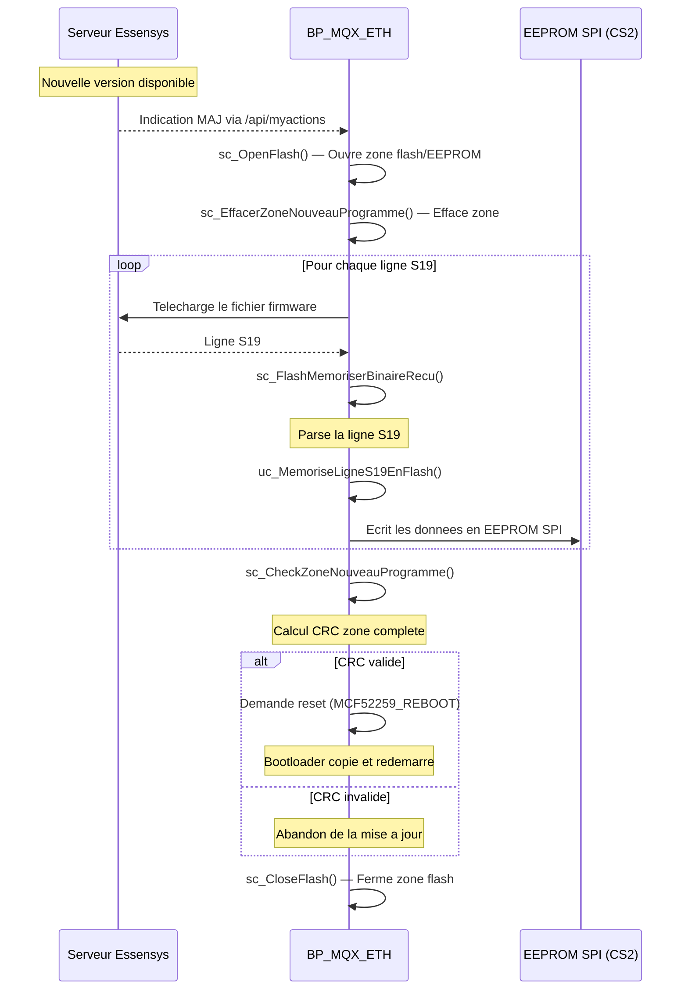

# Deploiement et Mise a Jour du Firmware Legacy

Ce document decrit les mecanismes de deploiement, mise a jour OTA et bootloader du firmware BP_MQX_ETH.

## 1. Architecture Memoire Flash

Le MCF52259 dispose de 512 Ko de flash interne organisee en zones :

```
┌────────────────────────────┐ 0x00000000
│     Vecteurs d'interruption │
│     + Bootloader            │
├────────────────────────────┤
│     .APP_JUMP               │ Code de saut vers __boot
├────────────────────────────┤
│     .APP_CRC                │ CRC de l'application (2 octets)
├────────────────────────────┤
│     .APP_VERSION            │ Version (us_BP_VERSION_SERVEUR)
├────────────────────────────┤
│                             │
│     Application principale  │ FLASH_APP_SOFT_START
│     (BP_MQX_ETH.elf)       │          ↕
│                             │ FLASH_APP_SOFT_END
├────────────────────────────┤
│     Zone nouveau programme  │ Pour mise a jour OTA
│     (EEPROM SPI externe)   │
└────────────────────────────┘
```

## 2. Bootloader

### Fonctionnement

Le bootloader est minimal et remplit 3 fonctions :

1. **Verification CRC** : Compare le CRC stocke dans `.APP_CRC` avec le CRC calcule de la zone application
2. **Verification version** : Lit `.APP_VERSION` pour reporter au serveur
3. **Saut vers l'application** : Execute `APP_CALL()` (assembleur inline) pour demarrer MQX

### Sections Absolues

```c
#pragma section far_absolute R ".APP_JUMP"
// Code assembleur : saut vers __boot

#pragma section far_absolute R ".APP_CRC"
__declspec(far_absolute) unsigned short CRC = 0x0102;

#pragma section far_absolute R ".APP_VERSION"
__declspec(far_absolute) unsigned short VERSION = us_BP_VERSION_SERVEUR; // 37
```

## 3. Mise a Jour OTA (Over-The-Air)

### Flux de Telechargement



### Format S19 (Motorola)

Le firmware est transmis au format S-Record :

| Type | Description | Traitement |
|------|-------------|------------|
| `S0` | Header | Ignore |
| `S3` | Donnees 32 bits | Parse et ecrit en EEPROM |
| `S7` | End record | Ignore |

Structure d'une ligne S3 :
```
S3 LL AAAAAAAA DD DD DD ... CC
│  │  │        │            │
│  │  │        │            └─ Checksum (complement a 1)
│  │  │        └────────────── Donnees
│  │  └─────────────────────── Adresse 32 bits
│  └────────────────────────── Longueur (octets apres LL)
└───────────────────────────── Type de record
```

### Verification d'Integrite

| Etape | Fonction | Verification |
|-------|----------|-------------|
| Ligne S19 | `uc_MemoriseLigneS19EnFlash()` | Checksum S19 (complement a 1) |
| Zone complete | `us_CalculerCRCZoneNew()` | CRC-16 sur toute la zone (hors zone CRC) |
| Post-reset | Bootloader | Comparaison CRC `.APP_CRC` vs calcule |

### Fonctions Cles

| Fonction | Fichier | Role |
|----------|---------|------|
| `sc_OpenFlash()` | `Ethernet/Download.c` | Ouverture zone flash/EEPROM |
| `sc_EffacerZoneNouveauProgramme()` | `Ethernet/Download.c` | Effacement zone OTA |
| `sc_FlashMemoriserBinaireRecu()` | `Ethernet/Download.c` | Traitement des lignes S19 |
| `uc_MemoriseLigneS19EnFlash()` | `Ethernet/Download.c` | Ecriture en EEPROM SPI |
| `sc_CheckZoneNouveauProgramme()` | `Ethernet/Download.c` | Verification CRC + demande reset |
| `us_CalculerCRCZoneApp()` | `Ethernet/Download.c` | CRC zone application courante |
| `us_CalculerCRCZoneNew()` | `Ethernet/Download.c` | CRC zone nouveau programme |
| `vd_MCF52259_REBOOT()` | `H/Hard.h` | Redemarrage du MCU |

## 4. Methode JTAG/BDM (acces physique)

### Prerequis

| Element | Description |
|---------|-------------|
| Programmeur | P&E Micro BDM |
| IDE | CodeWarrior pour Coldfire |
| Fichier | `BP_MQX_ETH.elf` (ELF) |
| Configuration | `.launch` (fichier de lancement) |

### Procedure

1. Connecter le programmeur BDM au connecteur JTAG de la carte
2. Ouvrir `BP_MQX_ETH_m52259evb_Int_Flash_Debug_PEBDM.launch` dans CodeWarrior
3. Lancer le flash/debug
4. Le programmeur ecrit directement en flash interne
5. Reset de la carte → le bootloader verifie le CRC et lance l'application

### Quand utiliser JTAG vs OTA

| Critere | JTAG | OTA |
|---------|------|-----|
| Acces physique | Requis | Non requis |
| Fiabilite | Maximale | Depend de la connexion reseau |
| Usage | Premier flash, recovery | Mises a jour normales |
| Risque de brick | Non (ecrit direct en flash) | Oui (si CRC echoue, ancien firmware conserve) |

## 5. Note sur l'Obsolescence

La mise a jour OTA existe dans le firmware mais les limitations suivantes la rendent **rarement utilisee en pratique** :

- Le bootloader ne supporte pas le rollback automatique
- La connexion HTTP en clair rend le telechargement vulnerable
- La taille de la flash interne limite les fonctionnalites ajoutables
- L'absence de TLS empeche l'authentification du serveur de mise a jour
- Le firmware est considere comme fige dans son etat actuel

## References Sources

- Telechargement OTA : `client-essensys-legacy/Ethernet/Download.c`
- Bootloader : `client-essensys-legacy/C/bootloader.c`
- Linker script : `client-essensys-legacy/m52259evb_Int_Flash_Debug/intflash.lcf`
- Reboot : `client-essensys-legacy/H/Hard.h`
