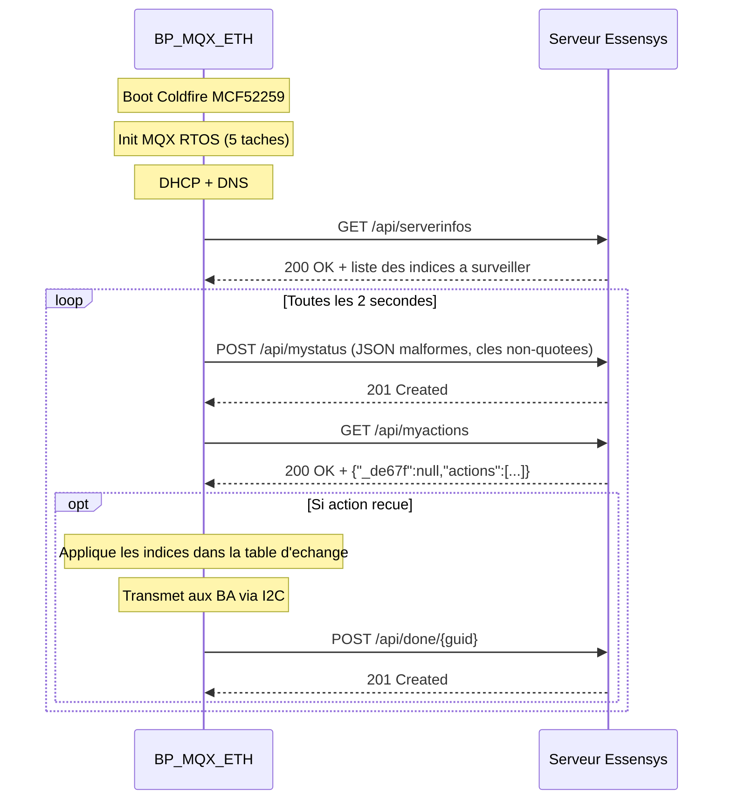

# Le Client Embarque BP_MQX_ETH

Ce document decrit les specifications techniques, les limitations et l'obsolescence du controleur domotique materiel BP_MQX_ETH. Ces contraintes sont la raison d'etre de toute l'architecture logicielle Essensys.

## 1. Hardware : Freescale Coldfire MCF52259

### Specifications

| Caracteristique | Valeur |
|----------------|--------|
| Processeur | Coldfire V2 MCF52259 (32 bits RISC) |
| Frequence | 80 MHz |
| Memoire Flash | Interne, 512 Ko (programme + config) |
| RAM | Interne + extension MRAM externe optionnelle |
| Ethernet | MAC integre, stack RTCS |
| Bus I2C | Communication avec 3 boitiers auxiliaires |
| UART x3 | Ecran tactile, Teleinfo Linky, Debug (EspionRS) |
| SPI | EEPROM externe (adresse MAC, cle serveur, code alarme) |
| ADC | Detection fuites d'eau |
| PWM | Pilotage fil pilote chauffage |
| GPIO | Entrees/sorties numeriques (detecteurs, sirenes, relais) |

### Peripheriques Connectes

```
                       ┌──────────────────────────┐
                       │     BP_MQX_ETH           │
                       │   (Coldfire MCF52259)     │
                       │                          │
  Ecran tactile ◄──────┤ UART 0                   │
                       │                          │
  Compteur Linky ──────┤ UART 1 (1200 bauds)      │
                       │                          │
  Debug EspionRS ◄─────┤ UART 2                   │
                       │                          │
  BA PDV (Salon) ◄─────┤                          │
  BA CHB (Chambres) ◄──┤ Bus I2C (50 kHz)         │
  BA PDE (Pieces eau) ◄┤                          │
                       │                          │
  EEPROM config ◄──────┤ SPI                      │
                       │                          │
  Serveur Essensys ◄───┤ Ethernet (Port 80)       │
                       │                          │
  Detecteurs alarme ───┤ GPIO (ETOR)              │
  Sirenes ◄────────────┤ GPIO (sorties)           │
  Fil pilote ◄─────────┤ PWM                      │
  Capteurs fuite ──────┤ ADC                      │
                       └──────────────────────────┘
```

## 2. Systeme d'Exploitation : MQX RTOS

### Presentation

MQX (Message Queue eXecutive) est un RTOS preemptif developpe par Freescale (aujourd'hui NXP). Il fournit :

- Ordonnancement preemptif avec time slicing
- Synchronisation : mutex, semaphores legers, files de messages
- Stack TCP/IP integree (RTCS - Real-Time Communication Stack)
- Gestion memoire avec pools de messages

### Les 5 Taches Temps Reel

Toutes les taches ont la meme priorite (8) et se partagent le CPU par time slicing.

```c
TASK_TEMPLATE_STRUCT MQX_template_list[] = {
    {MAIN_TASK,   Main_task,      1596, 8, "Main",     MQX_AUTO_START_TASK},
    {ECRAN_TASK,  Ecran_task,     1500, 8, "Ecran",    MQX_TIME_SLICE_TASK, 50},
    {BA_TASK,     Boitiers_task,  1796, 8, "I2C",      MQX_TIME_SLICE_TASK, 50},
    {TELE_TASK,   TeleInfo_task,  1396, 8, "TeleInf",  MQX_TIME_SLICE_TASK, 30},
    {ETH_TASK,    Ethernet_task,  3000, 8, "Ethernet", MQX_TIME_SLICE_TASK, 50},
};
```

| Tache | Stack | Quantum | Responsabilite |
|-------|-------|---------|----------------|
| **Main_task** | 1596 o | Auto-start | Boucle principale : chauffage, alarme, scenarios, fil pilote, arrosage, delestage, date/heure |
| **Ecran_task** | 1500 o | 50 ms | Communication serie avec l'ecran tactile proprietaire |
| **Boitiers_task** | 1796 o | 50 ms | Communication I2C avec les 3 boitiers auxiliaires (PDV, CHB, PDE) |
| **TeleInfo_task** | 1396 o | 30 ms | Reception et decodage des trames Linky (1200 bauds, 7 bits, parite paire) |
| **Ethernet_task** | 3000 o | 50 ms | Stack TCP/IP, polling HTTP vers le serveur, telechargement firmware |

**Stack totale : ~9 288 octets** pour les 5 taches.

### Synchronisation Inter-taches

```c
// Mutex pour les zones de chauffage (acces concurrent Main/Ecran/Ethernet)
MUTEX_STRUCT st_Mutex_ZJ;      // Zone jour
MUTEX_STRUCT st_Mutex_ZN;      // Zone nuit
MUTEX_STRUCT st_Mutex_Zsdb1;   // Salle de bain 1
MUTEX_STRUCT st_Mutex_Zsdb2;   // Salle de bain 2

// Files de messages Main -> Boitiers_task (ordres I2C)
_pool_id message_pool;
_queue_id BA_qid;
```

## 3. Contraintes Techniques Incontournables

Ces contraintes sont **codees en dur dans le firmware** et ne peuvent pas etre modifiees. Tout le stack logiciel serveur doit s'y conformer.

### 3.1 JSON Malformes (cles non-quotees)

Le client envoie du JSON invalide selon la RFC 8259 :

```
// Ce que le firmware envoie (INVALIDE)
{version:"1.0",ek:[{k:613,v:"1"},{k:607,v:"0"}]}

// Ce que la RFC attend (VALIDE)
{"version":"1.0","ek":[{"k":613,"v":"1"},{"k":607,"v":"0"}]}
```

**Impact** : Le backend Go doit normaliser chaque requete entrante avant de la parser (`internal/api/json_normalizer.go`).

### 3.2 Content-Type Non-Standard

Le firmware attend exactement ce header avec un espace **avant** le point-virgule :

```
Content-Type: application/json ;charset=UTF-8
```

Toute variation (`;charset`, `; charset`, casse differente) provoque un comportement imprevisible du client.

### 3.3 Reponse HTTP en Single-Packet TCP

Le parser HTTP du firmware lit la reponse en **un seul appel `recv()`**. Si la reponse arrive fragmentee en plusieurs paquets TCP, le client :
- Tronque la reponse
- Ignore les actions
- Peut se bloquer silencieusement

**Impact** : Le reverse proxy Nginx doit bufferiser integralement chaque reponse avant de l'envoyer au client :

```nginx
proxy_buffering on;
proxy_buffer_size 4k;
proxy_buffers 8 4k;
proxy_max_temp_file_size 0;
gzip off;  # Desactiver la compression pour eviter la fragmentation
```

### 3.4 Code HTTP 201 Created pour les POST

Le firmware attend `201 Created` (pas `200 OK`) pour toutes les requetes POST :

| Endpoint | Methode | Code attendu |
|----------|---------|-------------|
| `/api/serverinfos` | GET | 200 OK |
| `/api/mystatus` | POST | **201 Created** |
| `/api/myactions` | GET | 200 OK |
| `/api/done/{guid}` | POST | **201 Created** |

### 3.5 Champ `_de67f` en Premiere Position

Le parser JSON du firmware est **sequentiel**. Il attend le champ `_de67f` comme premiere cle :

```json
{"_de67f":null,"actions":[...]}
```

Si `actions` apparait avant `_de67f`, le parser peut ignorer les actions ou planter.

### 3.6 Port 80 Obligatoire

Le firmware se connecte au serveur uniquement sur le port 80. Le backend **doit** ecouter sur ce port. Un warning est log si le port est different :

```go
if cfg.Server.Port != 80 {
    log.Warn("Port is not 80 — BP_MQX_ETH clients will not connect")
}
```

### 3.7 Polling Synchrone Toutes les 2 Secondes

Le firmware ne supporte ni WebSocket, ni Server-Sent Events, ni push notification. Le cycle de communication est :

```
Boucle infinie (toutes les ~2 secondes) :
  1. POST /api/mystatus → envoie l'etat de la table d'echange
  2. GET /api/myactions  → recupere les commandes en attente
  3. Si action recue : executer puis POST /api/done/{guid}
  4. Attendre 1-2 secondes
```

### 3.8 Valeurs 8 Bits Uniquement

Chaque indice de la table d'echange est un `unsigned char` (0-255). Pour representer des valeurs plus grandes, le firmware utilise des paires LSB/MSB :

```c
TeleInf_PAPP_LSB,    // Puissance apparente (octet bas)
TeleInf_PAPP_MSB,    // Puissance apparente (octet haut)
// Valeur reelle = MSB * 256 + LSB
```

## 4. Protocole de Communication

### Sequence de Demarrage



### Endpoints du Protocole Legacy

| Endpoint | Methode | Frequence | Role |
|----------|---------|-----------|------|
| `/api/serverinfos` | GET | ~20 sec | Recupere la liste des indices a surveiller |
| `/api/mystatus` | POST | ~2 sec | Envoie l'etat courant de la table d'echange |
| `/api/myactions` | GET | ~2 sec | Recupere les commandes a executer |
| `/api/done/{guid}` | POST | A la demande | Acquitte l'execution d'une commande |

## 5. Obsolescence

### Composants en Fin de Vie

| Composant | Statut |
|-----------|--------|
| **MQX RTOS** | Abandonne par NXP, plus de mises a jour de securite |
| **Coldfire MCF52259** | Architecture Coldfire V2 discontinuee, remplacee par Cortex-M |
| **Compilateur CodeWarrior** | Plus supporte, derniere version ~2015 |
| **Stack RTCS** | Plus maintenue, vulnerabilites connues non corrigees |

### Consequences

1. **Pas de mise a jour OTA** : Le firmware ne peut etre flashe qu'en JTAG (acces physique a la carte)
2. **Pas de correction de bugs** : Les comportements non-standards (JSON, HTTP) sont permanents
3. **Pas de nouvelles fonctionnalites** : Le firmware est fige dans son etat actuel
4. **Pas de chiffrement** : RTCS ne supporte pas TLS, la communication est en clair sur le LAN

### Strategie de Mitigation

L'architecture Essensys contourne ces limitations sans toucher au firmware :

- **Backend Go** : Anti-Corruption Layer qui traduit le protocole legacy en API REST moderne
- **Nginx** : Buffer TCP single-packet, normalisation des headers
- **Redis** : Cache d'etat intermediaire entre le polling firmware et les clients modernes
- **MQTT** : Pont vers Home Assistant sans modifier le firmware
- **MCP + OpenClaw** : Interface IA qui abstrait totalement les indices numeriques

## References Sources

- Architecture embarquee : `client-essensys-legacy/docs/embedded-client/architecture.md`
- Protocole HTTP legacy : `client-essensys-legacy/docs/protocol/http-legacy-protocol.md`
- Contrainte TCP single-packet : `client-essensys-legacy/docs/protocol/tcp-single-packet.md`
- Code source firmware : `client-essensys-legacy/C/` et `client-essensys-legacy/H/`
- Parser JSON firmware : `client-essensys-legacy/Ethernet/Json.c`
- Stack reseau firmware : `client-essensys-legacy/Ethernet/GestionSocket.c`
