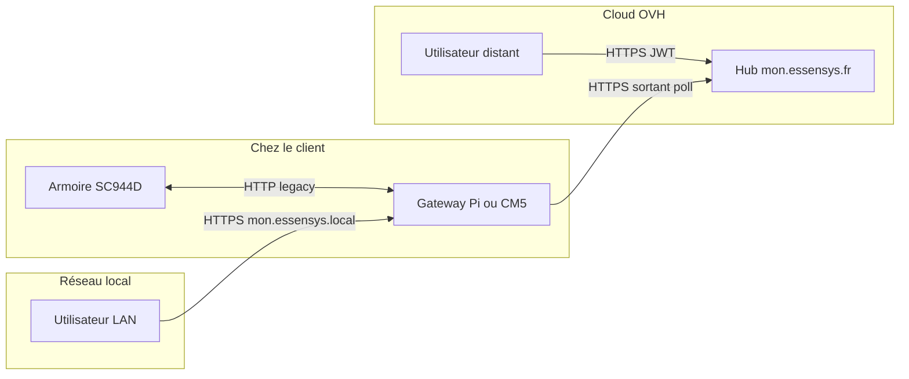

# Guides d'installation

Procédures pour déployer et configurer une installation Essensys. Avant de choisir un guide,
comparez les **trois profils** ci-dessous : deux installations **sur site** (matériel chez le
client) et l'**accès portail distant** (pilotage via Internet).

!!! info "Portail distant ≠ remplacement de la gateway"
    Le portail `https://mon.essensys.fr` est hébergé sur le cloud Essensys (OVH). Il ne remplace
    pas la passerelle locale : une **gateway Raspberry Pi ou CM5** doit rester installée chez le
    client et enregistrée pour relayer les commandes vers l'armoire.

## Matrice de choix

| Critère | Raspberry Pi (classique) | Gateway CM5 (dual-NIC) | Portail distant (`mon.essensys.fr`) |
|---------|--------------------------|------------------------|-------------------------------------|
| **Rôle** | Passerelle locale mono-interface | Passerelle locale professionnelle | Accès utilisateur depuis Internet |
| **Matériel** | Raspberry Pi 4 (eMMC) | CM5 + carte IO Essensys + NVMe | Aucun matériel supplémentaire (cloud OVH) |
| **Prérequis sur site** | Pi + stack Docker | CM5 + segment armoire isolé | Gateway déjà installée **et** enregistrée |
| **Playbook Ansible** | `install.raspberrypi.yml` | `install.gateway.yml` | Config cloud sync + enregistrement admin |
| **Accès utilisateur principal** | `https://mon.essensys.local` (LAN) | `https://mon.essensys.local` (LAN) + option WAN | `https://mon.essensys.fr` (depuis n'importe où) |
| **Segment armoire** | Même LAN que les postes | **eth1** dédié `10.0.1.0/24` (isolé) | Transparent (pilotage via la gateway) |
| **Complexité install** | Faible | Élevée (réseau, NVMe, MAC) | Moyenne (compte, liaison, secrets SOPS) |
| **Cible typique** | Rétrofit, labo, petit site | Installations neuves Essensys | Propriétaires en déplacement |
| **Guide détaillé** | [Raspberry Pi](raspberry-pi.md) | [Gateway CM5](gateway-cm5.md) | [CM5 — connectivité cloud](gateway-cm5.md#connectivite-cloud-prerequis-portail-distant) + [création de compte](https://www.essensys.fr/register) |

---

## Raspberry Pi (classique)

Installation sur **Raspberry Pi 4** mono-interface : stack Essensys conteneurisée (Docker Compose),
firmware armoire joignable sur le **même réseau LAN**.

### Avantages

- Matériel courant, coût réduit, procédure la plus courte.
- Idéal pour migration progressive ou environnement de test.
- Accès local immédiat via Traefik (HTTPS) et Nginx (HTTP legacy).

### Inconvénients

- **Pas d'isolation réseau** dédiée : l'armoire partage le LAN domestique.
- Stockage eMMC limité pour logs et données long terme.
- Pas de mDNS `mon.essensys.local` ni de CA locale Essensys par défaut (selon profil).
- Moins adapté aux installations neuves avec exigences réseau strictes.

### Sécurité

| Aspect | Comportement |
|--------|--------------|
| **Surface d'exposition** | HTTP (port 80) et HTTPS (443) écoutent sur **toutes** les interfaces — l'armoire et les postes sont sur le même segment. |
| **TLS local** | Certificat auto-signé ou Let's Encrypt selon configuration ; pas de CA locale Essensys standard. |
| **Accès distant** | Possible via domaine public + LE, mais **sans** le modèle pull cloud structuré du portail. |
| **Recommandation** | Réseau LAN de confiance, VLAN si possible ; migrer vers CM5 pour les sites production. |

→ [Guide Raspberry Pi](raspberry-pi.md) · source : [`essensys-raspberry-install`](https://essensys-hub.github.io/essensys-raspberry-install/)

---

## Gateway CM5 (dual-NIC)

Installation **complète** sur **Compute Module 5** : double Ethernet (LAN utilisateurs + segment
armoire), NVMe, AdGuard, mDNS et TLS local.

### Avantages

- **Isolation armoire** : `eth1` dédié (`10.0.1.0/24`), firmware legacy uniquement sur ce segment.
- **Durcissement LAN** : HTTP refusé sur `eth0` (port 80 → `444`), HTTPS Traefik lié à l'IP LAN.
- **TLS `.local`** : autorité **Essensys Local CA** — cadenas vert après import du certificat ([guide HTTPS local](https-local.md)).
- Stockage **NVMe** pour `/opt/data` et journaux.
- Prêt pour **synchronisation cloud** et portail distant (prérequis documentés).

### Inconvénients

- Matériel spécifique (CM5, carte IO, NVMe) et inventaire Ansible dédié (`inventory.gateway`).
- MAC `eth0` / `eth1` obligatoires pour l'enregistrement cloud.
- Cycle de vie plus lourd (désinstallation `uninstall.cm5.yml`, option NixOS).

### Sécurité

| Aspect | Comportement |
|--------|--------------|
| **Segmentation** | Armoires sur `eth1` isolé ; utilisateurs sur `eth0` — pas de routage direct poste → firmware. |
| **TLS** | CA locale pour `mon.essensys.local` ; Let's Encrypt pour le domaine WAN public. |
| **HTTP legacy** | Limité au bus armoire (`eth1`), pas exposé sur le LAN maison. |
| **Cloud sync** | Sortie **HTTPS uniquement** vers `mon.essensys.fr` (pas de HTTP WAN) ; token + MAC en en-têtes. |
| **Secrets** | Tokens gateway dans SOPS (`host_vars/.../secrets.sops.yaml`) — voir [gestion des secrets](https://github.com/essensys-hub/essensys-ansible/blob/main/docs/secrets.md). |

→ [Guide Gateway CM5](gateway-cm5.md)

---

## Portail distant (`mon.essensys.fr`)

Mode d'**accès à distance** pour l'utilisateur final : pilotage domotique depuis Internet sans
être sur le LAN. Le hub cloud (OVH) relaie les actions ; la gateway chez le client les exécute.

### Avantages

- **Aucun port entrant** sur la box : la gateway **interroge** le cloud en sortie (modèle pull).
- Accès depuis smartphone / tablette / PC, où que l'on soit.
- Authentification utilisateur (JWT) + compte géré sur `https://www.essensys.fr`.
- Même interface domotique que le site local (jumeaux frontend portal / server).

### Inconvénients

- **Nécessite une gateway** enregistrée (CM5 recommandé) — ce n'est pas une installation autonome.
- Latence liée à l'intervalle de polling (typ. quelques secondes).
- Dépendance au VPS OVH et à la connectivité Internet sortante (HTTPS 443).
- Liaison armoire validée par un administrateur (`link_requests`).

### Sécurité

| Aspect | Comportement |
|--------|--------------|
| **Modèle réseau** | Pas d'ouverture NAT ; trafic **sortant** gateway → hub uniquement. |
| **Auth utilisateur** | JWT sur `/api/portal/*` ; session initiée depuis `www.essensys.fr` (login) ou `mon.essensys.fr`. |
| **Auth gateway** | Token dédié + identité **MAC eth0/eth1** ; filtrage strict par `machine_id`. |
| **Données en transit** | TLS 1.2+ vers `mon.essensys.fr` ; certificat public Let's Encrypt. |
| **Données au repos** | Actions cloud en PostgreSQL OVH ; état domotique reste sur la gateway (Redis) — le cloud ne remplace pas l'armoire. |
| **Renforcement futur** | Identité gateway renforcée (mTLS / TPM) — voir conception [Gateway PKI](../architecture/overview.md). |

### Mise en service (résumé)

1. Installer une gateway ([CM5](gateway-cm5.md) recommandé) et valider le LAN local.
2. Vérifier la sortie HTTPS vers OVH (checklist P0–P6 dans le [guide CM5](gateway-cm5.md#connectivite-cloud-prerequis-portail-distant)).
3. Créer un compte sur [www.essensys.fr](https://www.essensys.fr/register) et demander la liaison armoire.
4. Enregistrer la gateway côté admin (`POST /api/portal/admin/gateways/register`) avec triplet `gateway_id`, token, `machine_id`, MAC.
5. Activer `cloud.enabled` dans `config.yaml` (ou variables Ansible SOPS).

---

## Quel profil choisir ?

| Besoin | Choix recommandé |
|--------|------------------|
| Test, labo, petit retrofit LAN simple | **Raspberry Pi** |
| Installation neuve, isolation armoire, production | **Gateway CM5** |
| Pilotage depuis l'extérieur (vacances, bureau) | **Portail distant** (+ CM5 ou Pi déjà en place) |
| Accès iPad/Mac sans avertissement TLS sur le LAN | **CM5** + [HTTPS local](https-local.md) |
| Zéro exposition entrante sur la box | **Portail distant** (pull sortant) |

---

## Guides détaillés

| Guide | Description |
|-------|-------------|
| [Gateway CM5 (dual-NIC)](gateway-cm5.md) | Installation complète CM5, cloud, Traefik |
| [HTTPS local utilisateur](https-local.md) | Certificat Essensys Local CA sur iPad/Mac/PC |
| [Raspberry Pi (classique)](raspberry-pi.md) | Bootstrap installation Pi 4 |

> Sources canoniques : dépôts [`essensys-ansible`](https://github.com/essensys-hub/essensys-ansible) et [`essensys-raspberry-install`](https://github.com/essensys-hub/essensys-raspberry-install).
