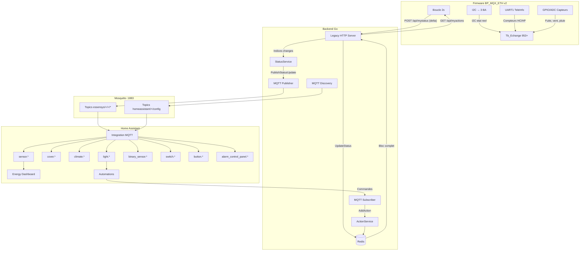

# Preparation du Firmware pour Home Assistant

**Statut** : Proposition  
**Auteur** : Essensys  
**Date** : 2026-01-21  
**Prerequis** : [Firmware v2 — Local + Status Reel](firmware-v2-local-fullstatus.md)

---

## 1. Diagnostic de l'Existant

### 1.1 Custom Component HA (`essensys-homeassitant/`)

| Aspect | Etat actuel | Probleme |
|--------|-------------|----------|
| Version | 1.2.0 | — |
| Plateformes | `light`, `cover`, `select` | Manque `climate`, `sensor`, `binary_sensor`, `switch`, `button`, `alarm_control_panel` |
| Setup | `setup()` synchrone legacy | Devrait utiliser `async_setup_entry()` + Config Flow |
| Communication | HTTP synchrone (`requests.post` vers `/api/admin/inject`) | Bloquant, pas de retour d'etat |
| Retour d'etat | **Aucun** — `self._is_on = False` en dur (ligne 83 de `light.py`) | L'etat affiche dans HA est toujours faux apres un redemarrage |
| Polling | Aucun | HA ne sait jamais l'etat reel des equipements |
| MQTT | Non utilise cote component | Le bridge MQTT du backend existe mais le component ne l'exploite pas |

### 1.2 Bridge MQTT du Backend Go (`internal/mqtt/`)

| Fichier | Role | Limitation |
|---------|------|------------|
| `discovery.go` | Generation des configs MQTT Discovery | Seulement `light`, `cover`, `select` |
| `client.go` | Connexion MQTT, publish/subscribe | — |
| `handlers.go` | Commandes HA → backend | `STOP` cover ignore, `select` label/valeur mal mappe |
| `publisher.go` | Publication etat vers MQTT | Appele **uniquement** dans `AddAction()` — publie l'intention, pas l'etat physique |

**Probleme central** : `PublishActionState()` est appele dans `ActionService.AddAction()` (ligne 78-91 de `action_service.go`). Quand le firmware envoie son `POST /api/mystatus`, les valeurs mises a jour dans Redis ne sont **jamais publiees vers MQTT**. HA ne voit donc que les commandes envoyees, pas l'etat confirme par le materiel.

### 1.3 Bugs Identifies dans le Bridge MQTT

| # | Bug | Fichier | Impact |
|---|-----|---------|--------|
| B1 | Collision `shortDescription` dans le groupement lights/covers | `discovery.go` | Quand plusieurs pieces ont un equipement avec le meme `shortDescription` (ex. "volet 1"), le dernier ecrase les precedents. Seul un volet sur N est visible dans HA |
| B2 | `select` : HA envoie le label, le backend attend la valeur numerique | `handlers.go` | HA envoie `"Forcage confort"` mais le backend a besoin de `"17"`. Le chauffage ne fonctionne pas via HA |
| B3 | `cover STOP` ignore | `handlers.go` | Le payload `STOP` est log et ignore. Impossible d'arreter un volet en position intermediaire depuis HA |
| B4 | `indexToEntity` ne mappe que `OpenIndex`, pas `CloseIndex` | `discovery.go` | La publication d'etat pour les covers ne fonctionne que pour l'ouverture |

### 1.4 Mapping des Entites — Etat Actuel vs. Cible

| Categorie Essensys | Indices | HA Domain Cible | Statut Backend MQTT | Statut Component HA |
|---------------------|---------|-----------------|---------------------|---------------------|
| Eclairages (directe + indirecte) | 605-616 | `light` | Implemente | Implemente (sans etat) |
| Volets roulants et store | 617-622 | `cover` | Implemente (sans STOP) | Implemente (sans etat) |
| Chauffage zones | 349-352 | `climate` | Partiel (`select`) | Implemente (`select`, pas `climate`) |
| Cumulus | 353 | `water_heater` ou `switch` | **Absent** | **Absent** |
| Arrosage | 363 | `switch` ou `number` | **Absent** | **Absent** |
| Alarme | 593 | `alarm_control_panel` | **Absent** | **Absent** |
| Prises securite | 440, 623 | `switch` | **Absent** | **Absent** |
| Machines (lave-linge/vaisselle) | 624 | `switch` | **Absent** | **Absent** |
| Sondes fuite | 11 (bits), 441-442 | `binary_sensor` | **Absent** | **Absent** |
| Vitesse vent | 940 | `sensor` | **Absent** | **Absent** |
| HC/HP, Delestage | 10 (bits) | `binary_sensor` | **Absent** | **Absent** |
| Scenarios | 590 | `button` | **Absent** | **Absent** |
| TeleInfo (nouveau firmware v2) | A definir | `sensor` (energy) | **Absent** | **Absent** |
| Etat reel BA (nouveau firmware v2) | 953+ | `binary_sensor` / `sensor` | **Absent** | **Absent** |
| Connectivite BA (nouveau firmware v2) | A definir | `binary_sensor` (connectivity) | **Absent** | **Absent** |

---

## 2. Ameliorations Proposees

### Axe 1 — Firmware : Etat Physique Reel

Ces ameliorations s'appuient sur le [firmware v2](firmware-v2-local-fullstatus.md) qui propose deja le status complet via delta et le retour d'etat des BA. Les points supplementaires pour HA :

#### 1a. Status Push Rapide

Quand un indice change dans `Tb_Echange[]` (detecte dans la boucle principale du BP), le firmware devrait le signaler au backend dans le prochain `mystatus` sans attendre le cycle complet de 2 secondes. Le firmware maintient deja `Tb_EchangePrecedent[]` pour la detection de changement. L'amelioration consiste a declencher un `POST /api/mystatus` immediat (ou a inserer le delta dans le prochain `POST` deja programme) des qu'un changement est detecte.

**Impact HA** : Latence de mise a jour reduite de ~2s (pire cas) a quelques centaines de ms.

#### 1b. TeleInfo comme Indices dans la Table d'Echange

Le BP recoit deja les trames TeleInfo via UART1 (1200 bauds, 7E1). Les donnees sont parsees dans `teleInfo.c` mais ne sont pas exposees dans la table d'echange vers le serveur.

Indices proposes (apres `Nb_Tbb_Donnees`, soit 953+) :

| Indice | Mnemonique TeleInfo | HA `device_class` | HA `state_class` | Unite |
|--------|---------------------|-------------------|------------------|-------|
| 953+ (a definir) | `HCHC` | `energy` | `total_increasing` | Wh |
| 953+ (a definir) | `HCHP` | `energy` | `total_increasing` | Wh |
| 953+ (a definir) | `PAPP` | `apparent_power` | `measurement` | VA |
| 953+ (a definir) | `IINST` | `current` | `measurement` | A |
| 953+ (a definir) | `PTEC` | — (enum) | — | HC/HP |

**Impact HA** : Alimente le **Energy Dashboard** nativement. Permet le suivi de consommation electrique sans materiel supplementaire.

**Contrainte** : Les compteurs `HCHC`/`HCHP` sont des entiers 32 bits. Un indice de la table d'echange ne contient qu'un octet. Il faut 4 indices consecutifs pour stocker un compteur, ou bien une representation en kWh tronquee.

#### 1c. Timestamp de Cycle

Ajouter un compteur de cycle incrementale dans `mystatus` pour que le backend detecte les paquets manques :

```json
{"version":"V38","cycle":1547,"ek":[...]}
```

**Impact HA** : Le backend peut calculer la fraicheur des donnees et marquer les entites `unavailable` si trop de cycles sont manques.

### Axe 2 — Backend Go : Boucle de Retour d'Etat vers MQTT

#### 2a. Hook sur PostMyStatus / PostMyFullStatus

Le changement le plus impactant pour HA. Apres que le backend a mis a jour Redis avec les valeurs recues du firmware, il doit publier les indices changes vers MQTT.

```
Flux actuel :
  Firmware → POST /api/mystatus → UpdateStatus(Redis) → [FIN]

Flux propose :
  Firmware → POST /api/mystatus → UpdateStatus(Redis) → CompareWithPrevious()
           → PublishChangedIndices(MQTT) → HA recoit l'etat confirme
```

**Fichiers a modifier** :
- `internal/api/legacy_http_server.go` : ajouter un appel au publisher MQTT apres `UpdateStatus()`
- `internal/mqtt/publisher.go` : nouvelle fonction `PublishStatusUpdate(changedIndices []IndexValue)`

#### 2b. Distinction Intention vs. Etat Reel

Deux jeux de topics MQTT separes :

| Topic | Source | Contenu |
|-------|--------|---------|
| `essensys/{type}/{id}/state` | `PostMyStatus` (firmware confirme) | Etat physique reel |
| `essensys/{type}/{id}/command_state` | `AddAction` (intention) | Derniere commande envoyee |

HA utilise `state` comme source de verite. Le `command_state` est optionnel et sert au debug (detection d'ecart intention/realite).

#### 2c. Mapping Complet des Entites

Enrichir `discovery.go` pour supporter toutes les categories du `table_reference.json` :

**`climate` (chauffage)** — Remplacer `select` :

| Valeur Firmware | `HVACMode` HA | `preset_mode` HA |
|-----------------|---------------|------------------|
| 0 ou 16 | `off` | — |
| 17 | `heat` | `comfort` |
| 18 | `heat` | `eco` |
| 19 | `heat` | — (custom "eco+") |
| 20 | `heat` | — (custom "eco++") |
| 21 | `heat` | — (custom "hors gel") |
| 32 | `heat` | `away` (anticipe) |

**`alarm_control_panel`** :

| Action | Indice | Valeur | HA State |
|--------|--------|--------|----------|
| Armer | 593 | 1 | `armed_away` |
| Desarmer | 593 | 2 | `disarmed` |
| Alerte intrusion (lecture) | 11 (bit 0) | 1 | `triggered` |

**`binary_sensor`** (alertes, fuites, status) :

| Entite | Indice | Bit | `device_class` HA |
|--------|--------|-----|-------------------|
| Fuite Lave-Linge | 11 | 1 | `moisture` |
| Fuite Lave-Vaisselle | 11 | 2 | `moisture` |
| Alarme Intrusion | 11 | 0 | `safety` |
| Heures Creuses | 10 | 0 | `power` |
| Delestage | 10 | 1 | `power` |
| Mode Secouru | 10 | 2 | `power` |
| Communication Compteur | 12 | 0 | `problem` |
| Communication IHM | 12 | 1 | `problem` |
| Connectivite BA PDV | 814 (v2) | 0 | `connectivity` |
| Connectivite BA CHB | 814 (v2) | 1 | `connectivity` |
| Connectivite BA PDE | 814 (v2) | 2 | `connectivity` |

**`sensor`** :

| Entite | Indice | `device_class` | `state_class` | Unite |
|--------|--------|----------------|---------------|-------|
| Vitesse Vent | 940 | `wind_speed` | `measurement` | km/h |
| Seuil Repliage Store | 939 | `wind_speed` | — | km/h |
| TeleInfo HCHC (v2) | A definir | `energy` | `total_increasing` | Wh |
| TeleInfo HCHP (v2) | A definir | `energy` | `total_increasing` | Wh |
| TeleInfo PAPP (v2) | A definir | `apparent_power` | `measurement` | VA |
| TeleInfo IINST (v2) | A definir | `current` | `measurement` | A |

**`switch`** :

| Entite | Indice | Valeur ON | Valeur OFF |
|--------|--------|-----------|------------|
| Prises Securite | 440 | 0 (On) | 1 (Off) |
| Machines | 624 | 2 (remettre) | 1 (couper) |
| Arrosage | 363 | 255 (auto) ou duree | 0 (off) |
| Cumulus | 353 | 1 (HC) | 2 (Off) |

**`button`** (scenarios) :

| Entite | Indice | Valeur |
|--------|--------|--------|
| Scenario 1 | 590 | 1 |
| Scenario 2 | 590 | 2 |
| ... | 590 | ... |
| Scenario 8 | 590 | 8 |

#### 2d. Correction des Bugs Existants

| Bug | Correction proposee |
|-----|---------------------|
| B1 — Collision `shortDescription` | Utiliser `zone + piece + shortDescription` comme cle de groupement au lieu de `shortDescription` seul |
| B2 — Select label/valeur | Stocker un mapping `label → value` dans `EntityCommand`. Dans `handlers.go`, traduire le label recu en valeur avant appel `AddAction()` |
| B3 — Cover STOP | Ajouter un `StopIndex`/`StopValue` dans `EntityCommand` pour les covers. Dans `handlers.go`, gerer le payload `STOP` |
| B4 — `indexToEntity` incomplet | Mapper `OpenIndex` ET `CloseIndex` vers la meme entite cover dans `indexToEntity` |

### Axe 3 — Custom Component HA : Migration Architecturale

#### 3a. Migration vers `async_setup_entry` + Config Flow

Le composant actuel utilise `setup()` (legacy, synchrone). Migration vers le pattern moderne HA :

| Ancien | Nouveau |
|--------|---------|
| `setup()` dans `__init__.py` | `async_setup_entry()` + `async_unload_entry()` |
| `configuration.yaml` | Config Flow UI (Integrations → Ajouter) |
| `requests.post()` synchrone | `aiohttp` asynchrone ou MQTT natif |
| Pas de `DataUpdateCoordinator` | Coordinator pour le polling centralise |

Fichiers a creer/modifier :

| Fichier | Role |
|---------|------|
| `config_flow.py` | Config Flow (URL backend, credentials MQTT) |
| `coordinator.py` | `DataUpdateCoordinator` — polling etat depuis backend REST ou subscription MQTT |
| `const.py` | Constantes (DOMAIN, platforms, etc.) |
| `__init__.py` | `async_setup_entry`, enregistrement des plateformes |
| `light.py` | Refactoring avec `CoordinatorEntity` |
| `cover.py` | Refactoring avec `CoordinatorEntity` |
| `climate.py` | Nouveau — remplace `select.py` pour le chauffage |
| `sensor.py` | Nouveau — vent, TeleInfo |
| `binary_sensor.py` | Nouveau — fuites, alertes, connectivite |
| `switch.py` | Nouveau — prises, machines, arrosage, cumulus |
| `button.py` | Nouveau — scenarios |
| `alarm_control_panel.py` | Nouveau — alarme intrusion |

#### 3b. MQTT Natif

Remplacer les appels HTTP synchrones par MQTT. HA a un excellent support MQTT integre :

```
Etat :
  HA subscribe → essensys/{type}/{id}/state → mise a jour entite

Commande :
  HA publish → essensys/{type}/{id}/set → backend recoit → ActionService
```

Le Discovery MQTT (`homeassistant/{domain}/essensys_{id}/config`) est deja genere par le backend. Le component HA n'a qu'a consommer les topics.

#### 3c. Device Grouping par Zone

Grouper les entites HA par device/area :

| Zone Firmware | Area HA suggeree | Equipements |
|---------------|------------------|-------------|
| PDV (0x11) | Salon, Cuisine, Entree | 5 lampes, 6 volets, 3 variateurs |
| CHB (0x12) | Chambres | 7 lampes, 5 volets, 4 variateurs |
| PDE (0x13) | SdB, WC, Buanderie | 13 lampes, 4 volets, 1 variateur |
| Global | Maison | Alarme, cumulus, arrosage, scenarios |

Chaque zone correspond a un `device` HA avec :
- `manufacturer: "Essensys"`
- `model: "SC940D"` / `"SC941C"` / `"SC942C"`
- `sw_version: "v37"` (ou v2 apres mise a jour)

#### 3d. Energy Dashboard

Entites `sensor` avec les attributs requis par le Energy Dashboard :

```python
class EssensysTeleInfoSensor(CoordinatorEntity, SensorEntity):
    _attr_device_class = SensorDeviceClass.ENERGY
    _attr_state_class = SensorStateClass.TOTAL_INCREASING
    _attr_native_unit_of_measurement = UnitOfEnergy.WATT_HOUR
```

### Axe 4 — UX et Fiabilite

#### 4a. Availability

Marquer les entites `unavailable` quand le firmware ne repond plus :

| Mecanisme | Condition | Entites affectees |
|-----------|-----------|-------------------|
| Heartbeat firmware | Aucun `mystatus` recu depuis > 10s (5 cycles) | Toutes |
| Connectivite BA (indice 814 v2) | Bit = 0 | Entites de la zone BA correspondante |
| Timestamp de cycle (v2) | Trop de cycles manques | Toutes |

Le backend publie `essensys/{type}/{id}/available` = `"offline"` quand la condition est remplie. HA affiche automatiquement l'entite comme indisponible.

#### 4b. Assumed State

Pour les covers et lights sans retour d'etat confirme (avant firmware v2 phase 3) :

```python
class EssensysCover(CoordinatorEntity, CoverEntity):
    @property
    def assumed_state(self) -> bool:
        return not self._has_confirmed_state
```

HA affiche les deux boutons (ouvrir/fermer) au lieu d'un toggle, ce qui est plus adapte quand l'etat reel est inconnu.

#### 4c. Diagnostics

Exposer les informations de debug comme entites `diagnostic` (non affichees par defaut dans le dashboard, visibles dans les details du device) :

| Entite Diagnostic | Source | Type |
|-------------------|--------|------|
| Version firmware | `us_BP_VERSION_SERVEUR` | `sensor` |
| Uptime BP | Compteur de cycles × 2s | `sensor` |
| Erreurs I2C BA PDV | Compteur erreurs I2C bus 0x11 | `sensor` |
| Erreurs I2C BA CHB | Compteur erreurs I2C bus 0x12 | `sensor` |
| Faute comm. Compteur | Indice 12, bit 0 | `binary_sensor` |
| Faute comm. IHM | Indice 12, bit 1 | `binary_sensor` |

---

## 3. Architecture Cible

### 3.1 Diagramme de Flux



### 3.2 Topics MQTT — Structure Complete

```
homeassistant/
├── light/essensys_{zone}_{id}/config          # Discovery
├── cover/essensys_{zone}_{id}/config
├── climate/essensys_{zone}_{id}/config
├── sensor/essensys_{id}/config
├── binary_sensor/essensys_{id}/config
├── switch/essensys_{id}/config
├── button/essensys_{id}/config
└── alarm_control_panel/essensys/config

essensys/
├── light/{zone}_{id}/
│   ├── state          # ON/OFF (confirme par firmware)
│   ├── command_state  # ON/OFF (derniere commande envoyee)
│   ├── available      # online/offline
│   └── set            # Commande depuis HA
├── cover/{zone}_{id}/
│   ├── state          # open/closed/opening/closing
│   ├── available
│   └── set            # OPEN/CLOSE/STOP
├── climate/{zone}_{id}/
│   ├── mode_state         # off/heat
│   ├── preset_mode_state  # comfort/eco/eco+/eco++/frost/away
│   ├── available
│   ├── mode_set
│   └── preset_mode_set
├── sensor/{id}/
│   └── state          # Valeur numerique
├── binary_sensor/{id}/
│   ├── state          # ON/OFF
│   └── available
├── switch/{id}/
│   ├── state
│   ├── available
│   └── set
├── button/{id}/
│   └── set            # PRESS
└── alarm_control_panel/
    ├── state          # armed_away/disarmed/triggered
    ├── available
    └── set            # ARM_AWAY/DISARM
```

---

## 4. Phasing

### Phase 0 — Correction des Bugs (sans firmware v2)

**Effort** : 1-2 jours  
**Risque** : Faible  
**Impact** : Les entites existantes fonctionnent correctement dans HA

| Tache | Fichier | Description |
|-------|---------|-------------|
| Corriger collision `shortDescription` | `discovery.go` | Cle = `zone_piece_shortDescription` |
| Corriger mapping select label/valeur | `handlers.go` | Lookup table label → valeur |
| Implementer cover STOP | `handlers.go` | Gerer payload `STOP` |
| Mapper `CloseIndex` dans `indexToEntity` | `discovery.go` | Ajouter l'index de fermeture |

### Phase 1 — Retour d'Etat via MQTT (sans firmware v2)

**Effort** : 3-5 jours  
**Risque** : Faible  
**Impact** : HA affiche l'etat confirme par le firmware (pour les indices deja demandes par le backend)

| Tache | Composant | Description |
|-------|-----------|-------------|
| Hook `PublishStatusUpdate` | Backend Go | Publier les indices changes apres `PostMyStatus` |
| Topics etat vs. intention | Backend Go | Separer `state` et `command_state` |
| Entites supplementaires | Backend Go | `binary_sensor`, `sensor`, `switch`, `button`, `alarm_control_panel` |
| Migration component HA | Component HA | `async_setup_entry`, config flow, MQTT natif |

### Phase 2 — Firmware v2 : Status Complet + TeleInfo

**Effort** : 2-3 semaines  
**Risque** : Moyen  
**Impact** : HA a une vue complete de tous les equipements + Energy Dashboard

| Tache | Composant | Description |
|-------|-----------|-------------|
| Delta complet `mystatus` | Firmware BP | Toute la table d'echange en delta |
| TeleInfo dans `Tb_Echange` | Firmware BP | Indices 953+ pour compteurs et puissance |
| Timestamp cycle | Firmware BP | Compteur incrementale dans `mystatus` |
| Endpoint `myfullstatus` | Backend Go | Stockage et publication du full status |
| Availability | Backend Go + HA | Marquer offline si pas de heartbeat |
| `climate` entity | Component HA | Remplacer `select` par `climate` |
| Energy sensors | Component HA | `sensor` avec `total_increasing` |

### Phase 3 — Firmware v2 : Retour d'Etat BA

**Effort** : 3-4 semaines (inclut flash des 3 BA)  
**Risque** : Eleve (acces physique requis)  
**Impact** : HA affiche l'etat physique confirme des relais, volets et variateurs

| Tache | Composant | Description |
|-------|-----------|-------------|
| `C_LIRE_ETAT` BA | Firmware BA | Nouvelle commande I2C (voir autocritique 9.2 de firmware-v2) |
| Interrogation cyclique BA | Firmware BP | Polling I2C des 3 BA |
| Indices etat reel | Firmware BP | Stockage dans `Tb_Echange[953+]` |
| Entites etat reel | Backend Go + HA | `binary_sensor` connectivite, etat confirme |
| Detection ecart | HA (automation) | Alerte si commande ≠ etat reel pendant > N secondes |

### Phase 4 — Polish UX

**Effort** : 1 semaine  
**Risque** : Faible  
**Impact** : Experience utilisateur complete dans HA

| Tache | Composant | Description |
|-------|-----------|-------------|
| Device grouping par zone | Backend Go | Device HA par BA (PDV, CHB, PDE) |
| Areas mapping | Component HA | Suggestion d'areas basee sur les zones |
| Diagnostics entities | Backend Go | Version firmware, uptime, erreurs I2C |
| Assumed state covers | Component HA | Afficher les deux boutons quand etat inconnu |
| Icons et traductions | Component HA | `strings.json` avec les traductions FR |

---

## 5. Estimation Globale

| Phase | Duree | Prerequis |
|-------|-------|-----------|
| Phase 0 — Bugs | 1-2 jours | Aucun |
| Phase 1 — Retour etat MQTT | 3-5 jours | Phase 0 |
| Phase 2 — Firmware v2 status + TeleInfo | 2-3 semaines | Phase 1, [firmware-v2](firmware-v2-local-fullstatus.md) Phase 2 |
| Phase 3 — Retour etat BA | 3-4 semaines | Phase 2, [firmware-v2](firmware-v2-local-fullstatus.md) Phase 3 |
| Phase 4 — Polish | 1 semaine | Phase 1+ |
| **Total** | **~8-10 semaines** | |

---

## 6. References

| Document | Lien |
|----------|------|
| Firmware v2 — Local + Status Reel | [firmware-v2-local-fullstatus.md](firmware-v2-local-fullstatus.md) |
| Bridge Pattern (ACL) | [archi/bridge-pattern.md](../archi/bridge-pattern.md) |
| Table d'Echange | [archi/exchange-table.md](../archi/exchange-table.md) |
| Domaines Fonctionnels | [archi/domaines-fonctionnels.md](../archi/domaines-fonctionnels.md) |
| Protocoles I2C/UART/SPI | [archi/legacy-client-protocols.md](../archi/legacy-client-protocols.md) |
| Configuration Hardware | [archi/legacy-client-config.md](../archi/legacy-client-config.md) |
| Component HA actuel | `essensys-homeassitant/custom_components/essensys/` |
| Backend MQTT | `essensys-server-backend/internal/mqtt/` |
| TableReference | `essensys-support-site/docs/TableReference.json` |
