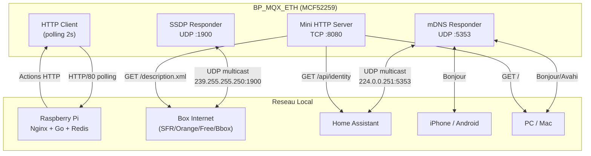

# Modernisation HTTP et Discovery Reseau du Firmware BP_MQX_ETH

**Statut** : Proposition  
**Auteur** : Essensys  
**Date** : 2026-01-22  
**Prerequis** : [Firmware v2 — Local + Status Reel](firmware-v2-local-fullstatus.md)

---

## 1. Diagnostic de l'Existant

### 1.1 Pile HTTP Actuelle

Le firmware communique via une pile HTTP construite manuellement dans `Ethernet/www.c` :

| Aspect | Etat actuel | Limitation |
|--------|-------------|------------|
| Version HTTP | HTTP/1.1 (string manuelle) | Headers construits par `strcpy`/`strcat` |
| Chiffrement | **Aucun** — TCP port 80 en clair | Trafic interceptable sur le LAN |
| Authentification | MD5 + Base64 (`Authorization: Basic`) | MD5 casse depuis 2004 (collision), pas de salt |
| Connexion | Nouvelle connexion TCP par requete | Pas de HTTP keep-alive, overhead 3-way handshake |
| Buffer TX | 1024 octets (`c_EthernetBufferTX`) | Limite la taille des POST |
| Buffer RX | 1500 octets (`c_EthernetBufferRX`) | Single `recv()` — pas de reassemblage |
| JSON | Parsing manuel avec `strstr()` | Fragile, pas de gestion d'echappement |
| DNS | `RTCS_resolve_ip_address()` unicast | Un seul host (`mon.essensys.fr`) |
| Socket | Un socket a la fois, port 80 fixe | `_io_socket_install()` a chaque ouverture |
| UDP | Disponible dans RTCS, **non utilise** | — |
| Multicast | Supporte par RTCS (IGMP), **non utilise** | — |
| mDNS / Bonjour | **Absent** | — |
| SSDP / UPnP | **Absent** | — |

### 1.2 Contraintes Memoire pour TLS

| Ressource | Total | Utilise | Disponible |
|-----------|-------|---------|------------|
| Flash | 512 Ko | ~280 Ko | ~232 Ko |
| RAM (SRAM) | 64 Ko | ~50 Ko | ~14 Ko |
| Stack Ethernet | 3000 octets | variable | — |

Une pile TLS (mbedTLS, WolfSSL) necessite typiquement :

| Bibliotheque | RAM supplementaire | Flash supplementaire | Viable ? |
|-------------|-------------------|---------------------|----------|
| WolfSSL (config minimale) | 10-15 Ko | 60-100 Ko | Critique — 14 Ko RAM dispo |
| mbedTLS (config minimale) | 20-40 Ko | 80-150 Ko | **Impossible** — depasse la RAM |
| BearSSL (ultra-leger) | 5-10 Ko | 30-50 Ko | Possible mais tres serre |

### 1.3 Architecture Reseau Actuelle

```
┌─────────────┐                                           ┌─────────────────┐
│  BP_MQX_ETH │──── HTTP/1.1 port 80 (clair) ────────────→│  Raspberry Pi   │
│  (MCF52259) │     TCP, single-socket                     │  Nginx → Go     │
│             │     Auth: Basic MD5+Base64                  │  Backend :7070  │
└─────────────┘                                           └─────────────────┘
       ↕                           Internet
  I2C vers BA                         ↕
                              ┌───────────────┐
                              │  Box Internet  │
                              │  (SFR/Orange/  │
                              │   Free/Bbox)   │
                              └───────────────┘
```

Le BP est **invisible** sur le reseau : aucun port en ecoute, aucun service annonce, aucun protocole de decouverte. Seul le backend Go sait qu'il existe (via le polling HTTP sortant).

---

## 2. Axe 1 — Securisation : HTTPS et Authentification Moderne

### 2.1 Strategie A : TLS Termination par Nginx (recommandee)

Le BP continue de communiquer en HTTP clair sur le LAN, mais Nginx assure le chiffrement pour les clients externes (frontend, HA, MCP).

```
Internet (HTTPS/443)          LAN prive
       ↕                        ↕
┌──────────┐  HTTPS   ┌───────────────┐  HTTP/80   ┌─────────────┐
│ Clients  │─────────→│    Nginx      │───────────→│  BP_MQX_ETH │
│ externes │          │  TLS termina- │            │  (MCF52259)  │
│          │←─────────│  tion + proxy │←───────────│             │
└──────────┘  HTTPS   └───────────────┘  HTTP/80   └─────────────┘
                             ↕ HTTP
                      ┌───────────────┐
                      │  Backend Go   │
                      │  :7070        │
                      └───────────────┘
```

**Avantages** :
- Zero modification firmware
- Nginx gere les certificats (Let's Encrypt via Traefik ou ACME)
- Le LAN reste en clair (performances, pas de surcharge CPU)
- Le trafic WAN est chiffre

**Inconvenient** :
- Le trafic LAN entre le BP et le Raspberry Pi reste en clair. Acceptable car le reseau est prive et physiquement controle.

**Modifications requises** :
- Nginx : ajouter un `upstream` pour le BP et un certificat auto-signe ou Let's Encrypt
- Aucune modification firmware

### 2.2 Strategie B : TLS Natif sur MCF52259 (exploratoire)

Tenter d'integrer BearSSL ou WolfSSL directement sur le MCF52259 pour une communication HTTPS native.

**Prerequis** :
- Mesurer la RAM libre reelle avec `_mem_get_highwater()` et `_task_get_template_ptr()`
- Compiler BearSSL pour ColdFire V2 avec CodeWarrior (cible non supportee officiellement)
- Configurer TLS 1.2 minimum avec une seule cipher suite (TLS_RSA_WITH_AES_128_CBC_SHA256)
- Stocker le certificat CA dans la Flash interne ou l'EEPROM SPI

**Estimation memoire BearSSL (config minimale)** :

| Composant | RAM | Flash |
|-----------|-----|-------|
| Contexte TLS (`br_ssl_client_context`) | ~3 Ko | — |
| Buffer I/O (record layer) | ~4 Ko (2 × 2048) | — |
| Buffer certificat | ~2 Ko | — |
| Code RSA + AES + SHA256 | — | ~30 Ko |
| Certificat CA racine | — | ~1-2 Ko |
| **Total** | **~9 Ko** | **~32 Ko** |

Avec ~14 Ko RAM disponible, c'est **faisable mais critique**. Toute regression dans l'utilisation RAM du reste du firmware (ajout de `Tb_EchangePrecedentEnvoye[]` = 953 octets) pourrait faire basculer vers un depassement.

**Risques** :
- BearSSL n'a pas de port officiel pour ColdFire/CodeWarrior
- Le handshake TLS prend ~2-5 secondes sur un CPU 80 MHz sans accelerateur crypto
- Le polling de 2 secondes deviendrait 4-7 secondes avec le handshake TLS
- Pas de keep-alive actuellement : un handshake TLS **a chaque requete** (3× par cycle)

**Mitigation du handshake** :
- Implementer TLS session resumption (session ID ou session ticket) pour eviter le handshake complet a chaque connexion
- Ou : passer en HTTP keep-alive pour maintenir la session TLS ouverte

### 2.3 Strategie C : Amelioration de l'Authentification (sans TLS)

Meme sans TLS, l'authentification peut etre renforcee tout en restant sur du HTTP clair.

| Methode actuelle | Probleme | Alternative proposee |
|------------------|----------|---------------------|
| `Authorization: Basic MD5(cle)` | MD5 casse, base64 visible | HMAC-SHA256 avec nonce |
| Cle fixe dans EEPROM | Pas de rotation | Challenge-response par session |
| Aucun replay protection | Requetes rejouables | Nonce + timestamp dans chaque requete |

**Schema HMAC-SHA256** :

```
1. BP → Serveur : GET /api/serverinfos
2. Serveur → BP : {"nonce":"abc123","infos":[...]}
3. BP calcule : HMAC-SHA256(cle_EEPROM, nonce + timestamp + body)
4. BP → Serveur : POST /api/mystatus
   Authorization: HMAC-SHA256 nonce=abc123,ts=1706000000,sig=<64hex>
5. Serveur verifie le HMAC et le timestamp (fenetre de 30s)
```

**Impact firmware** :
- Remplacer MD5 par SHA-256 (~2 Ko Flash, compatible ColdFire)
- Ajouter un champ `nonce` dans le parser JSON de `sc_JsonGetServerInformation()`
- Modifier `c_EnteteTrameAuthorisation()` pour generer le header HMAC

---

## 3. Axe 2 — HTTP Keep-Alive et Optimisations

### 3.1 HTTP Keep-Alive (Connection Persistante)

Actuellement, le firmware ouvre et ferme un socket TCP a chaque requete (3 par cycle de 2 secondes = 3 handshakes TCP). Avec keep-alive, une seule connexion persiste pour tout le cycle.

**Modifications `GestionSocket.c`** :

```c
// Avant : shutdown apres chaque requete
shutdown(l_ul_sock, FLAG_ABORT_CONNECTION);

// Apres : garder le socket ouvert, fermer seulement en fin de cycle
// Ajouter un header keep-alive :
strcat(c_EthernetBufferTX, "Connection: keep-alive\r\n");
```

**Modifications `www.c`** :

```c
// sc_DialogueAvecServeur() — un seul socket pour tout le cycle
signed char sc_DialogueAvecServeur(void) {
    unsigned long ul_Socket;
    
    // Ouvrir le socket une seule fois
    if (sc_SocketOpen(IPServeur, &ul_DetailErreur, &ul_Socket) != 0)
        return sc_ETHERNET_RETOUR_PB_RTCS;
    
    // GET /api/serverinfos (reutilise le socket)
    sc_GetInformationServer(ul_Socket);
    _time_delay(50);
    
    // POST /api/mystatus (reutilise le socket)
    sc_PostInformationServer(ul_Socket);
    _time_delay(50);
    
    // GET /api/myactions (reutilise le socket)
    sc_ActionManagment(ul_Socket);
    
    // Fermer le socket en fin de cycle
    shutdown(ul_Socket, FLAG_ABORT_CONNECTION);
}
```

**Gain** : Suppression de 2 handshakes TCP/IP par cycle (economie de ~200 ms par cycle sur un LAN).

### 3.2 Augmentation des Buffers

| Buffer | Actuel | Propose | Gain |
|--------|--------|---------|------|
| `us_BUFFER_TX` | 1024 | 2048 | ~80 indices par POST au lieu de ~30 |
| `us_BUFFER_RX1` | 1500 | 2048 | Marge pour les reponses plus longues |
| `us_BUFFER_RX2` | 1024 | 1024 | Inchange |
| `us_BUFFER_TX2` | 1024 | 2048 | Corps JSON plus large |

**Impact RAM** : +2048 octets. Valider par mesure highwater.

### 3.3 Amelioration du Parsing JSON

Le parser actuel utilise `strstr()` avec des chaines fixes. Un parser leger base sur un automate a etats serait plus robuste.

**Alternative recommandee** : [JSMN](https://github.com/zserge/jsmn) — parser JSON minimaliste sans allocation dynamique.

| Aspect | `strstr()` actuel | JSMN |
|--------|-------------------|------|
| RAM | 0 (in-place) | ~256 octets (64 tokens × 4 octets) |
| Flash | ~2 Ko | ~1 Ko |
| Robustesse | Fragile (position-dependant) | Solide (tokenizer complet) |
| Allocation | Aucune | Stack uniquement |
| Portabilite | Aucune | C89 pur |

---

## 4. Axe 3 — Discovery Reseau (Broadcast / mDNS / SSDP)

### 4.1 Le Probleme

Le BP est un equipement "fantome" sur le reseau :
- Pas de port en ecoute
- Pas de service annonce
- Invisible pour les boxes Internet, Home Assistant (auto-discovery), les apps mobiles
- Le seul moyen de le trouver est de connaitre son adresse MAC ou de surveiller le trafic DHCP

Pour l'integration avec les boxes Internet (SFR, Orange, Free, Bouygues) et Home Assistant, le BP devrait se rendre **visible** et **decouvrable** automatiquement, comme le fait un Apple TV, un Chromecast ou une imprimante reseau.

### 4.2 Protocoles de Decouverte

| Protocole | Port | Transport | Qui l'utilise | Interet Essensys |
|-----------|------|-----------|---------------|------------------|
| **mDNS** (RFC 6762) | 5353 | UDP multicast 224.0.0.251 | Apple TV, Chromecast, imprimantes, HA | Eleve — zero-config, pas de serveur DNS |
| **DNS-SD** (RFC 6763) | 5353 | Via mDNS | Apple, Google, HA | Eleve — annonce de services |
| **SSDP/UPnP** | 1900 | UDP multicast 239.255.255.250 | Boxes Internet (SFR, Orange, Free, Bbox) | Eleve — decouverte par les boxes |
| **LLDP** (802.1AB) | — | Ethernet L2 | Switches manageables | Faible — pas d'interet utilisateur |

### 4.3 Proposition A : mDNS + DNS-SD (Zero-Configuration)

mDNS permet au BP de repondre a des requetes DNS sur le reseau local sans serveur DNS central. DNS-SD permet d'annoncer des services.

**Principe** :
1. Le BP rejoint le groupe multicast 224.0.0.251 (IGMP Join)
2. Il ecoute les requetes mDNS sur UDP port 5353
3. Quand quelqu'un cherche `essensys-bp.local`, il repond avec son IP
4. Il annonce son service : `_essensys._tcp.local` avec les metadonnees (MAC, version, zone)

**Implementation firmware** :

```c
// Nouveau fichier : Ethernet/mDNS.c

#define MDNS_PORT        5353
#define MDNS_MULTICAST   0xE00000FB  // 224.0.0.251

// Buffer de reponse mDNS (pre-construit au boot)
static unsigned char uc_mDNS_Response[256];
static unsigned short us_mDNS_ResponseLen;

// Initialisation : creer un socket UDP et rejoindre le groupe multicast
signed char sc_mDNS_Init(void) {
    ul_mDNS_Socket = socket(PF_INET, SOCK_DGRAM, 0);
    // Bind sur port 5353
    // IGMP join sur 224.0.0.251
    // Construire la reponse DNS pre-formatee
}

// Boucle : ecouter les requetes et repondre
void vd_mDNS_Process(void) {
    // recvfrom() non-bloquant
    // Si requete pour "essensys-bp.local" ou "_essensys._tcp.local"
    //   → sendto() avec la reponse pre-construite
}
```

**Taille estimee** :

| Composant | RAM | Flash |
|-----------|-----|-------|
| Socket UDP | ~256 octets (RTCS) | — |
| Buffer reponse | 256 octets | — |
| Buffer requete | 512 octets | — |
| Code mDNS | — | ~3-4 Ko |
| **Total** | **~1 Ko** | **~4 Ko** |

**Benefices** :
- Home Assistant decouvre automatiquement le BP (via Zeroconf integration)
- Les appareils Apple (iPhone, Mac) voient le BP dans le Finder/reseau
- Compatible avec Avahi (Linux) et Bonjour (macOS/Windows)

**Service annonce** :

```
essensys-bp._essensys._tcp.local
  port=80
  txt="mac=XX:XX:XX:XX:XX:XX"
  txt="version=V37"
  txt="type=BP_MQX_ETH"
  txt="zones=PDV,CHB,PDE"
```

### 4.4 Proposition B : SSDP/UPnP (Decouverte par les Boxes Internet)

Les boxes Internet francaises utilisent UPnP/SSDP pour decouvrir les equipements reseau. C'est ce qui permet de voir les NAS, les imprimantes et les media players dans l'interface web de la box.

**Principe SSDP** :
1. Le BP rejoint le groupe multicast 239.255.255.250 (IGMP Join)
2. Au boot, il envoie un `NOTIFY ssdp:alive` sur le multicast
3. Quand la box envoie un `M-SEARCH`, le BP repond avec sa description
4. La box affiche "Essensys BP_MQX_ETH" dans sa liste d'equipements

**Message SSDP NOTIFY** :

```http
NOTIFY * HTTP/1.1
HOST: 239.255.255.250:1900
CACHE-CONTROL: max-age=1800
LOCATION: http://192.168.0.XXX:80/description.xml
NT: urn:essensys:device:HomeController:1
NTS: ssdp:alive
USN: uuid:essensys-bp-XXXXXXXXXXXX::urn:essensys:device:HomeController:1
SERVER: MQX/4.0 UPnP/1.1 EssensysBP/1.0
```

**Message M-SEARCH response** :

```http
HTTP/1.1 200 OK
CACHE-CONTROL: max-age=1800
LOCATION: http://192.168.0.XXX:80/description.xml
ST: urn:essensys:device:HomeController:1
USN: uuid:essensys-bp-XXXXXXXXXXXX::urn:essensys:device:HomeController:1
SERVER: MQX/4.0 UPnP/1.1 EssensysBP/1.0
```

**Description XML** (servie par le BP sur GET /description.xml) :

```xml
<?xml version="1.0"?>
<root xmlns="urn:schemas-upnp-org:device-1-0">
  <specVersion><major>1</major><minor>1</minor></specVersion>
  <device>
    <deviceType>urn:essensys:device:HomeController:1</deviceType>
    <friendlyName>Essensys Domotique</friendlyName>
    <manufacturer>Essensys</manufacturer>
    <modelName>BP_MQX_ETH</modelName>
    <modelNumber>V37</modelNumber>
    <serialNumber>XXXXXXXXXXXX</serialNumber>
    <UDN>uuid:essensys-bp-XXXXXXXXXXXX</UDN>
  </device>
</root>
```

**Impact firmware** :

| Composant | RAM | Flash |
|-----------|-----|-------|
| Socket UDP SSDP | ~256 octets | — |
| Buffer NOTIFY/M-SEARCH | 512 octets | — |
| Description XML (const) | — | ~500 octets |
| Code SSDP | — | ~3 Ko |
| **Total** | **~768 octets** | **~3.5 Ko** |

**Compatibilite boxes** :

| Box | UPnP/SSDP | mDNS | Resultat attendu |
|-----|-----------|------|-------------------|
| Orange Livebox | Oui | Non | Visible dans "Equipements UPnP" |
| SFR Box | Oui | Non | Visible dans "Peripheriques" |
| Freebox | Oui | Oui (via mDNS OS) | Visible dans l'interface et Bonjour |
| Bbox (Bouygues) | Oui | Non | Visible dans "Equipements reseau" |

### 4.5 Proposition C : Combinaison mDNS + SSDP

Implementer les deux protocoles pour une couverture maximale :

| Cible | Protocole | Resultat |
|-------|-----------|----------|
| Home Assistant | mDNS/DNS-SD | Auto-discovery via Zeroconf integration |
| Boxes Internet (SFR, Orange, Free, Bbox) | SSDP/UPnP | Visible dans l'interface web de la box |
| Apple (iPhone, Mac) | mDNS/Bonjour | Visible dans le Finder et les apps |
| Windows | SSDP + mDNS | Visible dans "Voisinage reseau" |
| Linux (Avahi) | mDNS | `avahi-browse -a` |

**Cout total** :

| Ressource | mDNS | SSDP | Total |
|-----------|------|------|-------|
| RAM | ~1 Ko | ~768 octets | ~1.8 Ko |
| Flash | ~4 Ko | ~3.5 Ko | ~7.5 Ko |

Avec ~14 Ko RAM disponible et ~232 Ko Flash disponible, c'est **largement faisable**.

### 4.6 Architecture de la Tache Discovery

Le code discovery peut etre integre dans la tache Ethernet existante (3000 octets de stack) ou dans une nouvelle tache legere.

**Option 1 : Integration dans Ethernet_task** (recommandee)

```c
// www.c — dans la boucle principale de Ethernet_task
void Ethernet_task(uint_32 dummy) {
    vd_RTCSInit();
    sc_mDNS_Init();    // Initialiser mDNS
    sc_SSDP_Init();    // Initialiser SSDP
    
    while(1) {
        switch(uc_EthernetTraitement) {
            // ... etats existants ...
            case uc_EthernetDNSOK:
                vd_mDNS_Process();   // Traiter requetes mDNS (non-bloquant)
                vd_SSDP_Process();   // Traiter requetes SSDP (non-bloquant)
                sc_DialogueAvecServeur();
                break;
        }
        _time_delay(us_TempoEntreAction);
    }
}
```

**Option 2 : Nouvelle tache dediee**

```c
// Ajouter dans MQX_template_list :
{DISC_TASK, Discovery_task, 1500, 9, "Discov", MQX_TIME_SLICE_TASK, 100},
```

Priorite 9 (inferieure a 8 des taches principales) pour ne pas impacter le polling. Stack de 1500 octets suffisant pour les buffers UDP.

---

## 5. Axe 4 — Endpoint HTTP Local (Mini-serveur)

### 5.1 Le Concept

Actuellement le BP est uniquement un **client HTTP** (il initie les connexions vers le serveur). Pour la decouverte reseau et l'integration directe, il devrait aussi etre un **serveur HTTP** minimal.

Cela permettrait :
- Servir `/description.xml` pour UPnP
- Offrir un endpoint `/api/status` pour interrogation directe (sans passer par le backend Go)
- Afficher une page d'identification minimale (`/`) pour les techniciens
- Repondre aux health checks des boxes et de Home Assistant

### 5.2 Mini-serveur HTTP

```c
// Nouveau fichier : Ethernet/HttpServer.c

#define HTTP_SERVER_PORT  80  // Partager le port ou utiliser 8080

// Socket serveur (listen)
void vd_HttpServer_Init(void) {
    ul_ServerSocket = socket(PF_INET, SOCK_STREAM, 0);
    bind(..., HTTP_SERVER_PORT, ...);
    listen(ul_ServerSocket, 2);  // Backlog de 2 connexions
}

// Traiter une connexion entrante (non-bloquant via select ou timeout court)
void vd_HttpServer_Process(void) {
    // accept() avec timeout 0 (non-bloquant)
    // Parser la requete (GET /path)
    // Repondre avec le contenu statique
}
```

**Attention** : Le port 80 est deja utilise en sortie (vers le backend). Le serveur HTTP local devrait utiliser un **port different** (ex. 8080) ou partager le port 80 via un mecanisme de socket serveur separe.

**Routes minimales** :

| Route | Contenu | Taille |
|-------|---------|--------|
| `GET /` | Page HTML minimale : nom, MAC, version, IP | ~300 octets |
| `GET /description.xml` | Description UPnP | ~500 octets |
| `GET /api/identity` | JSON : `{"mac":"...","version":"V37","ip":"..."}` | ~100 octets |

**Impact** :

| Ressource | Cout |
|-----------|------|
| RAM | ~1 Ko (socket serveur + buffer requete) |
| Flash | ~2 Ko (code) + ~1 Ko (contenu statique) |

---

## 6. Risques et Contraintes

### 6.1 Conflit de Port 80

Le BP utilise deja le port 80 comme **client** (connexion sortante vers le backend). Ajouter un serveur sur le port 80 est possible (c'est un port local different car le socket client utilise un port ephemere en source). Cependant, RTCS pourrait ne pas supporter le bind sur le port 80 en mode serveur si le client a deja fait un bind. A valider.

**Alternative** : Utiliser le port 8080 pour le serveur HTTP local.

### 6.2 Securite du Serveur Local

Un serveur HTTP sur le BP expose une surface d'attaque. Mitigations :
- Repondre uniquement aux requetes GET (pas de modification d'etat)
- Pas d'authentification requise (informations publiques seulement)
- Rate limiting : max 1 connexion simultanee, timeout 5 secondes
- Pas de route pour modifier la table d'echange (lecture seule)

### 6.3 Impact sur le Polling

Les traitements mDNS/SSDP et le serveur HTTP doivent etre non-bloquants pour ne pas retarder le cycle de polling de 2 secondes vers le backend.

| Operation | Duree estimee | Impact sur le cycle |
|-----------|---------------|---------------------|
| mDNS `recvfrom()` (non-bloquant) | < 1 ms | Negligeable |
| SSDP `recvfrom()` (non-bloquant) | < 1 ms | Negligeable |
| SSDP NOTIFY (au boot uniquement) | ~5 ms | Une seule fois |
| HTTP server `accept()` (non-bloquant) | < 1 ms | Negligeable |
| HTTP server `send()` (reponse) | ~2 ms | Rare (a la demande) |

### 6.4 Conflit `.local` et mDNS

Si le firmware v2 utilise `mon.essensys.local` via AdGuard (DNS unicast) et que le BP fait aussi du mDNS (multicast), il pourrait y avoir des conflits de resolution. Voir [autocritique 9.5](firmware-v2-local-fullstatus.md#95-risque--domaine-local-reserve-pour-mdns).

**Recommandation** : Si mDNS est implemente, utiliser `mon.essensys.lan` pour le DNS unicast du serveur (pas `.local`) et reserver `.local` exclusivement pour mDNS : `essensys-bp.local`.

---

## 7. Phasing

### Phase 1 — HTTP Keep-Alive + Buffers (risque faible)

**Effort** : 2-3 jours  
**Impact** : Reduction de la latence de 200 ms par cycle

| Tache | Fichier | Description |
|-------|---------|-------------|
| Implementer keep-alive | `GestionSocket.c`, `www.c` | Un socket TCP par cycle au lieu de 3 |
| Header `Connection: keep-alive` | `www.c` helpers | Ajouter le header HTTP |
| Augmenter `us_BUFFER_TX` a 2048 | `www.h` | Plus d'indices par POST |
| Valider RAM highwater | `main.c` | `_mem_get_highwater()` apres boot |

### Phase 2 — mDNS + DNS-SD (risque faible)

**Effort** : 1 semaine  
**Impact** : BP decouvrable par HA, Apple, Linux

| Tache | Fichier | Description |
|-------|---------|-------------|
| Creer `mDNS.c` / `mDNS.h` | Nouveau | Responder mDNS minimal |
| Socket UDP multicast | `mDNS.c` | Bind 5353, IGMP join 224.0.0.251 |
| Reponse A record | `mDNS.c` | `essensys-bp.local` → IP |
| Annonce DNS-SD | `mDNS.c` | `_essensys._tcp.local` avec TXT |
| Integration dans Ethernet_task | `www.c` | Appel `vd_mDNS_Process()` |

### Phase 3 — SSDP/UPnP (risque faible)

**Effort** : 3-5 jours  
**Impact** : BP visible dans les boxes Internet

| Tache | Fichier | Description |
|-------|---------|-------------|
| Creer `SSDP.c` / `SSDP.h` | Nouveau | Responder SSDP minimal |
| Socket UDP multicast | `SSDP.c` | Bind 1900, IGMP join 239.255.255.250 |
| NOTIFY ssdp:alive au boot | `SSDP.c` | Annonce initiale |
| Reponse M-SEARCH | `SSDP.c` | Reponse aux recherches UPnP |
| Mini-serveur description.xml | `HttpServer.c` | Page XML UPnP |

### Phase 4 — Authentification HMAC-SHA256 (risque moyen)

**Effort** : 1 semaine  
**Impact** : Authentification robuste sans TLS

| Tache | Fichier | Description |
|-------|---------|-------------|
| Implementer SHA-256 | `CryptageSHA256.c` | Ou integrer une lib existante |
| HMAC-SHA256 | `Cryptage.c` | Remplacer MD5+Base64 |
| Nonce dans serverinfos | `Json.c` | Parser le champ nonce |
| Header Authorization HMAC | `www.c` | Nouveau format d'auth |
| Modification backend Go | `legacy_http_server.go` | Valider le HMAC + nonce |

### Phase 5 — TLS Natif (risque eleve, optionnel)

**Effort** : 2-4 semaines  
**Impact** : Chiffrement de bout en bout

| Tache | Fichier | Description |
|-------|---------|-------------|
| Porter BearSSL sur ColdFire | Nouveau repertoire | Cross-compilation CodeWarrior |
| Configuration TLS minimale | `www.c` | `br_ssl_client_init_full()` |
| Certificat CA en Flash | EEPROM ou Flash | Stocker le certificat racine |
| Session resumption | `www.c` | Eviter le handshake complet a chaque cycle |
| Mesure performance | Debug | Valider que le cycle reste < 5s |

---

## 8. Estimation Globale

| Phase | Duree | Prerequis | RAM | Flash |
|-------|-------|-----------|-----|-------|
| Phase 1 — Keep-Alive + Buffers | 2-3 jours | Aucun | +2 Ko | ~0 |
| Phase 2 — mDNS + DNS-SD | 1 semaine | Phase 1 | +1 Ko | +4 Ko |
| Phase 3 — SSDP/UPnP | 3-5 jours | Phase 2 | +768 octets | +3.5 Ko |
| Phase 4 — Auth HMAC-SHA256 | 1 semaine | Phase 1 | +256 octets | +3 Ko |
| Phase 5 — TLS natif (optionnel) | 2-4 semaines | Phase 4 | +9 Ko | +32 Ko |
| **Total (sans TLS)** | **~3-4 semaines** | | **+4 Ko** | **+10.5 Ko** |
| **Total (avec TLS)** | **~5-8 semaines** | | **+13 Ko** | **+42.5 Ko** |

---

## 9. Diagramme d'Architecture Cible



---

## 10. References

| Document | Lien |
|----------|------|
| Firmware v2 — Local + Status Reel | [firmware-v2-local-fullstatus.md](firmware-v2-local-fullstatus.md) |
| Integration Home Assistant | [firmware-ha-integration.md](firmware-ha-integration.md) |
| RFC 6762 — mDNS | https://datatracker.ietf.org/doc/html/rfc6762 |
| RFC 6763 — DNS-SD | https://datatracker.ietf.org/doc/html/rfc6763 |
| UPnP Device Architecture 2.0 | https://openconnectivity.org/upnp-specs/UPnP-arch-DeviceArchitecture-v2.0.pdf |
| BearSSL | https://bearssl.org/ |
| JSMN (JSON parser minimal) | https://github.com/zserge/jsmn |
| MQX RTCS — TCP/IP Stack | https://nxp.com/docs/en/application-note/AN3507.pdf |
| MCF52259 Reference Manual | https://nxp.com/docs/en/reference-manual/MCF52259RM.pdf |
| Code source Ethernet firmware | `essensys-board-SC944D/SC944D/Prog/099-37/BP_MQX_ETH/Ethernet/` |
| Code source legacy | `client-essensys-legacy/Ethernet/` |
