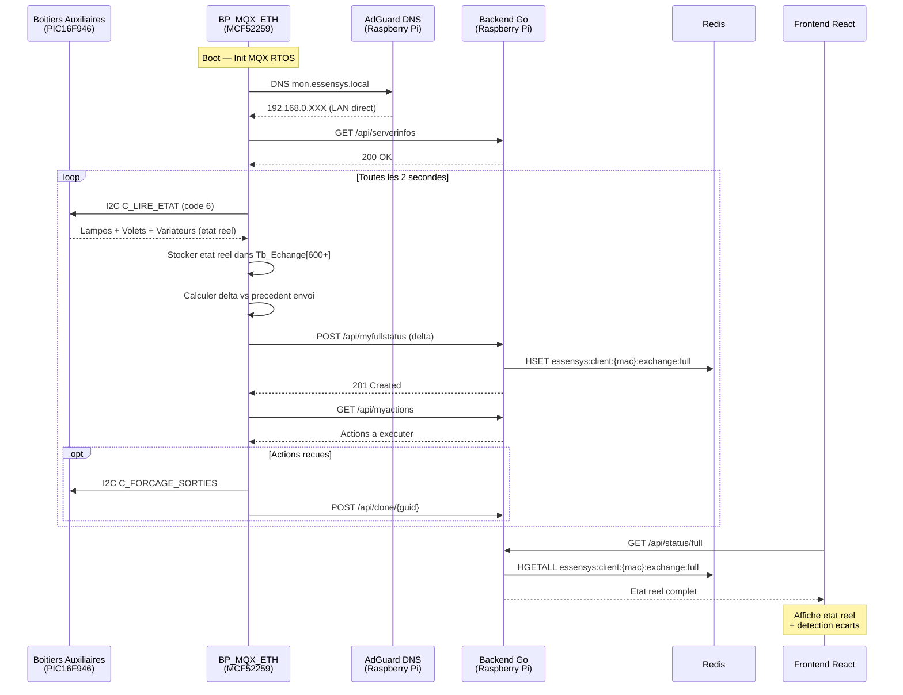

# BP_MQX_ETH v2 — Firmware Local + Status Reel

**Statut** : Proposition  
**Auteur** : Essensys  
**Date** : 2026-01-21

## 1. Contexte et Problemes

Le firmware actuel (v37) du BP_MQX_ETH presente deux limitations majeures :

### 1.1 Resolution DNS via WAN

Le firmware resout `mon.essensys.fr` via un DNS public, alors que le serveur Go tourne sur un Raspberry Pi **sur le meme LAN**. Cela cree :

- Une dependance a la connectivite Internet
- Un point de defaillance externe (DNS public, route WAN)
- Une latence inutile (resolution DNS + routage externe)
- Un risque de panne complete si la box Internet tombe

```
Actuel (v37) :
BP_MQX_ETH → DNS public → mon.essensys.fr → IP WAN → NAT → Raspberry Pi (LAN)

Propose (v2) :
BP_MQX_ETH → AdGuard (LAN :53) → mon.essensys.local → Raspberry Pi (LAN direct)
```

### 1.2 Status Partiel de la Table d'Echange

Le serveur ne connait qu'un **sous-ensemble** de la table d'echange (~784 indices, `Nb_Tbb_Donnees`) :

| Etape | Limitation |
|-------|------------|
| `GET /api/serverinfos` | Le serveur demande au max **30 indices** (`uc_NB_MAX_INFOS_DEMANDEES_PAR_SERVEUR = 30`) |
| `POST /api/mystatus` | Le BP ne renvoie **que les indices demandes** |
| Actions (`/api/myactions`) | Le serveur envoie des ordres mais **ne recoit jamais de confirmation d'execution physique** |

Consequences :
- Le dashboard affiche l'**intention** (action envoyee) et non l'**etat reel** (relais physiquement active)
- Impossible de savoir si un volet est reellement en position
- Impossible de detecter un dysfonctionnement materiel (relais colle, BA deconnecte)
- La `TableReference.json` du support site ne reflete pas l'etat reel des objets

### 1.3 Pas de Retour d'Etat des Boitiers Auxiliaires (BA)

Le protocole I2C actuel entre le BP et les BA est **unidirectionnel en termes d'etat** :

| Commande I2C | Code | Direction | Contenu |
|--------------|------|-----------|---------|
| `C_FORCAGE_SORTIES` | 1 | BP → BA | Ordres lampes, variateurs, volets |
| `C_CONF_SORTIES` | 2 | BP → BA | Configuration TOR/gradateur |
| `C_TPS_EXTINCTION` | 3 | BP → BA | Temps d'extinction lampes |
| `C_TPS_ACTION` | 4 | BP → BA | Temps d'action volets |
| `C_ACTIONS` | 5 | BP → BA | Sauvegarde, blocage, allumage force |

La reponse I2C du BA ne contient que le **code de trame echo + CRC**, pas l'etat physique des sorties.

## 2. Proposition d'Architecture

### 2.1 Changement DNS : `mon.essensys.fr` → `mon.essensys.local`

#### Modification Firmware (SC944D)

**Fichier** : `Ethernet/www.h`

```c
// Avant (v37)
#define NOM_SERVEUR_ESSENSYS  "mon.essensys.fr"

// Apres (v2)
#define NOM_SERVEUR_ESSENSYS  "mon.essensys.local"
```

**Fichier** : `Ethernet/www.c`

```c
// Avant (v37)
char * c_EnteteTrameHost(void) {
    return "host: mon.essensys.fr\r\n";
}

// Apres (v2)
char * c_EnteteTrameHost(void) {
    return "host: mon.essensys.local\r\n";
}
```

#### Configuration AdGuard (cote serveur)

Ajouter un enregistrement DNS dans AdGuard Home pour que `mon.essensys.local` pointe vers le Raspberry Pi :

```yaml
# AdGuard DNS Rewrite
domain: mon.essensys.local
answer: 192.168.0.XXX  # IP du Raspberry Pi
```

#### Configuration DHCP

Configurer le DHCP de la box/routeur pour que le BP obtienne **AdGuard comme serveur DNS** :
- DNS primaire : IP du Raspberry Pi (AdGuard :53)
- DNS secondaire : aucun (forcer le passage par AdGuard)

Alternative : configurer une IP DNS fixe dans le firmware si le DHCP de la box ne peut pas etre modifie.

#### Impact sur les Autres Composants

| Composant | Impact | Action |
|-----------|--------|--------|
| Backend Go | Aucun | Le backend ecoute sur :80, independant du nom DNS |
| Nginx | Ajouter `server_name mon.essensys.local` | Configuration Nginx |
| Traefik | Aucun (WAN uniquement) | — |
| Frontend | Aucun | Le frontend utilise des URLs relatives |
| EEPROM | Aucun | La cle serveur reste dans EEPROM, independante du DNS |

### 2.2 Status Reel Complet — Strategie en 3 Niveaux

#### Niveau 1 : Envoyer Toute la Table d'Echange (modification BP)

Plutot que d'attendre la liste des indices du serveur, le BP envoie **toute la table modifiee** a chaque cycle.

**Approche par delta** : Ne transmettre que les indices qui ont change depuis le dernier `POST /api/mystatus` reussi.

```c
// Pseudo-code v2 — mystatus avec delta
for (us_i = 0; us_i < Nb_Tbb_Donnees; us_i++) {
    if (Tb_Echange[us_i] != Tb_EchangePrecedentEnvoye[us_i]) {
        // Ajouter {k: us_i, v: Tb_Echange[us_i]} au JSON
        uc_NbChangements++;
    }
}
// Apres envoi reussi (201 Created) :
memcpy(Tb_EchangePrecedentEnvoye, Tb_Echange, Nb_Tbb_Donnees);
```

**Contrainte memoire** : `Tb_EchangePrecedentEnvoye` = ~784 octets supplementaires en RAM. A valider par mesure de highwater (voir autocritique 9.6).

**Contrainte TCP single-packet** : Si trop de deltas, fractionner en plusieurs cycles de polling (max ~30 indices par trame pour rester dans un seul paquet TCP).

```
Cycle 1: POST /api/mystatus → indices 0-29 modifies
Cycle 2: POST /api/mystatus → indices 30-59 modifies
...
Cycle N: POST /api/mystatus → derniers indices modifies
```

**Compatibilite ascendante** : Le serveur continue de renvoyer la liste `infos` dans `/api/serverinfos`, mais le firmware v2 l'ignore et envoie les deltas a la place.

#### Niveau 2 : Nouveau Endpoint `/api/myfullstatus` (modification Backend Go)

Creer un nouvel endpoint pour recevoir le dump complet :

```
POST /api/myfullstatus HTTP/1.1
Content-type: application/json ;charset=UTF-8
Authorization: Basic <cle>

{"version":"V38","full":true,"ek":[{k:0,v:"37"},{k:1,v:"30"},...,{k:599,v:"0"}]}
```

Le backend Go stocke l'integralite dans Redis :

```
HSET essensys:client:{mac}:exchange:full {indice} {valeur}
```

Le frontend peut alors lire l'etat reel de **chaque** indice de la `TableReference.json`.

#### Niveau 3 : Retour d'Etat des Boitiers Auxiliaires (modification BA + BP)

Ajouter une **nouvelle commande I2C** aux firmwares BA (SC940, SC941C, SC942C) :

```c
// Nouveau code de trame (a ajouter dans slavenode.c)
enum enum_CODE_TRAMES {
    C_FORCAGE_SORTIES = 1,
    C_CONF_SORTIES,
    C_TPS_EXTINCTION,
    C_TPS_ACTION,
    C_ACTIONS,
    C_LIRE_ETAT = 6    // NOUVEAU : lecture etat physique
};
```

> **ATTENTION** : Le format ci-dessous est **incompatible** avec le protocole I2C actuel qui est fixe a 5 octets de reponse (`TxBuf.b[4]`, `sl_fct_write_polled()` lit exactement 5 octets). Voir autocritique 9.2 pour les alternatives viables (multi-transactions ou bitmask compact).

**Format de la reponse I2C pour `C_LIRE_ETAT`** (necessite refonte du protocole) :

```
┌──────────┬──────────┬──────────┬──────────┬──────────┬──────────┬──────────┐
│ Octet 0  │ Octet 1  │ Octet 2  │ Octet 3  │ Octet 4  │ Octet 5  │ Octet 6  │
│ Code (6) │ Lampes   │ Lampes   │ Volets   │ Volets   │ Varia-   │ Varia-   │
│          │ LSB      │ MSB      │ LSB      │ MSB      │ teurs    │ teurs    │
└──────────┴──────────┴──────────┴──────────┴──────────┴──────────┴──────────┘
  + CRC16 (2 octets)
```

**Implementation cote BA** (dans `slavenode.c`) :

```c
case C_LIRE_ETAT:
    RXByteCount = 1;  // Pas de donnees entrantes
    // Preparer la reponse avec l'etat reel
    TxBuf.b[0] = C_LIRE_ETAT;
    TxBuf.b[1] = (us_SortiesRelais & 0xFF);        // Lampes LSB
    TxBuf.b[2] = ((us_SortiesRelais >> 8) & 0xFF);  // Lampes MSB
    TxBuf.b[3] = (us_EtatVolets & 0xFF);            // Volets LSB
    TxBuf.b[4] = ((us_EtatVolets >> 8) & 0xFF);     // Volets MSB
    TxBuf.b[5] = st_Variateur[0].uc_ValeurCourante; // Variateur 1
    TxBuf.b[6] = st_Variateur[1].uc_ValeurCourante; // Variateur 2
    SensBufCount = 9;  // 7 data + 2 CRC
    break;
```

**Implementation cote BP** (dans `ba.c` ou `ba_i2c.c`) :

```c
// Interroger chaque BA toutes les N secondes
for (uc_BA = 0; uc_BA < 3; uc_BA++) {
    sl_fct_write_polled(I2C_BUS_ADDRESS_BA + uc_BA,
                        C_LIRE_ETAT, &reponse, &erreur);
    if (erreur == I2C_OK) {
        // Stocker dans la table d'echange aux indices dedies
        Tb_Echange[ETAT_REEL_BA_BASE + uc_BA * ETAT_REEL_BA_SIZE + 0] = reponse.lampes_lsb;
        Tb_Echange[ETAT_REEL_BA_BASE + uc_BA * ETAT_REEL_BA_SIZE + 1] = reponse.lampes_msb;
        // ...
    }
}
```

## 3. Cartographie des Cartes

### 3.1 SC944D — Boitier Principal (BP)

| Caracteristique | Valeur |
|-----------------|--------|
| MCU | Freescale MCF52259 (ColdFire V2, 32 bits, 80 MHz) |
| OS | MQX RTOS 4.0 |
| Memoire | 512 Ko Flash + RAM interne |
| Communication | Ethernet (RTCS), I2C maitre, UART ×3, SPI |
| Role | Coordinateur central, pont Ethernet ↔ I2C |
| Firmware actuel | v37 (`us_BP_VERSION_SERVEUR`) |
| Sources | `essensys-board-SC944D/SC944D/Prog/099-37/BP_MQX_ETH/` |

### 3.2 SC940D — Boitier Auxiliaire PDV (Pieces de Vie)

| Caracteristique | Valeur |
|-----------------|--------|
| MCU | PIC16F946 (8 bits, Microchip) |
| OS | Bare metal (super loop) |
| Communication | I2C esclave (adresse `0x11`) |
| Entrees TOR | 5 |
| Lampes | 5 (relais monostables) |
| Variateurs | 3 |
| Volets | 6 (12 relais bistables) |
| Sources | `essensys-board-SC940/SC940D/Prog/code_ba/source/` |

### 3.3 SC941C — Boitier Auxiliaire PDE (Pieces d'Eau)

| Caracteristique | Valeur |
|-----------------|--------|
| MCU | PIC16F946 (8 bits, Microchip) |
| OS | Bare metal (super loop) |
| Communication | I2C esclave (adresse `0x13`) |
| Entrees TOR | 13 |
| Lampes | 13 (relais monostables) |
| Variateurs | 1 |
| Volets | 4 (8 relais bistables) |
| Sources | `essensys-board-SC941C/SC941C/Prog/code_ba/source/` |

### 3.4 SC942C — Boitier Auxiliaire CHB (Chambres)

| Caracteristique | Valeur |
|-----------------|--------|
| MCU | PIC16F946 (8 bits, Microchip) |
| OS | Bare metal (super loop) |
| Communication | I2C esclave (adresse `0x12`) |
| Entrees TOR | 7 |
| Lampes | 7 (relais monostables) |
| Variateurs | 4 |
| Volets | 5 (10 relais bistables) |
| Sources | `essensys-board-SC942C/SC942C/Prog/code_ba/source/` |

### 3.5 Firmware BA Partage

Les 3 cartes BA partagent le **meme code source**. La difference est le type de boitier selectionne dans `hard.h` :

```c
// hard.h — Selection du type
#define TYPE_PIECES_DE_VIE   // SC940 → I2C 0x11
#define TYPE_CHAMBRES        // SC942 → I2C 0x12
#define TYPE_PIECES_D_EAU    // SC941 → I2C 0x13
```

Le protocole I2C, les commandes et la logique applicative (variateurs, volets, anti-rebond) sont identiques.

## 4. Plan de Migration

### Phase 1 : DNS Local (risque minimal)

| Etape | Composant | Modification |
|-------|-----------|-------------|
| 1.1 | AdGuard | Ajouter `mon.essensys.local → IP Raspberry Pi` |
| 1.2 | Nginx | Ajouter `server_name mon.essensys.local` |
| 1.3 | Firmware BP | Changer `NOM_SERVEUR_ESSENSYS` + `c_EnteteTrameHost()` |
| 1.4 | DHCP | Configurer DNS = IP AdGuard |
| 1.5 | Test | Valider le polling HTTP en LAN direct |

**Rollback** : Remettre `mon.essensys.fr` dans le firmware (flash JTAG).

### Phase 2 : Status Complet via Delta (firmware BP uniquement)

| Etape | Composant | Modification |
|-------|-----------|-------------|
| 2.1 | Firmware BP | Ajouter `Tb_EchangePrecedentEnvoye[]` + logique delta |
| 2.2 | Firmware BP | Modifier `sc_JsonPostServerInformation()` pour envoyer les deltas |
| 2.3 | Backend Go | Ajouter endpoint `POST /api/myfullstatus` |
| 2.4 | Backend Go | Stocker le full status dans Redis |
| 2.5 | Frontend | Afficher l'etat reel depuis Redis via API |
| 2.6 | TableReference | Enrichir avec mapping indice → objet physique |

### Phase 3 : Retour d'Etat des BA (firmware BA + BP)

| Etape | Composant | Modification |
|-------|-----------|-------------|
| 3.1 | Firmware BA | Ajouter `C_LIRE_ETAT` dans `slavenode.c` (SC940, SC941C, SC942C) |
| 3.2 | Firmware BP | Ajouter interrogation cyclique des BA |
| 3.3 | Firmware BP | Stocker les reponses dans `Tb_Echange[]` (indices dedies) |
| 3.4 | Backend Go | Exposer les indices d'etat reel dans l'API |
| 3.5 | Frontend | Afficher etat physique confirme vs. etat commande |

**Attention** : La Phase 3 necessite un acces physique aux 3 cartes BA pour flasher le nouveau firmware PIC16F946 via programmeur ICSP (Microchip).

## 5. Impact sur la TableReference

### Nouveaux Indices Proposes

> **ATTENTION** : La table actuelle utilise ~784 indices (`Nb_Tbb_Donnees`). Les plages 600-630 sont **deja occupees** (scenarios, eclairages). Les nouveaux indices doivent etre places apres `Nb_Tbb_Donnees` (784+). Voir autocritique 9.1.

| Plage | Contenu | Description |
|-------|---------|-------------|
| 784-793 | Etat reel BA PDV (0x11) | Lampes, volets, variateurs confirmes |
| 794-803 | Etat reel BA CHB (0x12) | Lampes, volets, variateurs confirmes |
| 804-813 | Etat reel BA PDE (0x13) | Lampes, volets, variateurs confirmes |
| 814 | Etat connectivite BA | Bitmask: bit 0=PDV OK, bit 1=CHB OK, bit 2=PDE OK |

### Distinction Action vs. Etat

| Concept | Exemple | Indice actuel | Indice etat reel |
|---------|---------|---------------|------------------|
| Lampe salon commandee | "Allumer salon" | 619 (bit = 1) | 600 (bit = 1 si relais ON) |
| Volet chambre commande | "Ouvrir volet CH1" | Scenario | 612 (position confirmee) |
| Variateur cuisine | "Gradateur 75%" | 494+ | 620 (valeur courante) |

Cela permet au frontend d'afficher :
- **Etat commande** : ce que l'utilisateur a demande
- **Etat reel** : ce que le materiel confirme
- **Ecart** : alerte si commande ≠ reel (materiel defaillant)

## 6. Diagramme de Flux (v2)



## 7. Risques et Mitigations

| Risque | Probabilite | Impact | Mitigation |
|--------|-------------|--------|------------|
| Flash firmware BA echoue | Faible | Eleve | Tester sur un BA avant deploiement generalise |
| Trame I2C trop longue | Faible | Moyen | Limiter la reponse `C_LIRE_ETAT` a 9 octets (7 data + 2 CRC) |
| Delta trop volumineux pour single-packet | Moyenne | Moyen | Fractionner en cycles de 30 indices max |
| `mon.essensys.local` non resolu | Faible | Eleve | Configurer AdGuard + fallback IP fixe dans firmware |
| Memoire insuffisante MCF52259 | Faible | Eleve | `Tb_EchangePrecedentEnvoye` = +600 octets, stack Ethernet a 3000 |
| Incompatibilite backend ancien | Nulle | — | Nouvel endpoint `/api/myfullstatus`, l'ancien reste fonctionnel |

## 8. Prerequis

| Prerequis | Disponibilite |
|-----------|---------------|
| Programmeur JTAG/BDM (P&E Micro) | Pour flasher le BP (MCF52259) |
| Programmeur ICSP (PICkit 3/4) | Pour flasher les 3 BA (PIC16F946) |
| CodeWarrior pour Coldfire | Compilation BP |
| MPLAB X + XC8 | Compilation BA |
| Acces physique aux 4 cartes | Deploiement firmware |
| AdGuard configure | Resolution DNS locale |

## 9. Autocritique Technique

Analyse critique de la specification apres confrontation avec le code source reel des 4 firmwares. Plusieurs erreurs et risques ont ete identifies.

### 9.1 ERREUR : Taille de la Table d'Echange

**Spec** : "~600 indices"  
**Realite** : `Nb_Tbb_Donnees ≈ 784` (enum `Tbb_Donnees_Index` dans `TableEchange.h`, jusqu'a `AdresseMAC_6`).

**Impact** :
- `Tb_EchangePrecedentEnvoye[]` = 784 octets (pas 600)
- Les indices proposes 600-630 pour l'etat reel BA sont **deja utilises** par la table actuelle (scenarios, eclairages, etc.)
- Le delta initial au boot concernerait 784 indices, pas 600

**Correction** : Les nouveaux indices d'etat reel doivent etre places **apres `Nb_Tbb_Donnees`** (784+), ce qui necessite d'agrandir l'enum et les tableaux `Tb_Echange[]`, `Tb_EchangePrecedent[]` et `Tb_Echange_Droits[]`.

### 9.2 ERREUR CRITIQUE : Reponse I2C BA Fixe a 5 Octets

La spec propose une reponse de 9 octets (7 data + 2 CRC) pour `C_LIRE_ETAT`. Or le protocole I2C BA est **fige a 5 octets** :

**Cote BA (slavenode.c)** :
- `TxBuf` est un `union` de **4 octets** (`unsigned char b[4]`)
- Le `switch (SensBufIndex)` ne gere que les cas 0-3 (au-dela → dummy `0x55`)
- Le CRC est calcule sur `TxBuf.b[0..2]` (3 octets) uniquement
- Format reponse fixe : `[code] [CRC_recu_LSB] [CRC_recu_MSB] [CRC_resp_LSB] [CRC_resp_MSB]`

**Cote BP (ba_i2c.c)** :
- `sl_fct_write_polled()` demande toujours exactement **5 octets** en lecture : `l_ul_param = 5`
- Le CRC est verifie sur les 3 premiers octets uniquement

**Consequence** : Le pseudo-code propose dans la spec est **incompatible** avec le protocole I2C existant. Il est impossible d'envoyer lampes + volets + variateurs (7 octets) sans modifier en profondeur :
1. `TxBuf` (union → buffer de 10+ octets)
2. La machine d'etats `SensBufIndex` (ajouter des cas 4-8)
3. Le calcul du CRC (sur plus de 3 octets)
4. `sl_fct_write_polled()` cote BP (lecture parametrable, pas fixe a 5)
5. La verification CRC cote BP

**Alternative recommandee** : Utiliser **plusieurs transactions I2C** de 5 octets :

```
Transaction 1: C_LIRE_ETAT_LAMPES    → reponse 5 octets (code + lampes_LSB + CRC)
Transaction 2: C_LIRE_ETAT_VOLETS    → reponse 5 octets (code + volets_LSB + CRC)
Transaction 3: C_LIRE_ETAT_VARIATEUR → reponse 5 octets (code + variateur1 + CRC)
```

Ou bien : une seule commande `C_LIRE_ETAT` dont le champ `TxBuf.b[1]` renvoie un octet de bitmask compact (8 lampes ON/OFF dans un octet). Mais cela perd l'info des variateurs.

### 9.3 ERREUR : Timing ISR vs Main Loop

La spec propose de remplir `TxBuf` dans le `case C_LIRE_ETAT` du switch de traitement. Or :

- Le switch de traitement (`CmdBuf[0]`) est execute dans la **main loop** (`vd_Traitement_I2C()`, cadence 40 ms)
- Le remplissage de `TxBuf` pour la reponse I2C se fait dans l'**ISR** (`SSP_Handler()`)
- Le READ du maitre arrive **immediatement** apres le WRITE, bien avant la main loop

**Consequence** : Les donnees d'etat doivent etre preparees dans `TxBuf` **pendant l'ISR** (dans STATE 2, quand `RXBufferIndex == RXByteCount`), pas dans le switch de la main loop.

**Risque** : Lecture de `us_SortiesRelais` (16 bits) dans l'ISR d'un PIC 8 bits → **lecture non-atomique**. Un changement de relais en cours de lecture pourrait donner une valeur incoherente (LSB d'un etat, MSB d'un autre).

**Mitigation** : Maintenir un buffer `uc_EtatSnapshot[4]` mis a jour atomiquement dans la main loop (par octet), lu dans l'ISR.

### 9.4 RISQUE : Taille des Buffers TCP

**Spec** : "max ~30 indices par trame pour rester dans un seul paquet TCP"  
**Realite** :
- `c_EthernetBufferTX` = 1024 octets
- En-tetes HTTP = ~400 octets
- Reste pour le JSON = ~600 octets
- Un indice `{k:xxx,v:"yyy"}` = 16-23 caracteres
- Capacite reelle = **~30-35 indices** par trame

**Pour le delta de 784 indices** au premier cycle (boot), il faudrait :
- 784 / 30 = ~26 cycles
- A 2 secondes par cycle = **~52 secondes** pour la synchronisation initiale

**Alternative** : Augmenter `us_BUFFER_TX` a 2048 ou utiliser le buffer TX2 pour le corps JSON, ce qui permettrait ~80 indices par trame et une synchronisation en ~10 cycles (~20 secondes).

### 9.5 RISQUE : Domaine `.local` Reserve pour mDNS

Le TLD `.local` est reserve par la RFC 6762 pour le Multicast DNS (mDNS/Bonjour/Avahi). Utiliser `mon.essensys.local` avec un DNS unicast (AdGuard) peut provoquer :

- Des conflits avec les resolvers mDNS presents sur le reseau (macOS, Linux avec Avahi, Windows)
- Des delais de resolution si le systeme interroge mDNS avant le DNS unicast
- RTCS sur MCF52259 ne supporte probablement pas mDNS, donc pas de conflit cote firmware, mais les clients web (navigateurs) pourraient avoir des problemes

**Alternative** : Utiliser `mon.essensys.lan` (non-reserve) ou un sous-domaine reel `local.essensys.fr` (resolvable en interne via AdGuard).

### 9.6 RISQUE : Memoire RAM pour le 3eme Tableau

**Spec** : "Faisable car le MCF52259 a de la marge sur les 3000 octets de stack Ethernet"  
**Realite** :
- `Tb_EchangePrecedentEnvoye[784]` = 784 octets supplementaires
- La RAM totale est de 64 Ko (SRAM)
- Stack total des 5 taches = ~9 Ko
- `Tb_Echange[784]` + `Tb_EchangePrecedent[784]` = 1568 octets existants
- Buffers Ethernet : `BufferRX` (1500) + `BufferRX2` (1024) + `BufferTX` (1024) + `BufferTX2` (1024) = 4572 octets
- Un commentaire dans `main.c` indique un overflow de stack Ethernet a 2000, monte a 3000

**Conclusion** : 784 octets supplementaires sont probablement faisables mais **a valider** par mesure de highwater (`_mem_get_highwater()`) avant deploiement. La marge n'est pas dans le stack Ethernet mais dans la RAM globale.

### 9.7 RISQUE : Compatibilite du Nouvel Endpoint

**Spec** : "Le serveur continue de renvoyer la liste `infos` dans `/api/serverinfos`"  
**Realite** : Si le firmware v2 ignore la liste `infos` et envoie des deltas sur `/api/mystatus`, le backend recevra des indices non-demandes. Le parser actuel du backend Go doit accepter des indices arbitraires sans les rejeter.

**Recommandation** : Utiliser `/api/myfullstatus` (nouvel endpoint) pour les deltas, et continuer a utiliser `/api/mystatus` normalement avec les indices demandes. Les deux coexistent.

### 9.8 Tableau de Synthese

| # | Severite | Point | Action Requise |
|---|----------|-------|----------------|
| 9.1 | **Erreur** | Table = 784 indices, pas 600 | Corriger toutes les tailles, revoir les indices proposes |
| 9.2 | **Critique** | Reponse I2C fixe a 5 octets | Redesigner C_LIRE_ETAT : multi-transactions ou format compact |
| 9.3 | **Erreur** | TxBuf rempli dans ISR, pas main loop | Preparer les donnees dans l'ISR ou buffer pre-rempli |
| 9.4 | **Moyen** | 52s pour sync initiale (784/30 × 2s) | Augmenter buffer TX ou envoyer en batch |
| 9.5 | **Moyen** | `.local` reserve pour mDNS | Utiliser `.lan` ou `local.essensys.fr` |
| 9.6 | **Faible** | RAM 784 octets supplementaires | Valider par mesure highwater |
| 9.7 | **Faible** | Compatibilite backend pour deltas | Separer endpoints mystatus / myfullstatus |

## References Sources

| Composant | Chemin |
|-----------|--------|
| BP firmware | `essensys-board-SC944D/SC944D/Prog/099-37/BP_MQX_ETH/` |
| BP legacy | `client-essensys-legacy/` (C/, H/, Ethernet/) |
| BA PDV (SC940) | `essensys-board-SC940/SC940D/Prog/code_ba/source/` |
| BA PDE (SC941C) | `essensys-board-SC941C/SC941C/Prog/code_ba/source/` |
| BA CHB (SC942C) | `essensys-board-SC942C/SC942C/Prog/code_ba/source/` |
| DNS serveur | `mon.essensys.fr` → `www.h` ligne 41 |
| Host header | `mon.essensys.fr` → `www.c` `c_EnteteTrameHost()` |
| Table d'echange | `H/TableEchange.h` → `enum Tbb_Donnees_Index` (~600 indices) |
| Commandes I2C BA | `slavenode.c` → `enum enum_CODE_TRAMES` (codes 1-5) |
| Protocole HTTP | `Ethernet/www.c` → `sc_DialogueAvecServeur()` |
