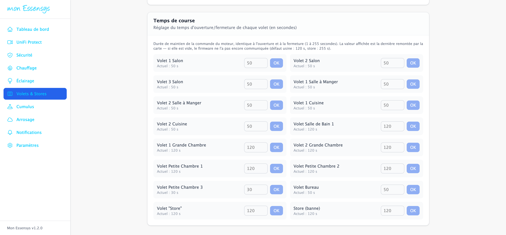
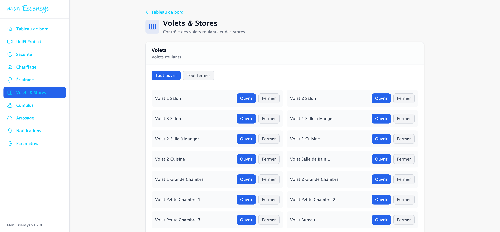
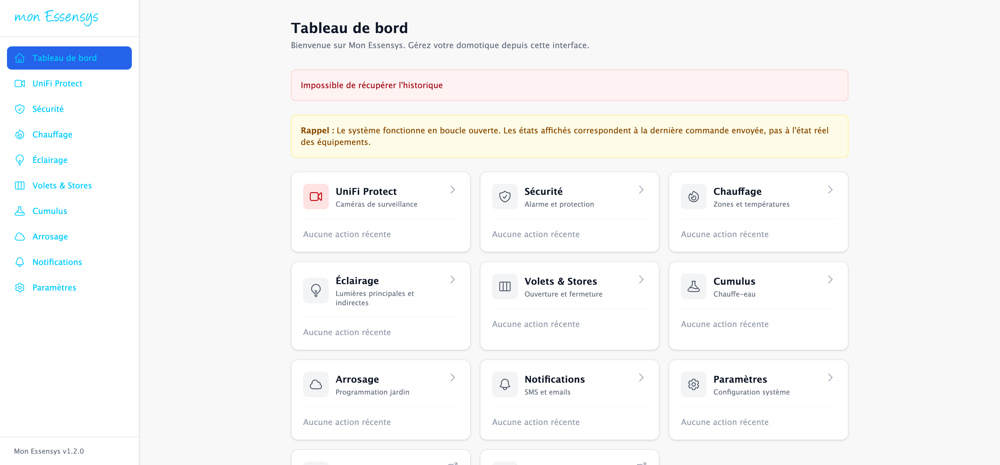
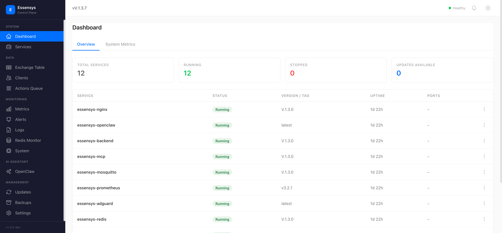

# Newsletter Essensys — Juin 2026

**Version V.1.3.0 · Gateway CM5 · Mise à jour front & back**

---

Bonjour,

Une nouvelle version de la plateforme Essensys vient d’être déployée sur la **gateway CM5** (`mon.essensys.local` / segment armoire `mon.essensys.fr`). Cette release apporte une fonctionnalité très attendue pour l’installation : le **réglage fin du temps de course de chaque volet**, directement depuis l’interface web.

---

## Ce qui change pour vous

### Réglage du temps de course par volet

Chaque volet roulant et store dispose désormais de son **propre temps de course** (de 1 à 255 secondes), identique à l’ouverture et à la fermeture.

- La valeur affichée est la **dernière remontée par la carte** firmware (indices d’échange **566 à 589**).
- Si le champ est vide, le firmware n’a pas encore communiqué la valeur (défaut usine : **120 s** pour un volet, **255 s** pour un store).
- Vous modifiez la valeur, vous cliquez **OK** : la commande part immédiatement vers l’armoire.

*Page **Volets & Stores → Temps de course** — exemple live sur gateway CM5 (salon 50 s, chambres 120 s, etc.).*

### Contrôle volets & stores inchangé, mais enrichi

L’écran **Volets & Stores** conserve les commandes groupées (ouvrir / fermer / stop) pour chaque zone de la maison, avec la nouvelle section de réglage en bas de page.

### Tableau de bord

Le tableau de bord reste le point d’entrée : état du site, accès rapide aux volets, éclairage, chauffage, sécurité, etc.

---

## Côté technique (pour les intégrateurs)

| Composant | Détail |
|-----------|--------|
| **Frontend** | `essensys-server-frontend` V.1.3.0 — page `ShuttersPage`, saisie temps par volet |
| **Backend** | `essensys-server-backend` V.1.3.0 — lecture/écriture indices **566-589**, endpoint exchange |
| **Gateway** | CM5 Essensys, stack Docker (Traefik, Nginx, backend, Redis, Mosquitto…) |
| **Accès LAN** | `https://mon.essensys.local/` (HTTPS, port 443) |
| **Accès armoire** | `http://mon.essensys.fr/` (segment 10.0.1.x, DHCP dnsmasq) |

Images Docker reconstruites et redéployées via Ansible le **12 juin 2026**.

*Control Plane (`:9100`) — état des services, versions et logs.*

---

## Comment en profiter

1. Ouvrez **`https://mon.essensys.local/`** depuis votre réseau local (ou **`http://mon.essensys.fr/`** depuis l’armoire).
2. Menu **Volets & Stores**.
3. Descendez jusqu’à **Temps de course**.
4. Ajustez la durée (secondes) pour chaque volet, puis **OK**.

> **Astuce :** commencez par un volet test (ex. bureau), vérifiez un cycle complet ouverture/fermeture, puis propagez les valeurs aux autres pièces.

---

## Prochaines étapes

- Migration **NixOS** sur CM5 (branche `nixos` publiée sur GitHub, préparation Ansible disponible).
- Poursuite des travaux **gateway hardware** (stack CM5 modulaire 3 cartes).
- Durcissement sécurité (scan secrets, rotation clés doc legacy).

Merci pour vos retours sur le terrain — ils orientent directement les prochaines releases.

**L’équipe Essensys**

---

*Captures réalisées le 14 juin 2026 via la gateway CM5 de labo (`192.168.0.14`).*
