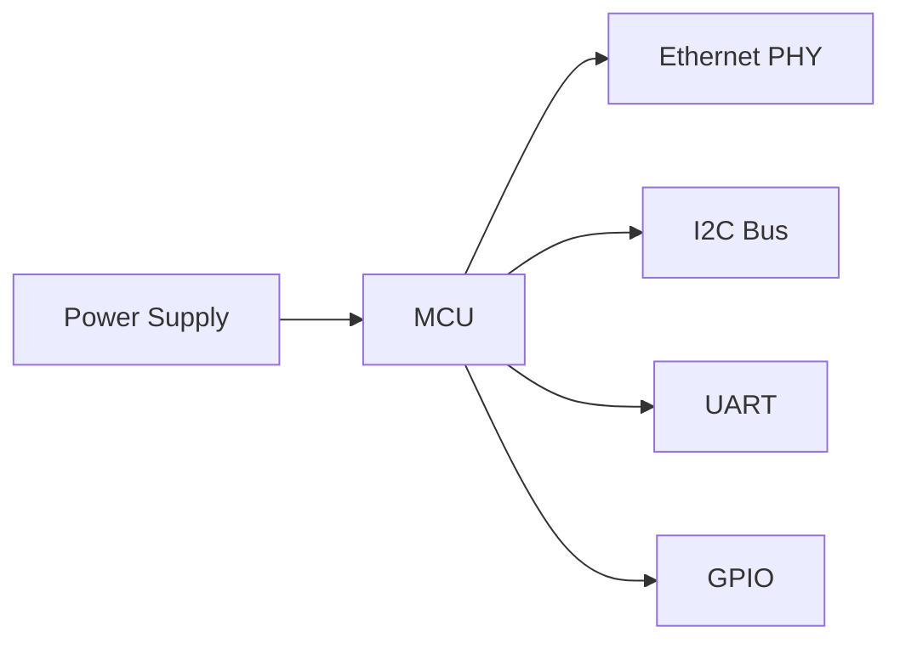
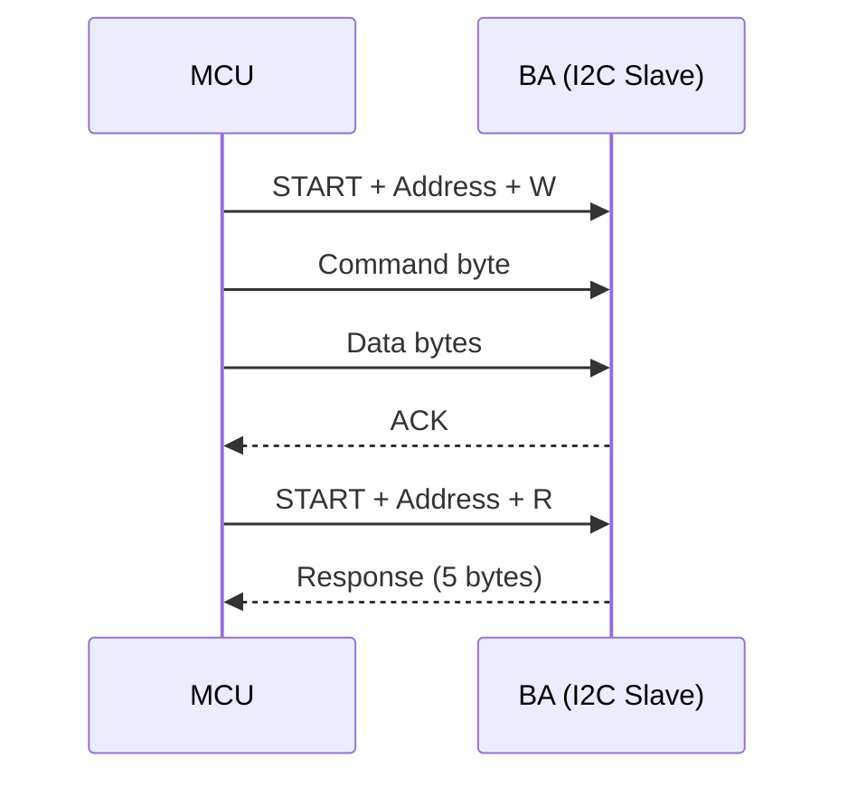

# Altium Designer Electronics Expert

## Capabilities

- Parse Altium project files (`.PrjPCB`) to extract schematic hierarchy and design structure
- Analyze BOM CSV files (component references, quantities, part numbers, pricing)
- Read Pick'n'Place CSV for assembly documentation
- Interpret Gerber file sets (layers, drills, panel) for manufacturing
- Read STEP 3D models metadata
- Generate hardware documentation: component lists, block diagrams, timing diagrams, power budgets
- Cross-reference schematics with firmware GPIO mapping

## Altium Project Structure

```
project/
├── ProjectName.PrjPCB          # Project file (INI format)
├── ProjectName.PrjPCBStructure # Structure metadata
├── ProjectName.OutJob          # Output job configuration
├── SDEC*_*.SchDoc              # Hierarchical schematics (binary)
├── SI*.PcbDoc                  # PCB layout (binary)
├── SI*.PcbLib                  # Component footprint library (binary)
├── SDEC*.SCHLIB                # Schematic symbol library (binary)
├── Assembly/
│   └── *_Pick'nPlace.csv       # Component placement data
├── 3D/
│   └── *.step                  # 3D model export
├── Gerbers/
│   ├── Single/Layers/          # Individual board Gerbers
│   │   ├── *.GTL               # Top copper
│   │   ├── *.GBL               # Bottom copper
│   │   ├── *.GKO               # Board outline (keep-out)
│   │   ├── *.GTS / *.GBS       # Solder mask (top/bottom)
│   │   ├── *.GTP / *.GBP       # Paste mask (top/bottom)
│   │   ├── *.GTO / *.GBO       # Silkscreen (top/bottom)
│   │   └── *.G1 / *.G2         # Inner layers
│   ├── Single/Drills/
│   │   ├── *.DRL               # Excellon drill file
│   │   └── *.DRR               # Drill report
│   └── Panel/                  # Panelized Gerbers for production
└── BOM_[No Variations].csv     # Bill of Materials
```

## Parsing the .PrjPCB File

The `.PrjPCB` is INI format. Extract the schematic hierarchy:

```ini
[Document1]
DocumentPath=SDEC944-xD_Page_de_Garde.SchDoc
AnnotateOrder=0

[Document2]
DocumentPath=SDEC944-xD_Alimentation_1-2.SchDoc
AnnotateOrder=1
```

Key fields: `DocumentPath` (schematic filename), `AnnotateOrder` (hierarchy order).

## BOM CSV Format

Standard Altium BOM export:

```csv
,Name,Description,Designator,Part Number,Price,Qty
,C_0603_X7R_10%_100N-50V,"Condensateur céramique, X7R, 10%, CMS 0603",C4...,KEMET C0603C104K5RACTU,1.82,45
```

| Column | Content |
|--------|---------|
| Name | Component name / value |
| Description | Full description (package, tolerance, rating) |
| Designator | Reference designators (comma-separated) |
| Part Number | Manufacturer + MPN |
| Price | Unit price |
| Qty | Total quantity |

## Documentation Generation

When asked to document a board, generate:

### 1. Overview
- Board name, revision, date
- MCU and main ICs
- Number of layers, dimensions
- Power supply topology

### 2. Schematic Block Diagram (Mermaid)



### 3. BOM Summary Table

| Category | Count | Examples |
|----------|-------|---------|
| Capacitors | 120 | 100nF X7R, 10µF X5R |
| Resistors | 85 | 10K, 4.7K |
| ICs | 12 | MCF52259, KSZ8041NL |
| Connectors | 15 | Bornier 2-pin, RJ45 |

### 4. Power Budget

| Rail | Voltage | Source | Consumers | Max Current |
|------|---------|--------|-----------|-------------|
| VCC_3V3 | 3.3V | LDO | MCU, PHY | 500mA |
| VCC_5V | 5.0V | SMPS | Relays | 2A |

### 5. Signal Timing Diagrams (Mermaid)



### 6. Firmware-Hardware Cross-Reference

Map GPIO pins to schematic net names and firmware constants:

| MCU Pin | Net Name | Firmware Constant | Function |
|---------|----------|-------------------|----------|
| PTD4 | RELAY_CUMULUS | `DD4` | Cumulus relay |
| PAS2 | ETOR_ALARME_Z1 | `AS2` | Alarm zone 1 |

## Essensys Board Context

| Board | MCU | Role | I2C Addr |
|-------|-----|------|----------|
| SC944D | MCF52259 (ColdFire) | Main controller (BP) | Master |
| SC940D | PIC16F946 | BA PDV (Pièces de Vie) | 0x11 |
| SC942C | PIC16F946 | BA CHB (Chambres) | 0x12 |
| SC941C | PIC16F946 | BA PDE (Pièces d'Eau) | 0x13 |

For detailed reference, see [reference.md](reference.md).
